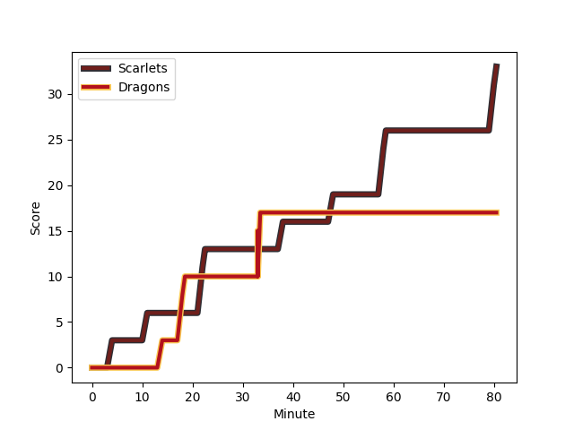
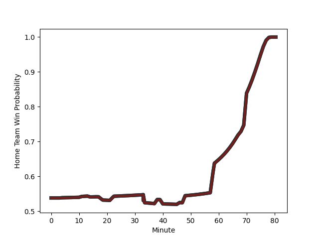

---  
layout: page  
title: Dragons at Scarlets; 17-33  
date: 2023-01-01 18:15:00 18:00:00 -0500  
categories: match review  
---
# Dragons (1499.06) at Scarlets (1673.02); 17-33

# Prediction: Scarlets by 21.4

Scarlets by 17.4 on a neutral field
## Scores over Time

## Win Probability over Time

# Pre-Match Prediction: Scarlets by 14.9

Scarlets by 10.9 on a neutral pitch

|   Away Minutes | Away Player                                                     |   Away elo |   Away Percentile |   Number |   Home Percentile |   Home elo | Home Player                                                     |   Home Minutes |
|---------------:|:----------------------------------------------------------------|-----------:|------------------:|---------:|------------------:|-----------:|:----------------------------------------------------------------|---------------:|
|             70 | [Aki Seiuli](..//playerfiles//AkiSeiuli_cleaned.md)             |     105.18 |                79 |        1 |                69 |     101.27 | [Kemsley Mathias](..//playerfiles//KemsleyMathias_cleaned.md)   |             55 |
|             74 | [Bradley Roberts](..//playerfiles//BradleyRoberts_cleaned.md)   |      86.98 |                24 |        2 |                83 |     110.03 | [Ken Owens](..//playerfiles//KenOwens_cleaned.md)               |             80 |
|             74 | [Chris Coleman](..//playerfiles//ChrisColeman_cleaned.md)       |      81.8  |                12 |        3 |                91 |     115.32 | [WillGriff John](..//playerfiles//WillGriffJohn_cleaned.md)     |             67 |
|             80 | [Joseph Davies](..//playerfiles//JosephDavies_cleaned.md)       |      81.78 |                15 |        4 |                96 |     128.93 | [Vaea Fifita](..//playerfiles//VaeaFifita_cleaned.md)           |             80 |
|             46 | [George Nott](..//playerfiles//GeorgeNott_cleaned.md)           |      84.45 |                19 |        5 |                96 |     128.9  | [Sam Lousi](..//playerfiles//SamLousi_cleaned.md)               |             80 |
|             59 | [Aaron Wainwright](..//playerfiles//AaronWainwright_cleaned.md) |      99.93 |                61 |        6 |                47 |      95.06 | [Aaron Shingler](..//playerfiles//AaronShingler_cleaned.md)     |             80 |
|             80 | [Taine Basham](..//playerfiles//TaineBasham_cleaned.md)         |     104.01 |                71 |        7 |                93 |     123.27 | [Dan Davis](..//playerfiles//DanDavis_cleaned.md)               |             80 |
|             80 | [Ross Moriarty](..//playerfiles//RossMoriarty_cleaned.md)       |     115.12 |                86 |        8 |                57 |      98.48 | [Sione Kalamafoni](..//playerfiles//SioneKalamafoni_cleaned.md) |             80 |
|             74 | [Lewis Jones](..//playerfiles//LewisJones_cleaned.md)           |      96.43 |                51 |        9 |                 2 |      65.67 | [Dane Blacker](..//playerfiles//DaneBlacker_cleaned.md)         |             67 |
|             80 | [JJ Hanrahan](..//playerfiles//JJHanrahan_cleaned.md)           |     130.05 |                93 |       10 |                99 |     147.76 | [Rhys Patchell](..//playerfiles//RhysPatchell_cleaned.md)       |             68 |
|             80 | [Ashton Hewitt](..//playerfiles//AshtonHewitt_cleaned.md)       |      98.74 |                58 |       11 |                83 |     112.96 | [Steffan Evans](..//playerfiles//SteffanEvans_cleaned.md)       |             80 |
|             74 | [Sio Tomkinson](..//playerfiles//SioTomkinson_cleaned.md)       |     114.45 |                86 |       12 |                62 |     101.17 | [Scott Williams](..//playerfiles//ScottWilliams_cleaned.md)     |             17 |
|             80 | [Steffan Hughes](..//playerfiles//SteffanHughes_cleaned.md)     |     125.09 |                93 |       13 |                74 |     107.65 | [Joe Roberts](..//playerfiles//JoeRoberts_cleaned.md)           |             79 |
|             80 | [Rio Dyer](..//playerfiles//RioDyer_cleaned.md)                 |      62.45 |                 2 |       14 |                88 |     119.25 | [Johnny McNicholl](..//playerfiles//JohnnyMcNicholl_cleaned.md) |             80 |
|             40 | [Angus O'Brien](..//playerfiles//AngusO'Brien_cleaned.md)       |      86.66 |                29 |       15 |                73 |     106.05 | [Leigh Halfpenny](..//playerfiles//LeighHalfpenny_cleaned.md)   |             80 |
|             40 | [Sam Davies](..//playerfiles//SamDavies_cleaned.md)             |     124.89 |                91 |       16 |                94 |     125.61 | [Jonathan Davies](..//playerfiles//JonathanDavies_cleaned.md)   |             63 |
|             34 | [Matthew Screech](..//playerfiles//MatthewScreech_cleaned.md)   |      83.1  |                18 |       17 |                13 |      83.77 | [Steffan Thomas](..//playerfiles//SteffanThomas_cleaned.md)     |             25 |
|             21 | [Ben Fry](..//playerfiles//BenFry_cleaned.md)                   |     110.45 |                82 |       18 |                83 |     106.93 | [Kieran Hardy](..//playerfiles//KieranHardy_cleaned.md)         |             13 |
|             10 | [Rob Evans](..//playerfiles//RobEvans_cleaned.md)               |     117.02 |                92 |       19 |                36 |      91.51 | [Sam Wainwright](..//playerfiles//SamWainwright_cleaned.md)     |             13 |
|              6 | [Che Hope](..//playerfiles//CheHope_cleaned.md)                 |      95.35 |               nan |       20 |                80 |     112.93 | [Dan Jones](..//playerfiles//DanJones_cleaned.md)               |             12 |
|              6 | [Brodie Coghlan](..//playerfiles//BrodieCoghlan_cleaned.md)     |      95    |               nan |       21 |               nan |      95    | [Carwyn Tuipulotu](..//playerfiles//CarwynTuipulotu_cleaned.md) |              1 |
|              6 | [Luke Yendle](..//playerfiles//LukeYendle_cleaned.md)           |      96.17 |                54 |       22 |               nan |     nan    | nan                                                             |            nan |
|              6 | [Max Clark](..//playerfiles//MaxClark_cleaned.md)               |     135.17 |                98 |       23 |               nan |     nan    | nan                                                             |            nan |

