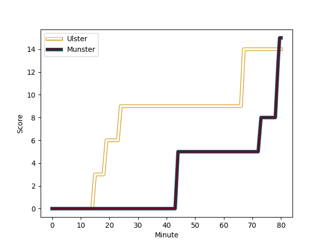
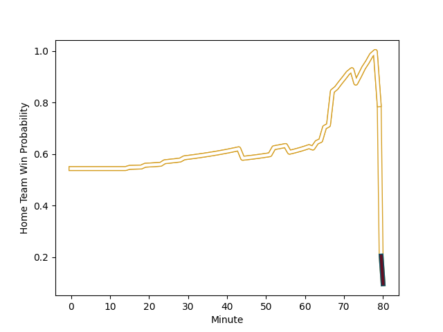

---  
layout: page  
title: Munster at Ulster; 15-14  
date: 2023-01-01 18:15:00 18:00:00 -0500  
categories: match review  
---
# Munster (1552.68) at Ulster (1610.74); 15-14

# Prediction: Ulster by 8.8

Ulster by 5.8 on a neutral field
## Scores over Time

## Win Probability over Time

# Pre-Match Prediction: Ulster by 12.6

Ulster by 9.6 on a neutral pitch

|   Away Minutes | Away Player                                                     |   Away elo |   Away Percentile |   Number |   Home Percentile |   Home elo | Home Player                                                           |   Home Minutes |
|---------------:|:----------------------------------------------------------------|-----------:|------------------:|---------:|------------------:|-----------:|:----------------------------------------------------------------------|---------------:|
|             65 | [Dave Kilcoyne](..//playerfiles//DaveKilcoyne_cleaned.md)       |     118.19 |                97 |        1 |                66 |      99.3  | [Rory Sutherland](..//playerfiles//RorySutherland_cleaned.md)         |             68 |
|             69 | [Niall Scannell](..//playerfiles//NiallScannell_cleaned.md)     |     104.28 |                82 |        2 |                54 |      95.72 | [Tom Stewart](..//playerfiles//TomStewart_cleaned.md)                 |             76 |
|             69 | [Roman Salanoa](..//playerfiles//RomanSalanoa_cleaned.md)       |      94.85 |                37 |        3 |                87 |     107.2  | [Marty Moore](..//playerfiles//MartyMoore_cleaned.md)                 |             29 |
|             80 | [Jean Kleyn](..//playerfiles//JeanKleyn_cleaned.md)             |     103.43 |                76 |        4 |                67 |      99.7  | [Kieran Treadwell](..//playerfiles//KieranTreadwell_cleaned.md)       |             62 |
|             80 | [Kiran McDonald](..//playerfiles//KiranMcDonald_cleaned.md)     |      94.39 |                45 |        5 |                81 |     105.63 | [Iain Henderson](..//playerfiles//IainHenderson_cleaned.md)           |             80 |
|             80 | [Jack O'Donoghue](..//playerfiles//JackO'Donoghue_cleaned.md)   |     111.23 |                90 |        6 |                54 |      97.18 | [Greg Jones](..//playerfiles//GregJones_cleaned.md)                   |             65 |
|             80 | [Alex Kendellen](..//playerfiles//AlexKendellen_cleaned.md)     |      93.47 |                30 |        7 |               nan |     108.72 | [Sean Reffell](..//playerfiles//SeanReffell_cleaned.md)               |             80 |
|             80 | [Gavin Coombes](..//playerfiles//GavinCoombes_cleaned.md)       |     113.39 |                89 |        8 |                98 |     132.19 | [Duane Vermeulen](..//playerfiles//DuaneVermeulen_cleaned.md)         |             80 |
|             56 | [Paddy Patterson](..//playerfiles//PaddyPatterson_cleaned.md)   |      93.11 |                32 |        9 |                91 |     112.54 | [John Cooney](..//playerfiles//JohnCooney_cleaned.md)                 |             62 |
|             80 | [Jack Crowley](..//playerfiles//JackCrowley_cleaned.md)         |     103.87 |                74 |       10 |                92 |     118.89 | [Billy Burns](..//playerfiles//BillyBurns_cleaned.md)                 |             72 |
|             63 | [Keith Earls](..//playerfiles//KeithEarls_cleaned.md)           |     105.98 |                82 |       11 |                78 |     103.51 | [Jacob Stockdale](..//playerfiles//JacobStockdale_cleaned.md)         |             76 |
|             52 | [Malakai Fekitoa](..//playerfiles//MalakaiFekitoa_cleaned.md)   |     115.05 |                91 |       12 |                97 |     125.9  | [Stuart McCloskey](..//playerfiles//StuartMcCloskey_cleaned.md)       |             80 |
|             80 | [Antoine Frisch](..//playerfiles//AntoineFrisch_cleaned.md)     |      99.83 |                64 |       13 |                68 |     101.71 | [James Hume](..//playerfiles//JamesHume_cleaned.md)                   |             80 |
|             80 | [Shane Daly](..//playerfiles//ShaneDaly_cleaned.md)             |     117.44 |                93 |       14 |                29 |      91.09 | [Robert Baloucoune](..//playerfiles//RobertBaloucoune_cleaned.md)     |             80 |
|             80 | [Mike Haley](..//playerfiles//MikeHaley_cleaned.md)             |      90.93 |                34 |       15 |                95 |     118.2  | [Stewart Moore](..//playerfiles//StewartMoore_cleaned.md)             |             80 |
|             28 | [Ben Healy](..//playerfiles//BenHealy_cleaned.md)               |      85.98 |                12 |       16 |                74 |     101.54 | [Gareth Milasinovich](..//playerfiles//GarethMilasinovich_cleaned.md) |             51 |
|             24 | [Conor Murray](..//playerfiles//ConorMurray_cleaned.md)         |     128.26 |                98 |       17 |                87 |     109.83 | [Sam Carter](..//playerfiles//SamCarter_cleaned.md)                   |             18 |
|             17 | [Patrick Campbell](..//playerfiles//PatrickCampbell_cleaned.md) |      91.99 |                21 |       18 |                16 |      86.67 | [Nathan Doak](..//playerfiles//NathanDoak_cleaned.md)                 |             18 |
|             15 | [Josh Wycherley](..//playerfiles//JoshWycherley_cleaned.md)     |      88.27 |                20 |       19 |                90 |     111.29 | [Jordi Murphy](..//playerfiles//JordiMurphy_cleaned.md)               |             15 |
|             11 | [Scott Buckley](..//playerfiles//ScottBuckley_cleaned.md)       |     101.05 |               nan |       20 |                88 |     105.77 | [Eric O'Sullivan](..//playerfiles//EricO'Sullivan_cleaned.md)         |             12 |
|             11 | [Stephen Archer](..//playerfiles//StephenArcher_cleaned.md)     |     108.67 |                89 |       21 |                32 |      92.31 | [Jake Flannery](..//playerfiles//JakeFlannery_cleaned.md)             |              8 |
|            nan | nan                                                             |     nan    |               nan |       22 |                10 |      85.34 | [John Andrew](..//playerfiles//JohnAndrew_cleaned.md)                 |              4 |
|            nan | nan                                                             |     nan    |               nan |       23 |                76 |     102.57 | [Ethan McIlroy](..//playerfiles//EthanMcIlroy_cleaned.md)             |              4 |

