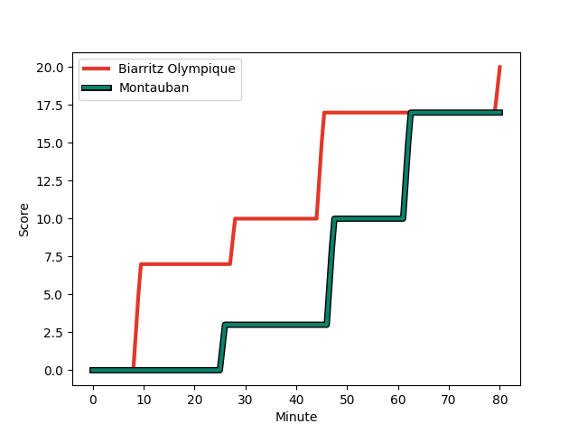
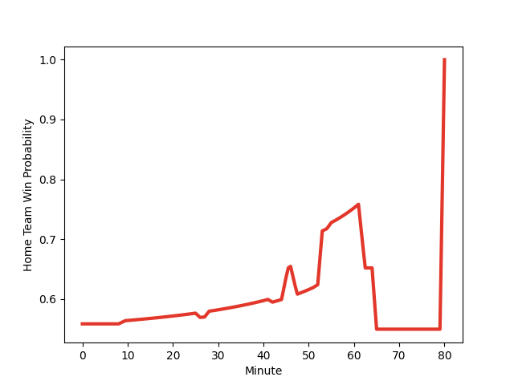

---  
layout: page  
title: Montauban at Biarritz Olympique; 17-20  
date: 2023-01-05 21:00:00 18:00:00 -0500  
categories: match review  
---
# Montauban (1462.71) at Biarritz Olympique (1565.06); 17-20

# Prediction: Biarritz Olympique by 14.2

Biarritz Olympique by 10.2 on a neutral field
## Scores over Time

## Win Probability over Time

# Pre-Match Prediction: Biarritz Olympique by 14.5

Biarritz Olympique by 10.5 on a neutral pitch

|   Away Minutes | Away Player                                                         |   Away elo |   Away Percentile |   Number |   Home Percentile |   Home elo | Home Player                                                                    |   Home Minutes |
|---------------:|:--------------------------------------------------------------------|-----------:|------------------:|---------:|------------------:|-----------:|:-------------------------------------------------------------------------------|---------------:|
|             42 | [Thomas Bue](..//playerfiles//ThomasBue_cleaned.md)                 |     104.67 |                77 |        1 |                74 |     103.36 | [Baptiste Erdocio](..//playerfiles//BaptisteErdocio_cleaned.md)                |             53 |
|             42 | [Arnaud Feltrin](..//playerfiles//ArnaudFeltrin_cleaned.md)         |      80.02 |                13 |        2 |                61 |      99.04 | [Thomas Sauveterre](..//playerfiles//ThomasSauveterre_cleaned.md)              |             63 |
|             42 | [Mirian Burduli](..//playerfiles//MirianBurduli_cleaned.md)         |      98.01 |                58 |        3 |                19 |      85.77 | [Quentin Samaran](..//playerfiles//QuentinSamaran_cleaned.md)                  |             63 |
|             52 | [Dimitri Vaotoa](..//playerfiles//DimitriVaotoa_cleaned.md)         |      88.78 |                29 |        4 |                65 |     101.68 | [Johan Aliouat](..//playerfiles//JohanAliouat_cleaned.md)                      |             53 |
|             52 | [Kevin Gimeno](..//playerfiles//KevinGimeno_cleaned.md)             |      50.32 |                 0 |        5 |                75 |     106.1  | [Josh Tyrell](..//playerfiles//JoshTyrell_cleaned.md)                          |             80 |
|             80 | [Quentin Witt](..//playerfiles//QuentinWitt_cleaned.md)             |      96.89 |                47 |        6 |                40 |      92.18 | [Dave O'Callaghan](..//playerfiles//DaveO'Callaghan_cleaned.md)                |             53 |
|             52 | [Otar Giorgadze](..//playerfiles//OtarGiorgadze_cleaned.md)         |     111.74 |                83 |        7 |                87 |     114.48 | [Thomas Hebert](..//playerfiles//ThomasHebert_cleaned.md)                      |             80 |
|             80 | [Tyrone Viiga](..//playerfiles//TyroneViiga_cleaned.md)             |     108.55 |                75 |        8 |                56 |     100.51 | [Tornike Jalagonia](..//playerfiles//TornikeJalagonia_cleaned.md)              |             80 |
|             65 | [Alexis Bernadet](..//playerfiles//AlexisBernadet_cleaned.md)       |     107.48 |                78 |        9 |                16 |      83.73 | [Kerman Aurrekoetxea](..//playerfiles//KermanAurrekoetxea_cleaned.md)          |             55 |
|             80 | [Tedo Abzhandadze](..//playerfiles//TedoAbzhandadze_cleaned.md)     |     105.27 |                68 |       10 |                72 |     106.12 | [Baptiste Germain](..//playerfiles//BaptisteGermain_cleaned.md)                |             80 |
|             80 | [Bastien Guillemin](..//playerfiles//BastienGuillemin_cleaned.md)   |      99.06 |                59 |       11 |                70 |     105.58 | [Baptiste Fariscot](..//playerfiles//BaptisteFariscot_cleaned.md)              |             80 |
|             65 | [Maxime Mathy](..//playerfiles//MaximeMathy_cleaned.md)             |     114.38 |                85 |       12 |                66 |     103.34 | [Auguste Cadot](..//playerfiles//AugusteCadot_cleaned.md)                      |             55 |
|             80 | [Taleta Tupuola](..//playerfiles//TaletaTupuola_cleaned.md)         |      73.39 |                 6 |       13 |                84 |     113.65 | [Tyler Morgan](..//playerfiles//TylerMorgan_cleaned.md)                        |             55 |
|             80 | [Semesa Rokoduguni](..//playerfiles//SemesaRokoduguni_cleaned.md)   |     127.97 |                95 |       14 |                98 |     142.21 | [Henry Speight](..//playerfiles//HenrySpeight_cleaned.md)                      |             80 |
|             80 | [Jérôme Bosviel](..//playerfiles//JérômeBosviel_cleaned.md)         |     101.4  |                63 |       15 |                81 |     111.73 | [Joe Jonas](..//playerfiles//JoeJonas_cleaned.md)                              |             80 |
|             38 | [Cyril Deligny](..//playerfiles//CyrilDeligny_cleaned.md)           |      75.77 |                 6 |       16 |                 9 |      79.69 | [Zhorzhi (Jorji) Saldadze](..//playerfiles//Zhorzhi(Jorji)Saldadze_cleaned.md) |             27 |
|             38 | [Victor Laval](..//playerfiles//VictorLaval_cleaned.md)             |      95.07 |                39 |       17 |                54 |      97.34 | [Adrian Motoc](..//playerfiles//AdrianMotoc_cleaned.md)                        |             27 |
|             38 | [Nicolas Agnesi](..//playerfiles//NicolasAgnesi_cleaned.md)         |     123.44 |                96 |       18 |                69 |     103.08 | [Temo Matiu](..//playerfiles//TemoMatiu_cleaned.md)                            |             27 |
|             28 | [Alexandre Manukula](..//playerfiles//AlexandreManukula_cleaned.md) |     102.99 |                68 |       19 |                75 |     108.87 | [Ilian Perraux](..//playerfiles//IlianPerraux_cleaned.md)                      |             25 |
|             28 | [Tjuee Uanivi](..//playerfiles//TjueeUanivi_cleaned.md)             |     105.84 |                75 |       20 |                11 |      80.51 | [Barnabe Couilloud](..//playerfiles//BarnabeCouilloud_cleaned.md)              |             25 |
|             28 | [Frédéric Quercy](..//playerfiles//FrédéricQuercy_cleaned.md)       |      56.82 |                 0 |       21 |                88 |     121.06 | [Romain Lonca](..//playerfiles//RomainLonca_cleaned.md)                        |             25 |
|             15 | [Segundo Tuculet](..//playerfiles//SegundoTuculet_cleaned.md)       |      79.98 |                16 |       22 |                40 |      95.06 | [Clement Renaud](..//playerfiles//ClementRenaud_cleaned.md)                    |             17 |
|             15 | [Anthony Meric](..//playerfiles//AnthonyMeric_cleaned.md)           |      57.03 |                 0 |       23 |                12 |      81.88 | [Luka Azariashvili](..//playerfiles//LukaAzariashvili_cleaned.md)              |             17 |

