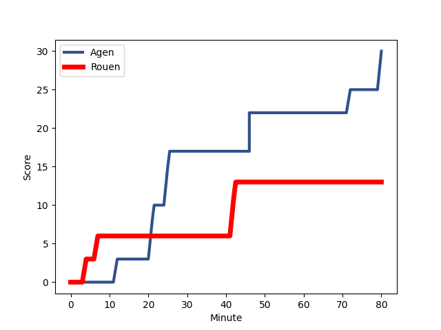
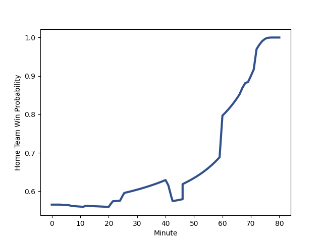

---  
layout: page  
title: Rouen at Agen; 13-30  
date: 2023-01-06 19:00:00 18:00:00 -0500  
categories: match review  
---
# Rouen (1350.96) at Agen (1464.93); 13-30

# Prediction: Agen by 15.4

Agen by 11.4 on a neutral field
## Scores over Time

## Win Probability over Time

# Pre-Match Prediction: Agen by 14.9

Agen by 10.9 on a neutral pitch

|   Away Minutes | Away Player                                                             |   Away elo |   Away Percentile |   Number |   Home Percentile |   Home elo | Home Player                                                             |   Home Minutes |
|---------------:|:------------------------------------------------------------------------|-----------:|------------------:|---------:|------------------:|-----------:|:------------------------------------------------------------------------|---------------:|
|             41 | [Antoine Fournier](..//playerfiles//AntoineFournier_cleaned.md)         |      76.21 |                 7 |        1 |                22 |      86.98 | [Hans Lombard-Buret](..//playerfiles//HansLombard-Buret_cleaned.md)     |             64 |
|             54 | [Lucas Malbert](..//playerfiles//LucasMalbert_cleaned.md)               |      92.92 |               nan |        2 |                85 |     108.87 | [Clement Martinez](..//playerfiles//ClementMartinez_cleaned.md)         |             64 |
|             41 | [Mohamed Boughanmi](..//playerfiles//MohamedBoughanmi_cleaned.md)       |     100.85 |                67 |        3 |                68 |      97.18 | [Alex Burin](..//playerfiles//AlexBurin_cleaned.md)                     |             60 |
|             49 | [Octave Leleu](..//playerfiles//OctaveLeleu_cleaned.md)                 |      95    |               nan |        4 |                13 |      80.14 | [Joe Maksymiw](..//playerfiles//JoeMaksymiw_cleaned.md)                 |             80 |
|             80 | [Jean Leleu](..//playerfiles//JeanLeleu_cleaned.md)                     |     104.15 |                81 |        5 |                62 |     100.35 | [William Demotte](..//playerfiles//WilliamDemotte_cleaned.md)           |             60 |
|             80 | [Lucas Costa](..//playerfiles//LucasCosta_cleaned.md)                   |      87.18 |                30 |        6 |                42 |      92.67 | [Arnaud Duputs](..//playerfiles//ArnaudDuputs_cleaned.md)               |             80 |
|             80 | [Abdelkarim Fofana](..//playerfiles//AbdelkarimFofana_cleaned.md)       |      71.8  |                 4 |        7 |                41 |      91.99 | [Evan Olmstead](..//playerfiles//EvanOlmstead_cleaned.md)               |             67 |
|             72 | [Willy N'Diaye](..//playerfiles//WillyN'Diaye_cleaned.md)               |     110.74 |                82 |        8 |                28 |      88    | [Martin Devergie](..//playerfiles//MartinDevergie_cleaned.md)           |             80 |
|             50 | [Joris Lezat](..//playerfiles//JorisLezat_cleaned.md)                   |      90.96 |                38 |        9 |                31 |      89.6  | [Tane Takulua](..//playerfiles//TaneTakulua_cleaned.md)                 |             67 |
|             58 | [Franck Pourteau](..//playerfiles//FranckPourteau_cleaned.md)           |      91.23 |                32 |       10 |                84 |     115.72 | [Thomas Vincent](..//playerfiles//ThomasVincent_cleaned.md)             |             69 |
|             80 | [Malcolm Bertschy](..//playerfiles//MalcolmBertschy_cleaned.md)         |      93.59 |                45 |       11 |                84 |     113.14 | [Iban Etcheverry](..//playerfiles//IbanEtcheverry_cleaned.md)           |             80 |
|             47 | [Taylor Gontineac](..//playerfiles//TaylorGontineac_cleaned.md)         |      90.75 |                38 |       12 |                75 |     106.97 | [Kolinio Ramoka](..//playerfiles//KolinioRamoka_cleaned.md)             |             80 |
|             80 | [Ugo Delorme](..//playerfiles//UgoDelorme_cleaned.md)                   |      95    |               nan |       13 |                67 |     103.72 | [Harry Sloan](..//playerfiles//HarrySloan_cleaned.md)                   |             63 |
|             80 | [Paul Surano](..//playerfiles//PaulSurano_cleaned.md)                   |      85.67 |                20 |       14 |                37 |      91.27 | [Tevita Railevu](..//playerfiles//TevitaRailevu_cleaned.md)             |             80 |
|             80 | [Kevin Milhorat](..//playerfiles//KevinMilhorat_cleaned.md)             |      80.05 |                20 |       15 |                71 |     106.07 | [Jean-Marcelin Buttin](..//playerfiles//Jean-MarcelinButtin_cleaned.md) |             80 |
|             39 | [Cody Thomas](..//playerfiles//CodyThomas_cleaned.md)                   |     103.87 |                78 |       16 |                29 |      88.7  | [Zak Farrance](..//playerfiles//ZakFarrance_cleaned.md)                 |             20 |
|             39 | [Jérémy Clamy-Edroux](..//playerfiles//JérémyClamy-Edroux_cleaned.md)   |     102.39 |                73 |       17 |               nan |      96.82 | [Beau Farrance](..//playerfiles//BeauFarrance_cleaned.md)               |             20 |
|             33 | [Opetera Peleseuma](..//playerfiles//OpeteraPeleseuma_cleaned.md)       |      90.45 |                36 |       18 |                40 |      89.05 | [Clement Garrigues](..//playerfiles//ClementGarrigues_cleaned.md)       |             17 |
|             31 | [John-Charles Astle](..//playerfiles//John-CharlesAstle_cleaned.md)     |      47.63 |                 0 |       19 |                63 |      99.93 | [Mike Sosene-Feagai](..//playerfiles//MikeSosene-Feagai_cleaned.md)     |             16 |
|             30 | [Florent Campeggia](..//playerfiles//FlorentCampeggia_cleaned.md)       |      71.34 |                 5 |       20 |                75 |     101.34 | [Richard Barrington](..//playerfiles//RichardBarrington_cleaned.md)     |             16 |
|             26 | [Jean-Étienne Lesueur](..//playerfiles//Jean-ÉtienneLesueur_cleaned.md) |      82.1  |                18 |       21 |                87 |     114.16 | [Antoine Erbani](..//playerfiles//AntoineErbani_cleaned.md)             |             13 |
|             22 | [Thibault Olender](..//playerfiles//ThibaultOlender_cleaned.md)         |     101.11 |                60 |       22 |                21 |      82.16 | [Theo Idjellidaine](..//playerfiles//TheoIdjellidaine_cleaned.md)       |             13 |
|              8 | [Tino Mapapalangi](..//playerfiles//TinoMapapalangi_cleaned.md)         |      83.38 |                17 |       23 |                15 |      78.55 | [Danré Gerber](..//playerfiles//DanréGerber_cleaned.md)                 |             11 |

