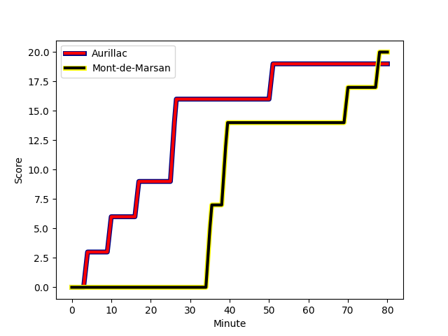
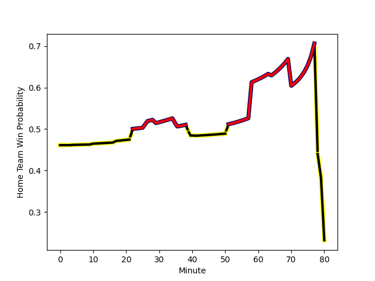

---  
layout: page  
title: Mont-de-Marsan at Aurillac; 20-19  
date: 2023-01-06 19:30:00 18:00:00 -0500  
categories: match review  
---
# Mont-de-Marsan (1556.57) at Aurillac (1489.02); 20-19

# Prediction: Mont-de-Marsan by 2.8

Mont-de-Marsan by 6.8 on a neutral field
## Scores over Time

## Win Probability over Time

# Pre-Match Prediction: Mont-de-Marsan by 4.2

Mont-de-Marsan by 8.2 on a neutral pitch

|   Away Minutes | Away Player                                                                      |   Away elo |   Away Percentile |   Number |   Home Percentile |   Home elo | Home Player                                                               |   Home Minutes |
|---------------:|:---------------------------------------------------------------------------------|-----------:|------------------:|---------:|------------------:|-----------:|:--------------------------------------------------------------------------|---------------:|
|             64 | [Max Curie](..//playerfiles//MaxCurie_cleaned.md)                                |     102.96 |                74 |        1 |                92 |     116.64 | [Alexandre Plantier](..//playerfiles//AlexandrePlantier_cleaned.md)       |             58 |
|             64 | [Romain Laterrade](..//playerfiles//RomainLaterrade_cleaned.md)                  |      96.57 |                55 |        2 |                91 |     117.35 | [Adrian Smith](..//playerfiles//AdrianSmith_cleaned.md)                   |             41 |
|             46 | [Lasha Macharashvili](..//playerfiles//LashaMacharashvili_cleaned.md)            |      83.34 |                14 |        3 |                95 |     121.66 | [Giorgi Kartvelishvili](..//playerfiles//GiorgiKartvelishvili_cleaned.md) |             58 |
|             64 | [Romain Durand](..//playerfiles//RomainDurand_cleaned.md)                        |     115.24 |                83 |        4 |                85 |     113.24 | [Cam Dodson](..//playerfiles//CamDodson_cleaned.md)                       |             64 |
|             80 | [Andrei Ostrikov](..//playerfiles//AndreiOstrikov_cleaned.md)                    |      88.54 |                28 |        5 |                31 |      89.31 | [Jean-Baptiste Singer](..//playerfiles//Jean-BaptisteSinger_cleaned.md)   |             46 |
|             80 | [Léo Banos](..//playerfiles//LéoBanos_cleaned.md)                                |      85.43 |                21 |        6 |                59 |      99.05 | [Eoghan Masterson](..//playerfiles//EoghanMasterson_cleaned.md)           |             80 |
|             80 | [Nicolas Garrault](..//playerfiles//NicolasGarrault_cleaned.md)                  |     133.88 |                97 |        7 |                44 |      93.45 | [Beka Shvangiradze](..//playerfiles//BekaShvangiradze_cleaned.md)         |             80 |
|             41 | [Veresa Tuqovu Ramototabua](..//playerfiles//VeresaTuqovuRamototabua_cleaned.md) |     111.83 |                82 |        8 |                50 |      97.17 | [Dylan Cretin](..//playerfiles//DylanCretin_cleaned.md)                   |             64 |
|             29 | [Christophe Loustalot](..//playerfiles//ChristopheLoustalot_cleaned.md)          |      71.76 |                 4 |        9 |                11 |      80.36 | [David Delarue](..//playerfiles//DavidDelarue_cleaned.md)                 |             68 |
|             80 | [Willie du Plessis](..//playerfiles//WillieduPlessis_cleaned.md)                 |     124.45 |                91 |       10 |                87 |     119.29 | [Marc Palmier](..//playerfiles//MarcPalmier_cleaned.md)                   |             80 |
|             80 | [Kaminieli Rasaku](..//playerfiles//KaminieliRasaku_cleaned.md)                  |     108.26 |                78 |       11 |                23 |      86.56 | [AJ Coertzen](..//playerfiles//AJCoertzen_cleaned.md)                     |             80 |
|             56 | [Simon Renda](..//playerfiles//SimonRenda_cleaned.md)                            |     107.47 |                68 |       12 |                33 |      89.85 | [Christa Powell](..//playerfiles//ChristaPowell_cleaned.md)               |             68 |
|             22 | [Nacani Wakaya](..//playerfiles//NacaniWakaya_cleaned.md)                        |     129.38 |                95 |       13 |                50 |      96.45 | [Jimmy Yobo](..//playerfiles//JimmyYobo_cleaned.md)                       |             80 |
|             80 | [Alexandre de Nardi](..//playerfiles//AlexandredeNardi_cleaned.md)               |      94.75 |                47 |       14 |                86 |     115.24 | [Giorgi Gogoladze](..//playerfiles//GiorgiGogoladze_cleaned.md)           |             80 |
|             80 | [Yoann Laousse Azpiazu](..//playerfiles//YoannLaousseAzpiazu_cleaned.md)         |     146.49 |                98 |       15 |                10 |      74.22 | [Anderson Neisen](..//playerfiles//AndersonNeisen_cleaned.md)             |             80 |
|             58 | [Jules Even](..//playerfiles//JulesEven_cleaned.md)                              |      71.59 |                 5 |       16 |                88 |     115.04 | [Luka Nioradze](..//playerfiles//LukaNioradze_cleaned.md)                 |             39 |
|             51 | [Martin Doan](..//playerfiles//MartinDoan_cleaned.md)                            |      94.64 |                41 |       17 |                51 |      96.19 | [Georgi Javakhia](..//playerfiles//GeorgiJavakhia_cleaned.md)             |             34 |
|             39 | [Mike Faleafa](..//playerfiles//MikeFaleafa_cleaned.md)                          |      86.16 |                23 |       18 |                23 |      88.27 | [Jean-Jacques Gymael](..//playerfiles//Jean-JacquesGymael_cleaned.md)     |             22 |
|             34 | [Gheorge Gajion](..//playerfiles//GheorgeGajion_cleaned.md)                      |      79.18 |                 9 |       19 |                27 |      89.87 | [Tim Daniel-Meissen](..//playerfiles//TimDaniel-Meissen_cleaned.md)       |             22 |
|             24 | [Simon Desaubies](..//playerfiles//SimonDesaubies_cleaned.md)                    |      87.79 |                24 |       20 |                16 |      83.36 | [Théo Cambon](..//playerfiles//ThéoCambon_cleaned.md)                     |             16 |
|             16 | [Dino Casadei](..//playerfiles//DinoCasadei_cleaned.md)                          |      97.27 |                48 |       21 |                27 |      88.84 | [Latuka Maituku](..//playerfiles//LatukaMaituku_cleaned.md)               |             16 |
|             16 | [Baptiste Hezard](..//playerfiles//BaptisteHezard_cleaned.md)                    |     124.61 |                94 |       22 |                37 |      91.31 | [Mikheil Alania](..//playerfiles//MikheilAlania_cleaned.md)               |             12 |
|             16 | [Jose Luis Gonzalez](..//playerfiles//JoseLuisGonzalez_cleaned.md)               |     111.48 |                84 |       23 |                26 |      89.44 | [Antoine Aucagne](..//playerfiles//AntoineAucagne_cleaned.md)             |             12 |

