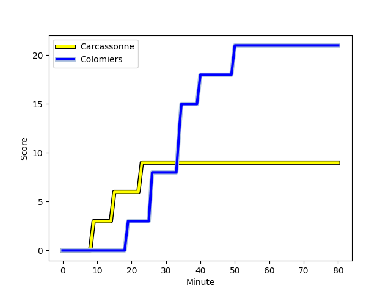
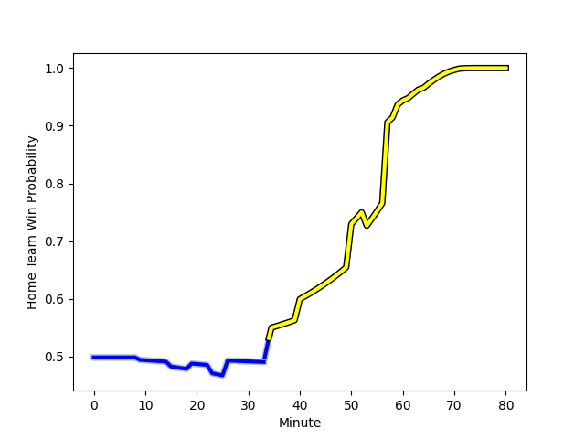

---  
layout: page  
title: Colomiers at Carcassonne; 21-9  
date: 2023-01-06 19:30:00 18:00:00 -0500  
categories: match review  
---
# Colomiers (1437.7) at Carcassonne (1434.86); 21-9

# Prediction: Carcassonne by 3.7

Colomiers by 0.3 on a neutral field
## Scores over Time

## Win Probability over Time

# Pre-Match Prediction: Colomiers by 1.1

Colomiers by 2.9 on a neutral pitch

|   Away Minutes | Away Player                                                               |   Away elo |   Away Percentile |   Number |   Home Percentile |   Home elo | Home Player                                                              |   Home Minutes |
|---------------:|:--------------------------------------------------------------------------|-----------:|------------------:|---------:|------------------:|-----------:|:-------------------------------------------------------------------------|---------------:|
|             50 | [Guillaume Tartas](..//playerfiles//GuillaumeTartas_cleaned.md)           |     125.42 |                96 |        1 |                 9 |      78.51 | [Youssef Amrouni](..//playerfiles//YoussefAmrouni_cleaned.md)            |             64 |
|             26 | [Hika Elliot](..//playerfiles//HikaElliot_cleaned.md)                     |     104.13 |                71 |        2 |                36 |      90.87 | [Raphael Carbou](..//playerfiles//RaphaelCarbou_cleaned.md)              |             64 |
|             50 | [Beka Sheklashvili](..//playerfiles//BekaSheklashvili_cleaned.md)         |      93.58 |                42 |        3 |                20 |      86.34 | [Soso Bekoshvili](..//playerfiles//SosoBekoshvili_cleaned.md)            |             59 |
|             53 | [Jean Thomas](..//playerfiles//JeanThomas_cleaned.md)                     |     102.03 |                66 |        4 |                35 |      90.89 | [George Merrick](..//playerfiles//GeorgeMerrick_cleaned.md)              |             67 |
|             80 | [Alexandre Ricard](..//playerfiles//AlexandreRicard_cleaned.md)           |      97.62 |                51 |        5 |                58 |      99.02 | [Rynard Landman](..//playerfiles//RynardLandman_cleaned.md)              |             80 |
|             80 | [Anthony Coletta](..//playerfiles//AnthonyColetta_cleaned.md)             |      58.4  |                 1 |        6 |                83 |     112.58 | [Aaron Carroll](..//playerfiles//AaronCarroll_cleaned.md)                |             80 |
|             53 | [Aldric Lescure](..//playerfiles//AldricLescure_cleaned.md)               |     106.66 |                71 |        7 |                76 |     107.05 | [Rob Harley](..//playerfiles//RobHarley_cleaned.md)                      |             80 |
|             80 | [Jorick Dastugue](..//playerfiles//JorickDastugue_cleaned.md)             |      92.6  |                36 |        8 |               nan |      91.13 | [Guilhem Vettore](..//playerfiles//GuilhemVettore_cleaned.md)            |             57 |
|             61 | [Mathis Galthié](..//playerfiles//MathisGalthié_cleaned.md)               |      93.89 |               nan |        9 |                98 |     134.13 | [Samuel Marques](..//playerfiles//SamuelMarques_cleaned.md)              |             71 |
|             80 | [Maxime Javaux](..//playerfiles//MaximeJavaux_cleaned.md)                 |      63.03 |                 1 |       10 |                45 |      95.46 | [Dorian Jones](..//playerfiles//DorianJones_cleaned.md)                  |             64 |
|             61 | [Alexis Palisson](..//playerfiles//AlexisPalisson_cleaned.md)             |     106.41 |                75 |       11 |                74 |     105.93 | [Martin Dulon](..//playerfiles//MartinDulon_cleaned.md)                  |             80 |
|             80 | [Johan Deysel (Jnr)](..//playerfiles//JohanDeysel(Jnr)_cleaned.md)        |     130.81 |                96 |       12 |                64 |     101.94 | [Nick Grigg](..//playerfiles//NickGrigg_cleaned.md)                      |             80 |
|             64 | [Fabien Perrin](..//playerfiles//FabienPerrin_cleaned.md)                 |      97.64 |                53 |       13 |                 0 |      57.36 | [Pierre Aguillon](..//playerfiles//PierreAguillon_cleaned.md)            |             80 |
|             80 | [Simon Delas](..//playerfiles//SimonDelas_cleaned.md)                     |      82.69 |               nan |       14 |                92 |     122.99 | [Benoit Jasmin](..//playerfiles//BenoitJasmin_cleaned.md)                |             80 |
|             80 | [Max Auriac](..//playerfiles//MaxAuriac_cleaned.md)                       |     103.17 |                65 |       15 |                26 |      85.28 | [Baptiste Mouchous](..//playerfiles//BaptisteMouchous_cleaned.md)        |             53 |
|             54 | [Andrew Ready](..//playerfiles//AndrewReady_cleaned.md)                   |      97.15 |                57 |       16 |                16 |      80.14 | [Maxime Gianet](..//playerfiles//MaximeGianet_cleaned.md)                |             27 |
|             30 | [Marco Fepulea'i](..//playerfiles//MarcoFepulea'i_cleaned.md)             |     139.6  |                99 |       17 |                 2 |      64.76 | [Stephane Onambele](..//playerfiles//StephaneOnambele_cleaned.md)        |             23 |
|             30 | [Hugo Djehi](..//playerfiles//HugoDjehi_cleaned.md)                       |      78.36 |                 8 |       18 |                 0 |      50.59 | [Vakhtangi Akhobadze](..//playerfiles//VakhtangiAkhobadze_cleaned.md)    |             21 |
|             27 | [Pierre-Samuel Pacheco](..//playerfiles//Pierre-SamuelPacheco_cleaned.md) |      88.63 |                29 |       19 |                10 |      75.2  | [Jules Martinez](..//playerfiles//JulesMartinez_cleaned.md)              |             16 |
|             27 | [Maxime Granouillet](..//playerfiles//MaximeGranouillet_cleaned.md)       |      95.85 |                37 |       20 |               nan |      94.75 | [Luka Petriashvili](..//playerfiles//LukaPetriashvili_cleaned.md)        |             16 |
|             19 | [Ugo Seguela](..//playerfiles//UgoSeguela_cleaned.md)                     |     104.99 |                73 |       21 |                37 |      92.25 | [Chris Hilsenbeck](..//playerfiles//ChrisHilsenbeck_cleaned.md)          |             16 |
|             19 | [Peni Rokoduguni](..//playerfiles//PeniRokoduguni_cleaned.md)             |      84.21 |                17 |       22 |                41 |      90.24 | [Come Clayver Joussain](..//playerfiles//ComeClayverJoussain_cleaned.md) |             13 |
|             16 | [Victor Moro](..//playerfiles//VictorMoro_cleaned.md)                     |      75.33 |                 8 |       23 |                23 |      87.13 | [Damien Añon](..//playerfiles//DamienAñon_cleaned.md)                    |              9 |

