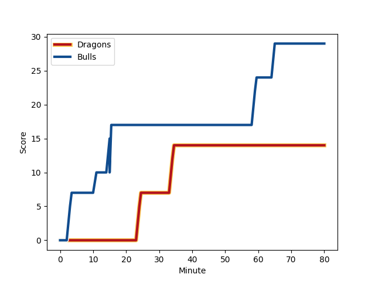
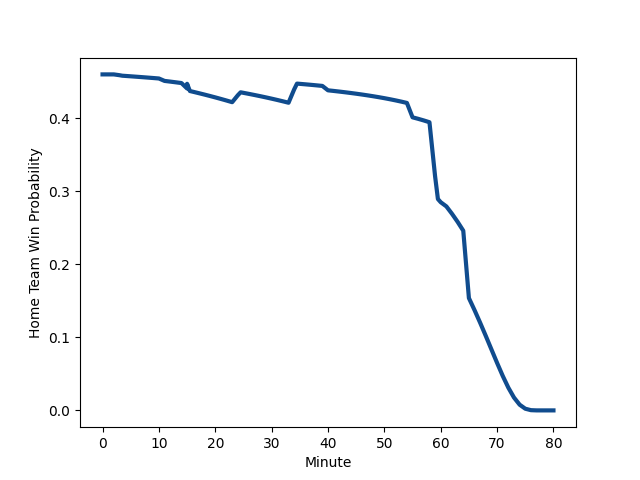

---  
layout: page  
title: Bulls at Dragons; 29-14  
date: 2023-01-06 20:35:00 18:00:00 -0500  
categories: match review  
---
# Bulls (1615.42) at Dragons (1545.92); 29-14

# Prediction: Bulls by 2.9

Bulls by 6.9 on a neutral field
## Scores over Time

## Win Probability over Time

# Pre-Match Prediction: Bulls by 0.2

Bulls by 3.8 on a neutral pitch

|   Away Minutes | Away Player                                                          |   Away elo |   Away Percentile |   Number |   Home Percentile |   Home elo | Home Player                                                       |   Home Minutes |
|---------------:|:---------------------------------------------------------------------|-----------:|------------------:|---------:|------------------:|-----------:|:------------------------------------------------------------------|---------------:|
|             64 | [Gerhard Steenekamp](..//playerfiles//GerhardSteenekamp_cleaned.md)  |     105.99 |                82 |        1 |                80 |     106.11 | [Aki Seiuli](..//playerfiles//AkiSeiuli_cleaned.md)               |             55 |
|             64 | [Johan Grobbelaar](..//playerfiles//JohanGrobbelaar_cleaned.md)      |     136.39 |                99 |        2 |                28 |      87.97 | [Bradley Roberts](..//playerfiles//BradleyRoberts_cleaned.md)     |             61 |
|             64 | [Mornay Smith](..//playerfiles//MornaySmith_cleaned.md)              |      93.6  |                44 |        3 |                23 |      87.39 | [Chris Coleman](..//playerfiles//ChrisColeman_cleaned.md)         |             40 |
|             62 | [Ruan Vermaak](..//playerfiles//RuanVermaak_cleaned.md)              |      88.7  |                29 |        4 |                26 |      87.83 | [Joseph Davies](..//playerfiles//JosephDavies_cleaned.md)         |             80 |
|             80 | [Ruan Nortje](..//playerfiles//RuanNortje_cleaned.md)                |      99.14 |                59 |        5 |                27 |      87.92 | [George Nott](..//playerfiles//GeorgeNott_cleaned.md)             |             69 |
|             80 | [Marco van Staden](..//playerfiles//MarcovanStaden_cleaned.md)       |      98.24 |                56 |        6 |                15 |      81.76 | [Sean Lonsdale](..//playerfiles//SeanLonsdale_cleaned.md)         |             80 |
|             62 | [Cyle Brink](..//playerfiles//CyleBrink_cleaned.md)                  |      94.51 |                46 |        7 |                85 |     114.34 | [Ollie Griffiths](..//playerfiles//OllieGriffiths_cleaned.md)     |             40 |
|             80 | [Elrigh Louw](..//playerfiles//ElrighLouw_cleaned.md)                |      94.79 |                42 |        8 |                86 |     116.18 | [Ross Moriarty](..//playerfiles//RossMoriarty_cleaned.md)         |             55 |
|             66 | [Zak Burger](..//playerfiles//ZakBurger_cleaned.md)                  |     108.93 |                80 |        9 |                65 |     102.03 | [Lewis Jones](..//playerfiles//LewisJones_cleaned.md)             |             55 |
|             80 | [Johan Goosen](..//playerfiles//JohanGoosen_cleaned.md)              |      88.76 |                33 |       10 |                91 |     125.42 | [Sam Davies](..//playerfiles//SamDavies_cleaned.md)               |             69 |
|             80 | [David Kriel](..//playerfiles//DavidKriel_cleaned.md)                |     126.97 |                95 |       11 |                88 |     117.8  | [Sio Tomkinson](..//playerfiles//SioTomkinson_cleaned.md)         |             80 |
|             80 | [Harold Vorster](..//playerfiles//HaroldVorster_cleaned.md)          |     125.93 |                94 |       12 |                98 |     135.63 | [Max Clark](..//playerfiles//MaxClark_cleaned.md)                 |             80 |
|             80 | [Wandisile Simelane](..//playerfiles//WandisileSimelane_cleaned.md)  |     101.43 |                62 |       13 |                96 |     131.14 | [Steffan Hughes](..//playerfiles//SteffanHughes_cleaned.md)       |             80 |
|             69 | [Canan Moodie](..//playerfiles//CananMoodie_cleaned.md)              |     119.67 |                90 |       14 |                 2 |      63.52 | [Rio Dyer](..//playerfiles//RioDyer_cleaned.md)                   |             80 |
|             80 | [Kurt-Lee Arendse](..//playerfiles//Kurt-LeeArendse_cleaned.md)      |     143.01 |                98 |       15 |                80 |     110.93 | [Jordan Williams](..//playerfiles//JordanWilliams_cleaned.md)     |             80 |
|             18 | [Janko Swanepoel](..//playerfiles//JankoSwanepoel_cleaned.md)        |      93.72 |                46 |       16 |                72 |     105.08 | [Taine Basham](..//playerfiles//TaineBasham_cleaned.md)           |             40 |
|             18 | [Nizaam Carr](..//playerfiles//NizaamCarr_cleaned.md)                |      80.97 |                13 |       17 |                11 |      76.55 | [Lloyd Fairbrother](..//playerfiles//LloydFairbrother_cleaned.md) |             40 |
|             16 | [Simphiwe Matanzima](..//playerfiles//SimphiweMatanzima_cleaned.md)  |     102.76 |                73 |       18 |                92 |     117.16 | [Rob Evans](..//playerfiles//RobEvans_cleaned.md)                 |             25 |
|             16 | [Bismarck du Plessis](..//playerfiles//BismarckduPlessis_cleaned.md) |     112.23 |                86 |       19 |                82 |     112.04 | [Ben Fry](..//playerfiles//BenFry_cleaned.md)                     |             25 |
|             16 | [Sebastian Lombard](..//playerfiles//SebastianLombard_cleaned.md)    |      92.63 |               nan |       20 |                70 |     103.8  | [Gonzalo Bertranou](..//playerfiles//GonzaloBertranou_cleaned.md) |             25 |
|             14 | [Embrose Papier](..//playerfiles//EmbrosePapier_cleaned.md)          |     108.13 |                80 |       21 |               nan |      95.45 | [Brodie Coghlan](..//playerfiles//BrodieCoghlan_cleaned.md)       |             19 |
|             11 | [Cornal Hendricks](..//playerfiles//CornalHendricks_cleaned.md)      |      98.59 |                54 |       22 |                14 |      81.46 | [Huw Taylor](..//playerfiles//HuwTaylor_cleaned.md)               |             11 |
|            nan | nan                                                                  |     nan    |               nan |       23 |                50 |      99.24 | [Will Reed](..//playerfiles//WillReed_cleaned.md)                 |             11 |

