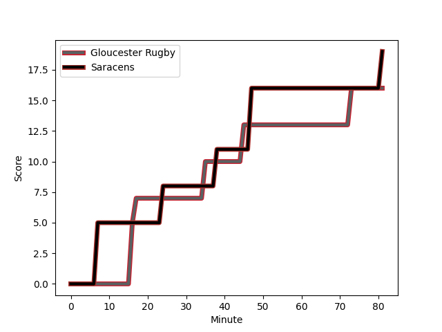

---  
layout: page  
title: Saracens at Gloucester Rugby; 19-16  
date: 2023-01-06 14:45:00 18:00:00 -0500  
categories: match review  
---
# Saracens (1645.15) at Gloucester Rugby (1629.5); 19-16

# Prediction: Gloucester Rugby by 2.4

Saracens by 1.6 on a neutral field
## Scores over Time

## Win Probability over Time

# Pre-Match Prediction: Saracens by 1.7

Saracens by 2.3 on a neutral pitch

|   Away Minutes | Away Player                                                   |   Away elo |   Away Percentile |   Number |   Home Percentile |   Home elo | Home Player                                                       |   Home Minutes |
|---------------:|:--------------------------------------------------------------|-----------:|------------------:|---------:|------------------:|-----------:|:------------------------------------------------------------------|---------------:|
|             62 | [Mako Vunipola](..//playerfiles//MakoVunipola_cleaned.md)     |     137.86 |                99 |        1 |                40 |      92.63 | [Val Rapava-Ruskin](..//playerfiles//ValRapava-Ruskin_cleaned.md) |             41 |
|             81 | [Jamie George](..//playerfiles//JamieGeorge_cleaned.md)       |     153.71 |               100 |        2 |                57 |      96.63 | [George McGuigan](..//playerfiles//GeorgeMcGuigan_cleaned.md)     |             72 |
|             73 | [Marco Riccioni](..//playerfiles//MarcoRiccioni_cleaned.md)   |     101.21 |                68 |        3 |                91 |     116.25 | [Kirill Gotovtsev](..//playerfiles//KirillGotovtsev_cleaned.md)   |             81 |
|             81 | [Maro Itoje](..//playerfiles//MaroItoje_cleaned.md)           |     103.55 |                70 |        4 |                71 |     104.34 | [Freddie Clarke](..//playerfiles//FreddieClarke_cleaned.md)       |             68 |
|             59 | [Hugh Tizard](..//playerfiles//HughTizard_cleaned.md)         |     101.47 |                63 |        5 |                89 |     117.27 | [Matias Alemanno](..//playerfiles//MatiasAlemanno_cleaned.md)     |             81 |
|             49 | [Andy Christie](..//playerfiles//AndyChristie_cleaned.md)     |      90.54 |                36 |        6 |                88 |     117.23 | [Ruan Ackermann](..//playerfiles//RuanAckermann_cleaned.md)       |             81 |
|             81 | [Ben Earl](..//playerfiles//BenEarl_cleaned.md)               |     109.29 |                80 |        7 |                43 |      93.27 | [Lewis Ludlow](..//playerfiles//LewisLudlow_cleaned.md)           |             81 |
|             81 | [Billy Vunipola](..//playerfiles//BillyVunipola_cleaned.md)   |     111.58 |                81 |        8 |                77 |     109.34 | [Ben Morgan](..//playerfiles//BenMorgan_cleaned.md)               |             68 |
|             59 | [Aled Davies](..//playerfiles//AledDavies_cleaned.md)         |      94.56 |                44 |        9 |                77 |     106.67 | [Ben Meehan](..//playerfiles//BenMeehan_cleaned.md)               |             72 |
|             81 | [Owen Farrell](..//playerfiles//OwenFarrell_cleaned.md)       |     136.48 |                96 |       10 |                98 |     145.93 | [Santiago Carreras](..//playerfiles//SantiagoCarreras_cleaned.md) |             81 |
|             68 | [Alex Lewington](..//playerfiles//AlexLewington_cleaned.md)   |      85.1  |                17 |       11 |                79 |     109.17 | [Ollie Thorley](..//playerfiles//OllieThorley_cleaned.md)         |             81 |
|             53 | [Duncan Taylor](..//playerfiles//DuncanTaylor_cleaned.md)     |     125.8  |                94 |       12 |                75 |     106.94 | [Giorgi Kveseladze](..//playerfiles//GiorgiKveseladze_cleaned.md) |             81 |
|             81 | [Alex Lozowski](..//playerfiles//AlexLozowski_cleaned.md)     |     102.58 |                64 |       13 |                84 |     112.99 | [Chris Harris](..//playerfiles//ChrisHarris_cleaned.md)           |             81 |
|             81 | [Max Malins](..//playerfiles//MaxMalins_cleaned.md)           |      92.09 |                39 |       14 |                55 |      97.83 | [Jonny May](..//playerfiles//JonnyMay_cleaned.md)                 |             68 |
|             81 | [Alex Goode](..//playerfiles//AlexGoode_cleaned.md)           |     108.15 |                75 |       15 |                91 |     124.12 | [Lloyd Evans](..//playerfiles//LloydEvans_cleaned.md)             |             39 |
|              4 | [Theo Dan](..//playerfiles//TheoDan_cleaned.md)               |     118.54 |                93 |       16 |               nan |      95    | [Sebastian Blake](..//playerfiles//SebastianBlake_cleaned.md)     |              9 |
|             19 | [Eroni Mawi](..//playerfiles//EroniMawi_cleaned.md)           |      73.38 |                 5 |       17 |                51 |      95.79 | [Harry Elrington](..//playerfiles//HarryElrington_cleaned.md)     |             40 |
|              8 | [Christian Judge](..//playerfiles//ChristianJudge_cleaned.md) |      95.63 |                51 |       18 |                 0 |      57.52 | [Ciaran Knight](..//playerfiles//CiaranKnight_cleaned.md)         |              0 |
|             32 | [Nick Isiekwe](..//playerfiles//NickIsiekwe_cleaned.md)       |      86.98 |                24 |       19 |                91 |     114.42 | [Cameron Jordan](..//playerfiles//CameronJordan_cleaned.md)       |             13 |
|             18 | [Jackson Wray](..//playerfiles//JacksonWray_cleaned.md)       |     139.53 |                98 |       20 |                51 |      96.63 | [Jack Clement](..//playerfiles//JackClement_cleaned.md)           |             13 |
|             22 | [Ivan van Zyl](..//playerfiles//IvanvanZyl_cleaned.md)        |     116.06 |                90 |       21 |                 8 |      78.02 | [Stephen Varney](..//playerfiles//StephenVarney_cleaned.md)       |              9 |
|             28 | [Josh Hallett](..//playerfiles//JoshHallett_cleaned.md)       |      95.82 |               nan |       22 |                95 |     130.64 | [Billy Twelvetrees](..//playerfiles//BillyTwelvetrees_cleaned.md) |             13 |
|             13 | [Rotimi Segun](..//playerfiles//RotimiSegun_cleaned.md)       |     106.71 |                76 |       23 |                10 |      77.5  | [Tom Seabrook](..//playerfiles//TomSeabrook_cleaned.md)           |             42 |

