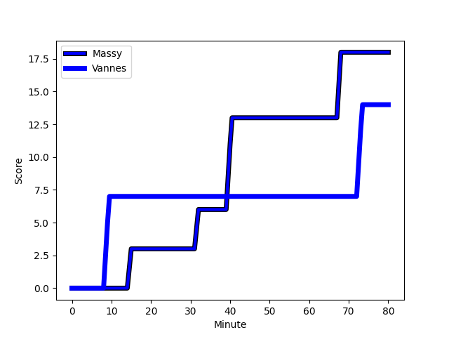
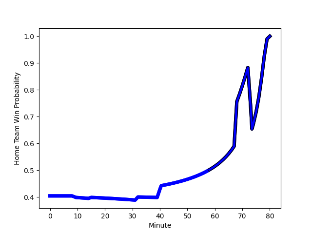

---  
layout: page  
title: Vannes at Massy; 14-18  
date: 2023-01-06 19:30:00 18:00:00 -0500  
categories: match review  
---
# Vannes (1531.75) at Massy (1363.43); 14-18

# Prediction: Vannes by 12.8

Vannes by 16.8 on a neutral field
## Scores over Time

## Win Probability over Time

# Pre-Match Prediction: Vannes by 8.9

Vannes by 12.9 on a neutral pitch

|   Away Minutes | Away Player                                                                |   Away elo |   Away Percentile |   Number |   Home Percentile |   Home elo | Home Player                                                                     |   Home Minutes |
|---------------:|:---------------------------------------------------------------------------|-----------:|------------------:|---------:|------------------:|-----------:|:--------------------------------------------------------------------------------|---------------:|
|             46 | [Andy Bordelai](..//playerfiles//AndyBordelai_cleaned.md)                  |     114.48 |                90 |        1 |                36 |      89.81 | [Robin Poipy](..//playerfiles//RobinPoipy_cleaned.md)                           |             48 |
|             46 | [Cyril Blanchard](..//playerfiles//CyrilBlanchard_cleaned.md)              |     110.85 |                84 |        2 |                93 |     118.38 | [Pierre Trassoudaine](..//playerfiles//PierreTrassoudaine_cleaned.md)           |             40 |
|             46 | [Phil Kite](..//playerfiles//PhilKite_cleaned.md)                          |      92.32 |                42 |        3 |                43 |      91.92 | [Tijde Visser](..//playerfiles//TijdeVisser_cleaned.md)                         |             47 |
|             40 | [Edoardo Iachizzi](..//playerfiles//EdoardoIachizzi_cleaned.md)            |      98.09 |                56 |        4 |                44 |      93.94 | [Andrew Chauveau](..//playerfiles//AndrewChauveau_cleaned.md)                   |             80 |
|             61 | [Ewan Thomas Johnson](..//playerfiles//EwanThomasJohnson_cleaned.md)       |     100.59 |                63 |        5 |                79 |     108.52 | [Marco Fuser](..//playerfiles//MarcoFuser_cleaned.md)                           |             12 |
|             60 | [Karl Chateau](..//playerfiles//KarlChateau_cleaned.md)                    |      75.64 |                 7 |        6 |                42 |      93.06 | [Jean Maurice Decubber](..//playerfiles//JeanMauriceDecubber_cleaned.md)        |             80 |
|             80 | [Francisco Gorrissen](..//playerfiles//FranciscoGorrissen_cleaned.md)      |     166.11 |               100 |        7 |                46 |      94.4  | [Samuel Nollet](..//playerfiles//SamuelNollet_cleaned.md)                       |             63 |
|             80 | [Joe Edwards](..//playerfiles//JoeEdwards_cleaned.md)                      |     110.78 |                80 |        8 |                15 |      81.86 | [Yohann Gbizie](..//playerfiles//YohannGbizie_cleaned.md)                       |             80 |
|             47 | [Alexandre Gouaux](..//playerfiles//AlexandreGouaux_cleaned.md)            |      99.39 |                58 |        9 |                89 |     114.87 | [Benjamin Prier](..//playerfiles//BenjaminPrier_cleaned.md)                     |             52 |
|             46 | [Jean Chezeau](..//playerfiles//JeanChezeau_cleaned.md)                    |      94.49 |               nan |       10 |                61 |     100.95 | [Massimo Ortolan](..//playerfiles//MassimoOrtolan_cleaned.md)                   |             65 |
|             80 | [Romaric Camou](..//playerfiles//RomaricCamou_cleaned.md)                  |     101.06 |                61 |       11 |                15 |      83.37 | [Nathan Farissier](..//playerfiles//NathanFarissier_cleaned.md)                 |             80 |
|             80 | [Andres Vilaseca Hontou](..//playerfiles//AndresVilasecaHontou_cleaned.md) |     104.72 |                70 |       12 |                16 |      82.21 | [Victorien Jacomme](..//playerfiles//VictorienJacomme_cleaned.md)               |             80 |
|             80 | [Branden Holder](..//playerfiles//BrandenHolder_cleaned.md)                |      91.63 |                37 |       13 |                48 |      95.57 | [JJ Taulagi](..//playerfiles//JJTaulagi_cleaned.md)                             |             80 |
|             80 | [Nathanael Hulleu](..//playerfiles//NathanaelHulleu_cleaned.md)            |     100.01 |                62 |       14 |                32 |      88.43 | [Martin Carré](..//playerfiles//MartinCarré_cleaned.md)                         |             55 |
|             80 | [Nick Abendanon](..//playerfiles//NickAbendanon_cleaned.md)                |     101.55 |                62 |       15 |                11 |      75.8  | [Romain Clouté](..//playerfiles//RomainClouté_cleaned.md)                       |             80 |
|             40 | [Eric Marks](..//playerfiles//EricMarks_cleaned.md)                        |      46.68 |                 0 |       16 |                 9 |      76.26 | [Dion Evrard Oulai](..//playerfiles//DionEvrardOulai_cleaned.md)                |             68 |
|             34 | [Charles-Henri Berguet](..//playerfiles//Charles-HenriBerguet_cleaned.md)  |      93.84 |                44 |       17 |                36 |      90.93 | [Pierre-Alexandre Duclieu](..//playerfiles//Pierre-AlexandreDuclieu_cleaned.md) |             40 |
|             34 | [Pat Leafa](..//playerfiles//PatLeafa_cleaned.md)                          |     110.06 |                84 |       18 |                80 |     106.37 | [Nicolas Ferrer](..//playerfiles//NicolasFerrer_cleaned.md)                     |             33 |
|             34 | [Paga Tafili](..//playerfiles//PagaTafili_cleaned.md)                      |     132.33 |                98 |       19 |                 1 |      64.68 | [Ushangi Tcheishvili](..//playerfiles//UshangiTcheishvili_cleaned.md)           |             32 |
|             34 | [Maxime Lafage](..//playerfiles//MaximeLafage_cleaned.md)                  |     101.1  |                60 |       20 |                67 |     102.76 | [Gaetan Pichon](..//playerfiles//GaetanPichon_cleaned.md)                       |             28 |
|             33 | [Will Percillier](..//playerfiles//WillPercillier_cleaned.md)              |      83.59 |                16 |       21 |                75 |     106.15 | [Arthur Seigneuret](..//playerfiles//ArthurSeigneuret_cleaned.md)               |             25 |
|             20 | [Gregoire Bazin](..//playerfiles//GregoireBazin_cleaned.md)                |      75.25 |                 7 |       22 |                 7 |      74.63 | [Abongile Nonkontwana](..//playerfiles//AbongileNonkontwana_cleaned.md)         |             17 |
|             19 | [Myles Edwards](..//playerfiles//MylesEdwards_cleaned.md)                  |      65.38 |                 3 |       23 |                42 |      92.84 | [Tom Deleuze](..//playerfiles//TomDeleuze_cleaned.md)                           |             15 |

