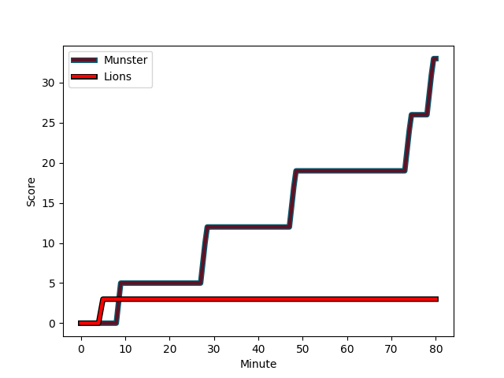
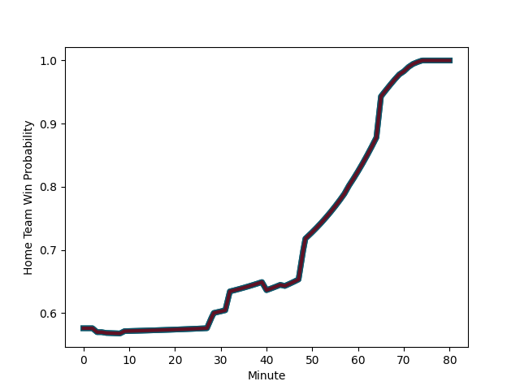

---  
layout: page  
title: Lions at Munster; 3-33  
date: 2023-01-06 20:35:00 18:00:00 -0500  
categories: match review  
---
# Lions (1440.17) at Munster (1573.47); 3-33

# Prediction: Munster by 17.3

Munster by 13.3 on a neutral field
## Scores over Time

## Win Probability over Time

# Pre-Match Prediction: Munster by 16.6

Munster by 12.6 on a neutral pitch

|   Away Minutes | Away Player                                                                   |   Away elo |   Away Percentile |   Number |   Home Percentile |   Home elo | Home Player                                                     |   Home Minutes |
|---------------:|:------------------------------------------------------------------------------|-----------:|------------------:|---------:|------------------:|-----------:|:----------------------------------------------------------------|---------------:|
|             73 | [Jean-Pierre Smith](..//playerfiles//Jean-PierreSmith_cleaned.md)             |      92.68 |                40 |        1 |                17 |      84.14 | [Josh Wycherley](..//playerfiles//JoshWycherley_cleaned.md)     |             32 |
|             70 | [PJ Botha](..//playerfiles//PJBotha_cleaned.md)                               |      86.59 |                24 |        2 |                91 |     120.23 | [Diarmuid Barron](..//playerfiles//DiarmuidBarron_cleaned.md)   |              3 |
|             65 | [Asenathi Ntlabakanye](..//playerfiles//AsenathiNtlabakanye_cleaned.md)       |      75.66 |                 6 |        3 |                71 |     102.29 | [Roman Salanoa](..//playerfiles//RomanSalanoa_cleaned.md)       |             44 |
|             44 | [Ruan Venter](..//playerfiles//RuanVenter_cleaned.md)                         |     107.39 |                77 |        4 |                48 |      95.2  | [Jean Kleyn](..//playerfiles//JeanKleyn_cleaned.md)             |             56 |
|             80 | [Darrien-Lane Landsberg](..//playerfiles//Darrien-LaneLandsberg_cleaned.md)   |      96.88 |                52 |        5 |                79 |     109.92 | [Gavin Coombes](..//playerfiles//GavinCoombes_cleaned.md)       |             80 |
|             70 | [Jarod Cairns](..//playerfiles//JarodCairns_cleaned.md)                       |      70.29 |                 4 |        6 |                87 |     114.25 | [Jack O'Donoghue](..//playerfiles//JackO'Donoghue_cleaned.md)   |             80 |
|             80 | [Emile van Heerden](..//playerfiles//EmilevanHeerden_cleaned.md)              |      87.91 |                27 |        7 |                51 |      96.45 | [John Hodnett](..//playerfiles//JohnHodnett_cleaned.md)         |             71 |
|             80 | [Emmanuel Tshituka](..//playerfiles//EmmanuelTshituka_cleaned.md)             |      75.53 |                 8 |        8 |                63 |     100.43 | [Alex Kendellen](..//playerfiles//AlexKendellen_cleaned.md)     |             80 |
|             76 | [Morne Van den Berg](..//playerfiles//MorneVandenBerg_cleaned.md)             |      83.2  |                13 |        9 |                54 |      97.98 | [Paddy Patterson](..//playerfiles//PaddyPatterson_cleaned.md)   |             58 |
|             40 | [Jordan Hendrikse](..//playerfiles//JordanHendrikse_cleaned.md)               |      75.63 |                 6 |       10 |                18 |      90.46 | [Ben Healy](..//playerfiles//BenHealy_cleaned.md)               |             80 |
|             80 | [Edwill van der Merwe](..//playerfiles//EdwillvanderMerwe_cleaned.md)         |     113.1  |                84 |       11 |                18 |      84.72 | [Liam Coombes](..//playerfiles//LiamCoombes_cleaned.md)         |             80 |
|             80 | [Marius Louw](..//playerfiles//MariusLouw_cleaned.md)                         |     118.68 |                89 |       12 |                81 |     111.76 | [Rory Scannell](..//playerfiles//RoryScannell_cleaned.md)       |             58 |
|             55 | [Henco van Wyk](..//playerfiles//HencovanWyk_cleaned.md)                      |     112.41 |                83 |       13 |                93 |     124.9  | [Malakai Fekitoa](..//playerfiles//MalakaiFekitoa_cleaned.md)   |             80 |
|             80 | [Stean Pienaar](..//playerfiles//SteanPienaar_cleaned.md)                     |     111.17 |                83 |       14 |                93 |     123.56 | [Shane Daly](..//playerfiles//ShaneDaly_cleaned.md)             |             80 |
|             80 | [Quan Horn](..//playerfiles//QuanHorn_cleaned.md)                             |     116.06 |                84 |       15 |                30 |      87.24 | [Mike Haley](..//playerfiles//MikeHaley_cleaned.md)             |             54 |
|             40 | [Gianni Dean Lombard](..//playerfiles//GianniDeanLombard_cleaned.md)          |     101.31 |                62 |       16 |               nan |     110.4  | [Scott Buckley](..//playerfiles//ScottBuckley_cleaned.md)       |             77 |
|             36 | [Willem Alberts](..//playerfiles//WillemAlberts_cleaned.md)                   |     105.48 |                73 |       17 |                98 |     130.21 | [Dave Kilcoyne](..//playerfiles//DaveKilcoyne_cleaned.md)       |             48 |
|             25 | [Manuel Rass](..//playerfiles//ManuelRass_cleaned.md)                         |      88.26 |                23 |       18 |                39 |      92.37 | [Stephen Archer](..//playerfiles//StephenArcher_cleaned.md)     |             36 |
|             15 | [Ruan Smith](..//playerfiles//RuanSmith_cleaned.md)                           |     111.34 |                86 |       19 |                39 |      98.99 | [Patrick Campbell](..//playerfiles//PatrickCampbell_cleaned.md) |             26 |
|             10 | [Sibusiso Sangweni](..//playerfiles//SibusisoSangweni_cleaned.md)             |      90.66 |                39 |       20 |               nan |      91.04 | [Cian Hurley](..//playerfiles//CianHurley_cleaned.md)           |             24 |
|             10 | [Pieter Jansen van Vuuren](..//playerfiles//PieterJansenvanVuuren_cleaned.md) |     100.05 |                61 |       21 |                90 |     119.89 | [Dan Goggin](..//playerfiles//DanGoggin_cleaned.md)             |             22 |
|              7 | [Morgan Naude](..//playerfiles//MorganNaude_cleaned.md)                       |     106.99 |               nan |       22 |                99 |     137.39 | [Conor Murray](..//playerfiles//ConorMurray_cleaned.md)         |             22 |
|              4 | [Andre Warner](..//playerfiles//AndreWarner_cleaned.md)                       |      90.41 |                35 |       23 |                57 |     101.72 | [Jack O'Sullivan](..//playerfiles//JackO'Sullivan_cleaned.md)   |              9 |

