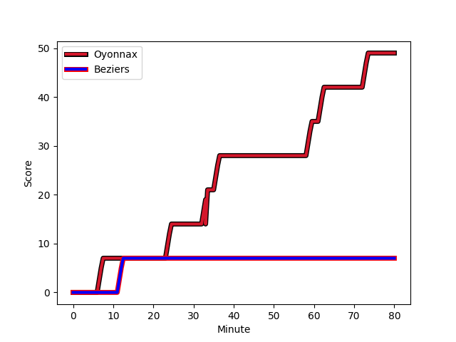
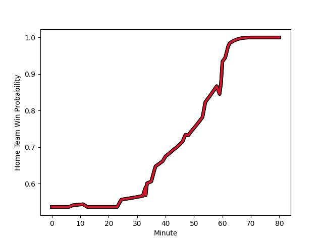

---  
layout: page  
title: Beziers at Oyonnax; 7-49  
date: 2023-01-06 19:30:00 18:00:00 -0500  
categories: match review  
---
# Beziers (1542.38) at Oyonnax (1605.63); 7-49

# Prediction: Oyonnax by 10.3

Oyonnax by 6.3 on a neutral field
## Scores over Time

## Win Probability over Time

# Pre-Match Prediction: Oyonnax by 9.7

Oyonnax by 5.7 on a neutral pitch

|   Away Minutes | Away Player                                                                          |   Away elo |   Away Percentile |   Number |   Home Percentile |   Home elo | Home Player                                                           |   Home Minutes |
|---------------:|:-------------------------------------------------------------------------------------|-----------:|------------------:|---------:|------------------:|-----------:|:----------------------------------------------------------------------|---------------:|
|             60 | [Giorgi Akhaladze](..//playerfiles//GiorgiAkhaladze_cleaned.md)                      |      99.15 |                60 |        1 |                 5 |      74.26 | [Tommy Raynaud](..//playerfiles//TommyRaynaud_cleaned.md)             |             54 |
|             40 | [Clément Esteriola](..//playerfiles//ClémentEsteriola_cleaned.md)                    |      76.56 |                 6 |        2 |                55 |      96.21 | [Benjamin Geledan](..//playerfiles//BenjaminGeledan_cleaned.md)       |             49 |
|             44 | [Yannick Arroyo](..//playerfiles//YannickArroyo_cleaned.md)                          |     108    |                82 |        3 |                69 |     101.66 | [Thomas Laclayat](..//playerfiles//ThomasLaclayat_cleaned.md)         |             59 |
|             40 | [Clément Bitz](..//playerfiles//ClémentBitz_cleaned.md)                              |     106.52 |                75 |        4 |                99 |     155.76 | [Phoenix Battye](..//playerfiles//PhoenixBattye_cleaned.md)           |             80 |
|             47 | [John Madigan](..//playerfiles//JohnMadigan_cleaned.md)                              |     102.47 |                67 |        5 |                57 |      98.23 | [Hugo Fabregue](..//playerfiles//HugoFabregue_cleaned.md)             |             49 |
|             48 | [Jean-Baptiste Barrère](..//playerfiles//Jean-BaptisteBarrère_cleaned.md)            |      79.25 |                11 |        6 |                95 |     125.68 | [Kevin Lebreton](..//playerfiles//KevinLebreton_cleaned.md)           |             80 |
|             80 | [Gillian Benoy](..//playerfiles//GillianBenoy_cleaned.md)                            |     113.19 |                85 |        7 |                66 |     101.66 | [Loïc Credoz](..//playerfiles//LoïcCredoz_cleaned.md)                 |             54 |
|             80 | [Maxence Lemardelet](..//playerfiles//MaxenceLemardelet_cleaned.md)                  |      84.91 |                18 |        8 |                95 |     129.41 | [Rory Grice](..//playerfiles//RoryGrice_cleaned.md)                   |             80 |
|             54 | [Mitch Short](..//playerfiles//MitchShort_cleaned.md)                                |      74.45 |                 5 |        9 |                99 |     138.32 | [Charlie Cassang](..//playerfiles//CharlieCassang_cleaned.md)         |             59 |
|             54 | [Romain Uruty](..//playerfiles//RomainUruty_cleaned.md)                              |     106.99 |                72 |       10 |                68 |     105.57 | [Jules Soulan](..//playerfiles//JulesSoulan_cleaned.md)               |             80 |
|             80 | [Gabin Lorre](..//playerfiles//GabinLorre_cleaned.md)                                |     110.47 |                81 |       11 |                46 |      94.64 | [Enzo Reybier](..//playerfiles//EnzoReybier_cleaned.md)               |             80 |
|             80 | [Jarrod Poi](..//playerfiles//JarrodPoi_cleaned.md)                                  |     107.28 |                75 |       12 |                58 |      99.69 | [Theo Millet](..//playerfiles//TheoMillet_cleaned.md)                 |             80 |
|             80 | [Maxime Espeut](..//playerfiles//MaximeEspeut_cleaned.md)                            |     140.16 |                98 |       13 |                60 |     100.22 | [Florian Vialelle](..//playerfiles//FlorianVialelle_cleaned.md)       |             59 |
|             80 | [Nicolas Plazy](..//playerfiles//NicolasPlazy_cleaned.md)                            |     147.84 |                99 |       14 |                34 |      90.61 | [Gavin Stark](..//playerfiles//GavinStark_cleaned.md)                 |             80 |
|             80 | [Charly Malie](..//playerfiles//CharlyMalie_cleaned.md)                              |      81.62 |                20 |       15 |                19 |      81.57 | [Tony Ensor](..//playerfiles//TonyEnsor_cleaned.md)                   |             54 |
|             40 | [Wilmar Arnoldi](..//playerfiles//WilmarArnoldi_cleaned.md)                          |      85.56 |                20 |       16 |                46 |      91.17 | [Manu Leiataua](..//playerfiles//ManuLeiataua_cleaned.md)             |             31 |
|             40 | [Pierrick Gunther](..//playerfiles//PierrickGunther_cleaned.md)                      |      85.7  |                22 |       17 |               nan |     107.06 | [Steve Mafi](..//playerfiles//SteveMafi_cleaned.md)                   |             31 |
|             36 | [Jon Zabala Arrieta](..//playerfiles//JonZabalaArrieta_cleaned.md)                   |     110.1  |                85 |       18 |                30 |      89.65 | [Antoine Abraham](..//playerfiles//AntoineAbraham_cleaned.md)         |             26 |
|             33 | [Yassine Maamry](..//playerfiles//YassineMaamry_cleaned.md)                          |      83.19 |                12 |       19 |                93 |     124.46 | [Wandrille Picault](..//playerfiles//WandrillePicault_cleaned.md)     |             26 |
|             32 | [William van Bost](..//playerfiles//WilliamvanBost_cleaned.md)                       |      97.6  |                54 |       20 |                94 |     125.78 | [Aurelien Callandret](..//playerfiles//AurelienCallandret_cleaned.md) |             26 |
|             26 | [Victor Dreuille](..//playerfiles//VictorDreuille_cleaned.md)                        |      86.33 |                19 |       21 |                62 |     100.92 | [Justin Bouraux](..//playerfiles//JustinBouraux_cleaned.md)           |             21 |
|             26 | [Josh Valentine](..//playerfiles//JoshValentine_cleaned.md)                          |     106.62 |                77 |       22 |               nan |      85.27 | [Ilan El Khattabi](..//playerfiles//IlanElKhattabi_cleaned.md)        |             21 |
|             20 | [Francisco Fernandes Moreira](..//playerfiles//FranciscoFernandesMoreira_cleaned.md) |     120.56 |                95 |       23 |                46 |      92.65 | [Thibault Berthaud](..//playerfiles//ThibaultBerthaud_cleaned.md)     |             21 |

