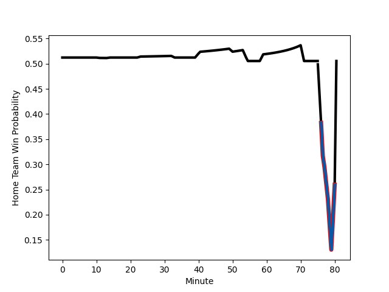

---  
layout: page  
title: Grenoble at Provence Rugby; 23-23  
date: 2023-01-06 21:00:00 18:00:00 -0500  
categories: match review  
---
# Grenoble (1452.71) at Provence Rugby (1473.91); 23-23

# Prediction: Provence Rugby by 6.1

Provence Rugby by 2.1 on a neutral field
## Scores over Time

## Win Probability over Time

# Pre-Match Prediction: Provence Rugby by 7.8

Provence Rugby by 3.8 on a neutral pitch

|   Away Minutes | Away Player                                                                         |   Away elo |   Away Percentile |   Number |   Home Percentile |   Home elo | Home Player                                                              |   Home Minutes |
|---------------:|:------------------------------------------------------------------------------------|-----------:|------------------:|---------:|------------------:|-----------:|:-------------------------------------------------------------------------|---------------:|
|             61 | [Zack Gauthier](..//playerfiles//ZackGauthier_cleaned.md)                           |     112.44 |                87 |        1 |                84 |     109.67 | [Federico Wegrzyn](..//playerfiles//FedericoWegrzyn_cleaned.md)          |             60 |
|             66 | [Jean Charles Orioli](..//playerfiles//JeanCharlesOrioli_cleaned.md)                |      92.63 |                36 |        2 |                 0 |      60.79 | [Loick Jammes](..//playerfiles//LoickJammes_cleaned.md)                  |             60 |
|             61 | [Irakli Aptsiauri](..//playerfiles//IrakliAptsiauri_cleaned.md)                     |      92.36 |                39 |        3 |                68 |     101.05 | [Luke Tagi](..//playerfiles//LukeTagi_cleaned.md)                        |             65 |
|             80 | [Tanginoa Halaifonua](..//playerfiles//TanginoaHalaifonua_cleaned.md)               |     106.12 |                74 |        4 |                86 |     114.17 | [Jérôme Dufour](..//playerfiles//JérômeDufour_cleaned.md)                |             55 |
|             50 | [Levi Douglas](..//playerfiles//LeviDouglas_cleaned.md)                             |      73.08 |                 7 |        5 |                91 |     121.16 | [Clément Chartier](..//playerfiles//ClémentChartier_cleaned.md)          |             80 |
|             80 | [Clement Ancely](..//playerfiles//ClementAncely_cleaned.md)                         |     100.9  |                58 |        6 |                63 |     102.92 | [Carl Axtens](..//playerfiles//CarlAxtens_cleaned.md)                    |             80 |
|             80 | [Steeve Blanc-Mappaz](..//playerfiles//SteeveBlanc-Mappaz_cleaned.md)               |     116.17 |                88 |        7 |                 5 |      71.14 | [Bilel Taieb](..//playerfiles//BilelTaieb_cleaned.md)                    |             80 |
|             50 | [Thibaut Martel](..//playerfiles//ThibautMartel_cleaned.md)                         |      87.94 |                27 |        8 |                 3 |      67.84 | [Charles Malet](..//playerfiles//CharlesMalet_cleaned.md)                |             51 |
|             56 | [Eric Escande](..//playerfiles//EricEscande_cleaned.md)                             |     115.09 |                89 |        9 |                 9 |      78.1  | [Joris Cazenave](..//playerfiles//JorisCazenave_cleaned.md)              |             59 |
|             56 | [Thomas Fortunel](..//playerfiles//ThomasFortunel_cleaned.md)                       |      78.78 |                 9 |       10 |                93 |     127.86 | [Enzo Selponi](..//playerfiles//EnzoSelponi_cleaned.md)                  |             61 |
|             80 | [Lucas Dupont](..//playerfiles//LucasDupont_cleaned.md)                             |      84.95 |                19 |       11 |                34 |      90.83 | [Eroni Sau](..//playerfiles//EroniSau_cleaned.md)                        |             80 |
|             80 | [Bautista Ezcurra](..//playerfiles//BautistaEzcurra_cleaned.md)                     |     104.81 |                69 |       12 |                97 |     133.49 | [Louis Marrou](..//playerfiles//LouisMarrou_cleaned.md)                  |             80 |
|             61 | [Romain Trouilloud](..//playerfiles//RomainTrouilloud_cleaned.md)                   |      83.53 |                18 |       13 |                80 |     114.42 | [Adrian Sanday](..//playerfiles//AdrianSanday_cleaned.md)                |             51 |
|             80 | [Karim Qadiri](..//playerfiles//KarimQadiri_cleaned.md)                             |      89.75 |                31 |       14 |                76 |     108.89 | [Léo Drouet](..//playerfiles//LéoDrouet_cleaned.md)                      |             80 |
|             80 | [Tom Sposito](..//playerfiles//TomSposito_cleaned.md)                               |      95    |               nan |       15 |                69 |     105.61 | [Florent Massip](..//playerfiles//FlorentMassip_cleaned.md)              |             80 |
|             30 | [Thomas Lainault](..//playerfiles//ThomasLainault_cleaned.md)                       |     110.44 |                81 |       16 |                 0 |      58.53 | [Jessy Jegerlehner](..//playerfiles//JessyJegerlehner_cleaned.md)        |             29 |
|             30 | [Talalelei Gray](..//playerfiles//TalaleleiGray_cleaned.md)                         |      92.45 |                37 |       17 |                28 |      87.67 | [Dorian Lavernhe](..//playerfiles//DorianLavernhe_cleaned.md)            |             29 |
|             24 | [Felipe Ezcurra](..//playerfiles//FelipeEzcurra_cleaned.md)                         |     126.16 |                96 |       18 |                 2 |      59.9  | [Hans N'kinsi](..//playerfiles//HansN'kinsi_cleaned.md)                  |             25 |
|             24 | [Romain Barthelemy](..//playerfiles//RomainBarthelemy_cleaned.md)                   |     117.57 |                86 |       19 |                47 |      95.58 | [Simon Tarel](..//playerfiles//SimonTarel_cleaned.md)                    |             21 |
|             19 | [Eli Eglaine](..//playerfiles//EliEglaine_cleaned.md)                               |      82.2  |                13 |       20 |                 5 |      73.68 | [Dave Lolohea](..//playerfiles//DaveLolohea_cleaned.md)                  |             20 |
|             19 | [Atunaisa Taulanga Vaka Manu](..//playerfiles//AtunaisaTaulangaVakaManu_cleaned.md) |      73.47 |                 6 |       21 |                79 |     106.61 | [German Kessler Lordon](..//playerfiles//GermanKesslerLordon_cleaned.md) |             20 |
|             19 | [Vincent Vial](..//playerfiles//VincentVial_cleaned.md)                             |      90.04 |                31 |       22 |                33 |      91.6  | [Johnny McPhillips](..//playerfiles//JohnnyMcPhillips_cleaned.md)        |             19 |
|             14 | [Enzo Camilleri](..//playerfiles//EnzoCamilleri_cleaned.md)                         |      84.78 |                19 |       23 |                28 |      88.09 | [Nicolas Toth](..//playerfiles//NicolasToth_cleaned.md)                  |             15 |

