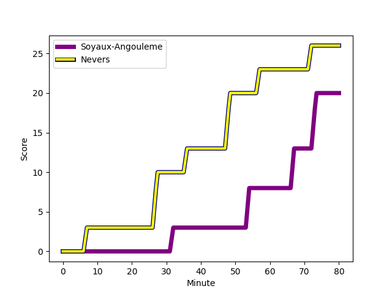
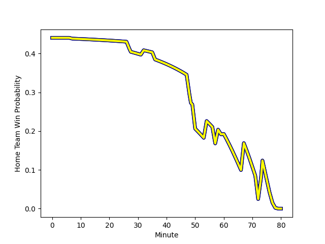

---  
layout: page  
title: Nevers at Soyaux-Angouleme; 26-20  
date: 2023-01-06 19:30:00 18:00:00 -0500  
categories: match review  
---
# Nevers (1539.3) at Soyaux-Angouleme (1435.44); 26-20

# Prediction: Nevers by 6.4

Nevers by 10.4 on a neutral field
## Scores over Time

## Win Probability over Time

# Pre-Match Prediction: Nevers by 1.0

Nevers by 5.0 on a neutral pitch

|   Away Minutes | Away Player                                                           |   Away elo |   Away Percentile |   Number |   Home Percentile |   Home elo | Home Player                                                         |   Home Minutes |
|---------------:|:----------------------------------------------------------------------|-----------:|------------------:|---------:|------------------:|-----------:|:--------------------------------------------------------------------|---------------:|
|             47 | [Kamaliele Tufele](..//playerfiles//KamalieleTufele_cleaned.md)       |      85.21 |                17 |        1 |                47 |      94.44 | [Omar Odishvili](..//playerfiles//OmarOdishvili_cleaned.md)         |              6 |
|             60 | [Issam Hamel](..//playerfiles//IssamHamel_cleaned.md)                 |      98.64 |                58 |        2 |                98 |     132.11 | [Kevin Le Guen](..//playerfiles//KevinLeGuen_cleaned.md)            |             47 |
|             60 | [Cleopas Kundiona](..//playerfiles//CleopasKundiona_cleaned.md)       |      89.04 |                28 |        3 |               nan |      95    | [Shota Gogisvanidze](..//playerfiles//ShotaGogisvanidze_cleaned.md) |             34 |
|             80 | [Maxence Barjaud](..//playerfiles//MaxenceBarjaud_cleaned.md)         |     111    |                82 |        4 |                87 |     112.62 | [Saba Pesvianidze](..//playerfiles//SabaPesvianidze_cleaned.md)     |             48 |
|             58 | [Will Skelton](..//playerfiles//WillSkelton_cleaned.md)               |     120.26 |                91 |        5 |                38 |      91.77 | [Janse Roux](..//playerfiles//JanseRoux_cleaned.md)                 |             80 |
|             80 | [Luka Plataret](..//playerfiles//LukaPlataret_cleaned.md)             |      85.86 |                16 |        6 |                14 |      81.81 | [Gautier Gibouin](..//playerfiles//GautierGibouin_cleaned.md)       |             80 |
|             58 | [Hugues Bastide](..//playerfiles//HuguesBastide_cleaned.md)           |     129.02 |                96 |        7 |                64 |     101.03 | [Germain Burgaud](..//playerfiles//GermainBurgaud_cleaned.md)       |             48 |
|             80 | [Steven David](..//playerfiles//StevenDavid_cleaned.md)               |      95.97 |                46 |        8 |                29 |      88.64 | [Yassine Jarmouni](..//playerfiles//YassineJarmouni_cleaned.md)     |             58 |
|             54 | [Yoan Cottin](..//playerfiles//YoanCottin_cleaned.md)                 |     102.93 |                72 |        9 |                90 |     116.11 | [Manu Saubusse](..//playerfiles//ManuSaubusse_cleaned.md)           |             50 |
|             80 | [Yohan Le Bourhis](..//playerfiles//YohanLeBourhis_cleaned.md)        |      89.39 |                24 |       10 |                79 |     112.69 | [Matthieu Ugalde](..//playerfiles//MatthieuUgalde_cleaned.md)       |             26 |
|             80 | [Lucas Blanc](..//playerfiles//LucasBlanc_cleaned.md)                 |     112.84 |                83 |       11 |                64 |     100.4  | [Marvin Lestremau](..//playerfiles//MarvinLestremau_cleaned.md)     |             80 |
|             60 | [Leonard Paris](..//playerfiles//LeonardParis_cleaned.md)             |     121.7  |                92 |       12 |                84 |     113.72 | [Mathis Lafon](..//playerfiles//MathisLafon_cleaned.md)             |             80 |
|             80 | [Alifereti Loaloa](..//playerfiles//AliferetiLoaloa_cleaned.md)       |      73.72 |                 6 |       13 |                 6 |      74.11 | [Ledua Mau](..//playerfiles//LeduaMau_cleaned.md)                   |             80 |
|             80 | [Andrzej Charlat](..//playerfiles//AndrzejCharlat_cleaned.md)         |     135.59 |                97 |       14 |                57 |      98.07 | [Maxime Laforgue](..//playerfiles//MaximeLaforgue_cleaned.md)       |             80 |
|             80 | [Kylian Jaminet](..//playerfiles//KylianJaminet_cleaned.md)           |     118.27 |                87 |       15 |                 9 |      73.55 | [Pierre Lafitte](..//playerfiles//PierreLafitte_cleaned.md)         |             80 |
|             33 | [Tomike Mataradze](..//playerfiles//TomikeMataradze_cleaned.md)       |      76.84 |                 7 |       16 |                41 |      92.87 | [Khatchik Vartanov](..//playerfiles//KhatchikVartanov_cleaned.md)   |             74 |
|             26 | [Arthurs Barbier](..//playerfiles//ArthursBarbier_cleaned.md)         |      99.57 |                59 |       17 |                63 |     100.89 | [Jacob Botica](..//playerfiles//JacobBotica_cleaned.md)             |             54 |
|             22 | [Jason-Colin Fraser](..//playerfiles//Jason-ColinFraser_cleaned.md)   |     131.3  |                96 |       18 |               nan |      95    | [Baptiste Bouche](..//playerfiles//BaptisteBouche_cleaned.md)       |             46 |
|             22 | [Maka Polutele](..//playerfiles//MakaPolutele_cleaned.md)             |      50.11 |                 0 |       19 |                82 |     108.35 | [Ole Avei](..//playerfiles//OleAvei_cleaned.md)                     |             33 |
|             20 | [Aviata Silago](..//playerfiles//AviataSilago_cleaned.md)             |      88.32 |                22 |       20 |                29 |      85.54 | [Nicolas Martins](..//playerfiles//NicolasMartins_cleaned.md)       |             32 |
|             20 | [Elia Elia](..//playerfiles//EliaElia_cleaned.md)                     |      94.02 |                48 |       21 |                35 |      89.4  | [Ian Kitwanga](..//playerfiles//IanKitwanga_cleaned.md)             |             32 |
|             20 | [Ilia Kaikatsishvili](..//playerfiles//IliaKaikatsishvili_cleaned.md) |      99.24 |                53 |       22 |                 1 |      61.15 | [Adrien Bau](..//playerfiles//AdrienBau_cleaned.md)                 |             30 |
|            nan | nan                                                                   |     nan    |               nan |       23 |                75 |     105.66 | [Hubert Texier](..//playerfiles//HubertTexier_cleaned.md)           |             22 |

