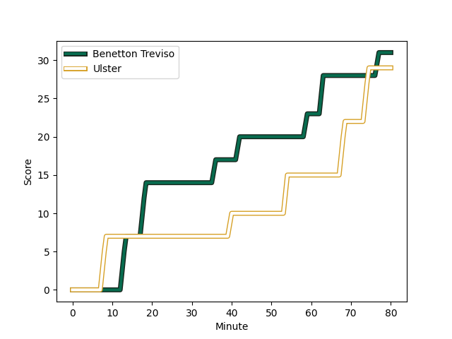
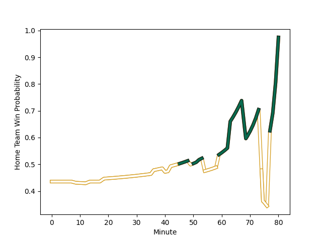

---  
layout: page  
title: Ulster at Benetton Treviso; 29-31  
date: 2023-01-07 14:00:00 18:00:00 -0500  
categories: match review  
---
# Ulster (1623.43) at Benetton Treviso (1510.96); 29-31

# Prediction: Ulster by 7.2

Ulster by 11.2 on a neutral field
## Scores over Time

## Win Probability over Time

# Pre-Match Prediction: Ulster by 10.3

Ulster by 14.3 on a neutral pitch

|   Away Minutes | Away Player                                                         |   Away elo |   Away Percentile |   Number |   Home Percentile |   Home elo | Home Player                                                           |   Home Minutes |
|---------------:|:--------------------------------------------------------------------|-----------:|------------------:|---------:|------------------:|-----------:|:----------------------------------------------------------------------|---------------:|
|             56 | [Eric O'Sullivan](..//playerfiles//EricO'Sullivan_cleaned.md)       |      94.41 |                63 |        1 |                58 |      99.18 | [Federico Zani](..//playerfiles//FedericoZani_cleaned.md)             |             65 |
|             56 | [Rob Herring](..//playerfiles//RobHerring_cleaned.md)               |      89.12 |                33 |        2 |                76 |     105.83 | [Giacomo Nicotera](..//playerfiles//GiacomoNicotera_cleaned.md)       |             60 |
|             80 | [Jeff Toomaga-Allen](..//playerfiles//JeffToomaga-Allen_cleaned.md) |     115.29 |                91 |        3 |                63 |      99.4  | [Simone Ferrari](..//playerfiles//SimoneFerrari_cleaned.md)           |             69 |
|             80 | [Kieran Treadwell](..//playerfiles//KieranTreadwell_cleaned.md)     |     100.39 |                62 |        4 |                 0 |      50.56 | [Niccolo Cannone](..//playerfiles//NiccoloCannone_cleaned.md)         |             80 |
|             49 | [Iain Henderson](..//playerfiles//IainHenderson_cleaned.md)         |     106.06 |                75 |        5 |                49 |      95.34 | [Federico Ruzza](..//playerfiles//FedericoRuzza_cleaned.md)           |             80 |
|             49 | [Greg Jones](..//playerfiles//GregJones_cleaned.md)                 |      93.28 |                43 |        6 |                16 |      82.78 | [Sebastian Negri](..//playerfiles//SebastianNegri_cleaned.md)         |             54 |
|             69 | [Sean Reffell](..//playerfiles//SeanReffell_cleaned.md)             |     114.06 |                87 |        7 |                86 |     113.76 | [Michele Lamaro](..//playerfiles//MicheleLamaro_cleaned.md)           |             80 |
|             80 | [Nick Timoney](..//playerfiles//NickTimoney_cleaned.md)             |     120.8  |                90 |        8 |                39 |      93.63 | [Lorenzo Cannone](..//playerfiles//LorenzoCannone_cleaned.md)         |             80 |
|             80 | [John Cooney](..//playerfiles//JohnCooney_cleaned.md)               |      98.9  |                56 |        9 |                30 |      89.08 | [Alessandro Garbisi](..//playerfiles//AlessandroGarbisi_cleaned.md)   |             60 |
|             75 | [Billy Burns](..//playerfiles//BillyBurns_cleaned.md)               |     117.38 |                85 |       10 |                88 |     120.85 | [Tomas Albornoz](..//playerfiles//TomasAlbornoz_cleaned.md)           |             80 |
|             75 | [Jacob Stockdale](..//playerfiles//JacobStockdale_cleaned.md)       |     117.6  |                88 |       11 |                77 |     107.2  | [Onisi Ratave](..//playerfiles//OnisiRatave_cleaned.md)               |             80 |
|             80 | [Stuart McCloskey](..//playerfiles//StuartMcCloskey_cleaned.md)     |     140.03 |                98 |       12 |                79 |     109.65 | [Tommaso Menoncello](..//playerfiles//TommasoMenoncello_cleaned.md)   |             52 |
|             49 | [James Hume](..//playerfiles//JamesHume_cleaned.md)                 |     109.66 |                79 |       13 |                80 |     110.31 | [Juan Ignacio Brex](..//playerfiles//JuanIgnacioBrex_cleaned.md)      |             80 |
|             80 | [Robert Baloucoune](..//playerfiles//RobertBaloucoune_cleaned.md)   |      98.43 |                58 |       14 |                85 |     114.68 | [Edoardo Padovani](..//playerfiles//EdoardoPadovani_cleaned.md)       |             80 |
|             80 | [Michael Lowry](..//playerfiles//MichaelLowry_cleaned.md)           |      98    |                52 |       15 |                59 |     100.39 | [Rhyno Smith](..//playerfiles//RhynoSmith_cleaned.md)                 |             80 |
|             31 | [Alan O'Connor](..//playerfiles//AlanO'Connor_cleaned.md)           |     117    |                89 |       16 |                88 |     118.16 | [Marco Zanon](..//playerfiles//MarcoZanon_cleaned.md)                 |             28 |
|             31 | [Duane Vermeulen](..//playerfiles//DuaneVermeulen_cleaned.md)       |     116    |                86 |       17 |                94 |     125.77 | [Giovanni Pettinelli](..//playerfiles//GiovanniPettinelli_cleaned.md) |             26 |
|             31 | [Stewart Moore](..//playerfiles//StewartMoore_cleaned.md)           |     110.73 |                79 |       18 |                90 |     115.88 | [Sam Hidalgo-Clyne](..//playerfiles//SamHidalgo-Clyne_cleaned.md)     |             20 |
|             24 | [Rory Sutherland](..//playerfiles//RorySutherland_cleaned.md)       |     104.07 |                76 |       19 |                43 |      93.77 | [Siua Maile](..//playerfiles//SiuaMaile_cleaned.md)                   |             20 |
|             24 | [Tom Stewart](..//playerfiles//TomStewart_cleaned.md)               |      88.67 |                30 |       20 |                21 |      86.74 | [Cherif Traore](..//playerfiles//CherifTraore_cleaned.md)             |             15 |
|             11 | [Andrew Warwick](..//playerfiles//AndrewWarwick_cleaned.md)         |     104.56 |                77 |       21 |                63 |      99.57 | [Tiziano Pasquali](..//playerfiles//TizianoPasquali_cleaned.md)       |             11 |
|              5 | [Ethan McIlroy](..//playerfiles//EthanMcIlroy_cleaned.md)           |      88.6  |                29 |       22 |               nan |     nan    | nan                                                                   |            nan |
|              5 | [Nathan Doak](..//playerfiles//NathanDoak_cleaned.md)               |      68    |                 2 |       23 |               nan |     nan    | nan                                                                   |            nan |

