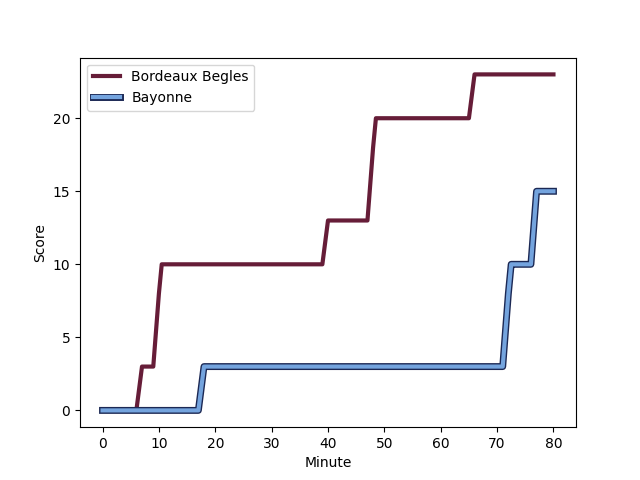
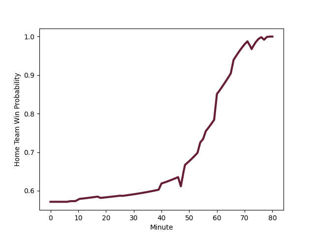

---  
layout: page  
title: Bayonne at Bordeaux Begles; 15-23  
date: 2023-01-07 15:00:00 18:00:00 -0500  
categories: match review  
---
# Bayonne (1559.29) at Bordeaux Begles (1683.98); 15-23

# Prediction: Bordeaux Begles by 16.5

Bordeaux Begles by 12.5 on a neutral field
## Scores over Time

## Win Probability over Time

# Pre-Match Prediction: Bordeaux Begles by 15.9

Bordeaux Begles by 11.9 on a neutral pitch

|   Away Minutes | Away Player                                                               |   Away elo |   Away Percentile |   Number |   Home Percentile |   Home elo | Home Player                                                                      |   Home Minutes |
|---------------:|:--------------------------------------------------------------------------|-----------:|------------------:|---------:|------------------:|-----------:|:---------------------------------------------------------------------------------|---------------:|
|             54 | [Swan Cormenier](..//playerfiles//SwanCormenier_cleaned.md)               |     101.4  |                69 |        1 |                88 |     113.22 | [Lekso Kaulashvili](..//playerfiles//LeksoKaulashvili_cleaned.md)                |             63 |
|             47 | [Thomas Acquier](..//playerfiles//ThomasAcquier_cleaned.md)               |     117.72 |                90 |        2 |                68 |     101.78 | [Maxime Lamothe](..//playerfiles//MaximeLamothe_cleaned.md)                      |             51 |
|             26 | [Tevita Tatafu](..//playerfiles//TevitaTatafu_cleaned.md)                 |      87.08 |               nan |        3 |                95 |     125.66 | [Vadim Cobilas](..//playerfiles//VadimCobilas_cleaned.md)                        |             60 |
|             47 | [Manuel Leindekar](..//playerfiles//ManuelLeindekar_cleaned.md)           |     100.28 |                62 |        4 |                21 |      85.66 | [Thomas Jolmes](..//playerfiles//ThomasJolmes_cleaned.md)                        |             51 |
|             80 | [Kote Mikautadze](..//playerfiles//KoteMikautadze_cleaned.md)             |      85.07 |                20 |        5 |                87 |     115.6  | [Cyril Cazeaux](..//playerfiles//CyrilCazeaux_cleaned.md)                        |             80 |
|             80 | [Pierre Huguet](..//playerfiles//PierreHuguet_cleaned.md)                 |      81.15 |                13 |        6 |                97 |     133.12 | [Jandré Marais](..//playerfiles//JandréMarais_cleaned.md)                        |             68 |
|             80 | [Baptiste Heguy](..//playerfiles//BaptisteHeguy_cleaned.md)               |     111.34 |                83 |        7 |                90 |     118.34 | [Mahamadou Diaby](..//playerfiles//MahamadouDiaby_cleaned.md)                    |             80 |
|             67 | [Geoff Cridge](..//playerfiles//GeoffCridge_cleaned.md)                   |      87.82 |                23 |        8 |                81 |     110.02 | [Bastien Vergnes Taillefer](..//playerfiles//BastienVergnesTaillefer_cleaned.md) |             80 |
|             62 | [Maxime Machenaud](..//playerfiles//MaximeMachenaud_cleaned.md)           |     112.29 |                85 |        9 |                99 |     146.85 | [Maxime Lucu](..//playerfiles//MaximeLucu_cleaned.md)                            |             71 |
|             70 | [Camille Lopez](..//playerfiles//CamilleLopez_cleaned.md)                 |     141.54 |                98 |       10 |                85 |     117.21 | [Zack Holmes](..//playerfiles//ZackHolmes_cleaned.md)                            |             80 |
|             80 | [Remy Baget](..//playerfiles//RemyBaget_cleaned.md)                       |     106.7  |                76 |       11 |                28 |      88.58 | [Santiago Cordero](..//playerfiles//SantiagoCordero_cleaned.md)                  |             80 |
|             56 | [Eneriko Buliruarua](..//playerfiles//EnerikoBuliruarua_cleaned.md)       |      85.93 |                23 |       12 |                22 |      85.06 | [Yoram Moefana](..//playerfiles//YoramMoefana_cleaned.md)                        |             80 |
|             80 | [Sireli Maqala](..//playerfiles//SireliMaqala_cleaned.md)                 |      90.77 |                37 |       13 |                54 |      98.27 | [Jean-Baptiste Dubie](..//playerfiles//Jean-BaptisteDubie_cleaned.md)            |             60 |
|             80 | [Arnaud Erbinartegaray](..//playerfiles//ArnaudErbinartegaray_cleaned.md) |     105.47 |                74 |       14 |                54 |      97.06 | [Louis Bielle-Biarrey](..//playerfiles//LouisBielle-Biarrey_cleaned.md)          |             54 |
|             80 | [Luke Morahan](..//playerfiles//LukeMorahan_cleaned.md)                   |     132.54 |                97 |       15 |                99 |     150.02 | [Romain Buros](..//playerfiles//RomainBuros_cleaned.md)                          |             80 |
|             54 | [Pascal Cotet](..//playerfiles//PascalCotet_cleaned.md)                   |      89.6  |                29 |       16 |                69 |     102.14 | [Clement Maynadier](..//playerfiles//ClementMaynadier_cleaned.md)                |             29 |
|             33 | [Torsten van Jaarsveld](..//playerfiles//TorstenvanJaarsveld_cleaned.md)  |     113.67 |                87 |       17 |                92 |     120.86 | [Antoine Miquel](..//playerfiles//AntoineMiquel_cleaned.md)                      |             29 |
|             33 | [Denis Marchois](..//playerfiles//DenisMarchois_cleaned.md)               |     159.83 |                99 |       18 |                81 |     110.01 | [Madosh Tambwe](..//playerfiles//MadoshTambwe_cleaned.md)                        |             26 |
|             26 | [Pieter Scholtz](..//playerfiles//PieterScholtz_cleaned.md)               |      91.67 |                32 |       19 |                75 |     106.58 | [Christopher Vaotoa](..//playerfiles//ChristopherVaotoa_cleaned.md)              |             20 |
|             24 | [Guillaume Martocq](..//playerfiles//GuillaumeMartocq_cleaned.md)         |      72.17 |                 4 |       20 |                62 |     100.8  | [Tani Vili](..//playerfiles//TaniVili_cleaned.md)                                |             20 |
|             18 | [Michael Ruru](..//playerfiles//MichaelRuru_cleaned.md)                   |     110.58 |                84 |       21 |                66 |     100.33 | [Ugo Boniface](..//playerfiles//UgoBoniface_cleaned.md)                          |             17 |
|             13 | [Aitor Hourcade](..//playerfiles//AitorHourcade_cleaned.md)               |      74.74 |                 7 |       22 |                58 |      98.95 | [Alban Roussel](..//playerfiles//AlbanRoussel_cleaned.md)                        |             12 |
|             10 | [Thomas Dolhagaray](..//playerfiles//ThomasDolhagaray_cleaned.md)         |     120.68 |                88 |       23 |                10 |      79.51 | [Jules Gimbert](..//playerfiles//JulesGimbert_cleaned.md)                        |              9 |

