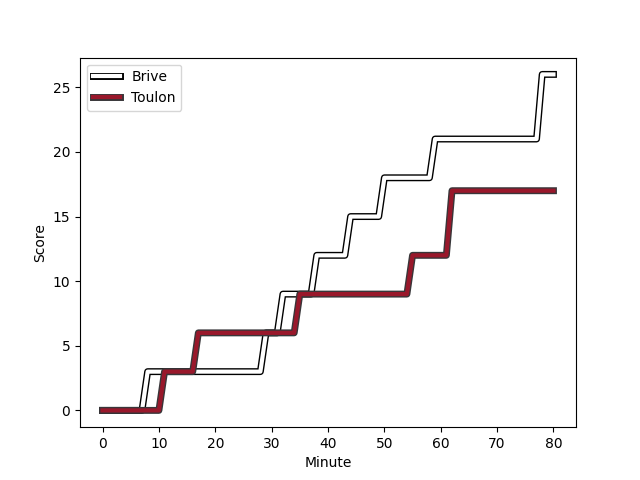
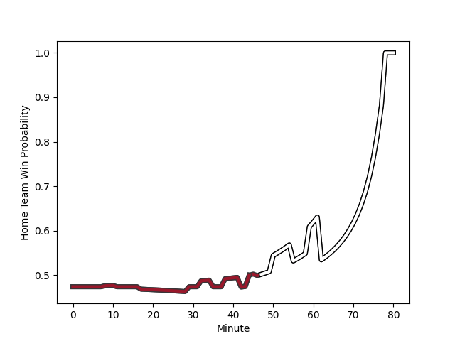

---  
layout: page  
title: Toulon at Brive; 17-26  
date: 2023-01-07 17:00:00 18:00:00 -0500  
categories: match review  
---
# Toulon (1593.43) at Brive (1547.67); 17-26

# Prediction: Toulon by 0.6

Toulon by 4.6 on a neutral field
## Scores over Time

## Win Probability over Time

# Pre-Match Prediction: Toulon by 1.6

Toulon by 2.4 on a neutral pitch

|   Away Minutes | Away Player                                                           |   Away elo |   Away Percentile |   Number |   Home Percentile |   Home elo | Home Player                                                              |   Home Minutes |
|---------------:|:----------------------------------------------------------------------|-----------:|------------------:|---------:|------------------:|-----------:|:-------------------------------------------------------------------------|---------------:|
|             51 | [Dany Priso](..//playerfiles//DanyPriso_cleaned.md)                   |      96.1  |                53 |        1 |                17 |      86.13 | [Daniel Brennan](..//playerfiles//DanielBrennan_cleaned.md)              |             64 |
|             51 | [Anthony Etrillard](..//playerfiles//AnthonyEtrillard_cleaned.md)     |     106.61 |                78 |        2 |                11 |      79.76 | [Motu Matu'u](..//playerfiles//MotuMatu'u_cleaned.md)                    |             42 |
|             42 | [Kieran Brookes](..//playerfiles//KieranBrookes_cleaned.md)           |      74.46 |                 6 |        3 |                47 |      94.41 | [Marcel van der Merwe](..//playerfiles//MarcelvanderMerwe_cleaned.md)    |             64 |
|             51 | [Mathieu Tanguy](..//playerfiles//MathieuTanguy_cleaned.md)           |      94.74 |                51 |        4 |                24 |      86.78 | [Julien Delannoy](..//playerfiles//JulienDelannoy_cleaned.md)            |             64 |
|             80 | [Brian Alainu'uese](..//playerfiles//BrianAlainu'uese_cleaned.md)     |     109.81 |                81 |        5 |                66 |     101.91 | [Lucas Paulos](..//playerfiles//LucasPaulos_cleaned.md)                  |             71 |
|             80 | [Swan Rebbadj](..//playerfiles//SwanRebbadj_cleaned.md)               |      77.01 |                10 |        6 |                84 |     112.9  | [Retief Marais](..//playerfiles//RetiefMarais_cleaned.md)                |             55 |
|             80 | [Raphael Lakafia](..//playerfiles//RaphaelLakafia_cleaned.md)         |     114.83 |                88 |        7 |                99 |     150.68 | [Said Hireche](..//playerfiles//SaidHireche_cleaned.md)                  |             80 |
|             51 | [Mathieu Bastareaud](..//playerfiles//MathieuBastareaud_cleaned.md)   |     108.98 |                80 |        8 |                86 |     116.28 | [Esteban Abadie](..//playerfiles//EstebanAbadie_cleaned.md)              |             80 |
|             51 | [Benoit Paillaugue](..//playerfiles//BenoitPaillaugue_cleaned.md)     |      94.13 |                49 |        9 |                28 |      88.68 | [Paul Abadie](..//playerfiles//PaulAbadie_cleaned.md)                    |             80 |
|             69 | [Dan Biggar](..//playerfiles//DanBiggar_cleaned.md)                   |     147.86 |                99 |       10 |                92 |     127.12 | [Enzo Herve](..//playerfiles//EnzoHerve_cleaned.md)                      |             80 |
|             80 | [Gaël Dréan](..//playerfiles//GaëlDréan_cleaned.md)                   |      93.05 |                42 |       11 |                65 |     100.71 | [Axel Muller](..//playerfiles//AxelMuller_cleaned.md)                    |             80 |
|             80 | [Jérémy Sinzelle](..//playerfiles//JérémySinzelle_cleaned.md)         |      88.95 |                31 |       12 |                91 |     120.79 | [Nico Lee](..//playerfiles//NicoLee_cleaned.md)                          |             80 |
|             80 | [Duncan Paia'aua](..//playerfiles//DuncanPaia'aua_cleaned.md)         |     113.93 |                85 |       13 |                30 |      88.16 | [Seta Tuicuvu](..//playerfiles//SetaTuicuvu_cleaned.md)                  |             71 |
|             80 | [Cheslin Kolbe](..//playerfiles//CheslinKolbe_cleaned.md)             |     151.12 |                99 |       14 |                67 |     101.61 | [Joris Jurand](..//playerfiles//JorisJurand_cleaned.md)                  |             46 |
|             80 | [Thomas Salles](..//playerfiles//ThomasSalles_cleaned.md)             |     105.55 |                72 |       15 |                22 |      82.72 | [Mathis Ferté](..//playerfiles//MathisFerté_cleaned.md)                  |             80 |
|             38 | [Beka Gigashvili](..//playerfiles//BekaGigashvili_cleaned.md)         |     107.68 |                82 |       16 |                42 |      92.72 | [Vano Karkadze](..//playerfiles//VanoKarkadze_cleaned.md)                |             38 |
|             29 | [Facundo Isa](..//playerfiles//FacundoIsa_cleaned.md)                 |     106.37 |                71 |       17 |                57 |      99.74 | [Kevin Fabien](..//playerfiles//KevinFabien_cleaned.md)                  |             34 |
|             29 | [Baptiste Serin](..//playerfiles//BaptisteSerin_cleaned.md)           |      97.13 |                51 |       18 |                74 |     108.34 | [Abraham Papali'i](..//playerfiles//AbrahamPapali'i_cleaned.md)          |             25 |
|             29 | [Bruce Devaux](..//playerfiles//BruceDevaux_cleaned.md)               |      92.2  |                39 |       19 |                64 |      99.76 | [Wesley Tapueluelu](..//playerfiles//WesleyTapueluelu_cleaned.md)        |             16 |
|             29 | [Sergio Parisse](..//playerfiles//SergioParisse_cleaned.md)           |     126.7  |                93 |       20 |                78 |     105.45 | [Pietro Ceccarelli](..//playerfiles//PietroCeccarelli_cleaned.md)        |             16 |
|             29 | [Christopher Tolofua](..//playerfiles//ChristopherTolofua_cleaned.md) |      93.51 |                44 |       21 |                51 |      96.16 | [Oskar Rixen](..//playerfiles//OskarRixen_cleaned.md)                    |             16 |
|             11 | [Ihaia West](..//playerfiles//IhaiaWest_cleaned.md)                   |     111.27 |                76 |       22 |                31 |      94.06 | [Tom Raffy](..//playerfiles//TomRaffy_cleaned.md)                        |              9 |
|            nan | nan                                                                   |     nan    |               nan |       23 |                13 |      80.61 | [Andres Zafra Tarazona](..//playerfiles//AndresZafraTarazona_cleaned.md) |              9 |

