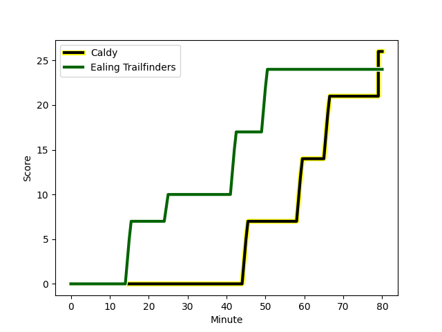
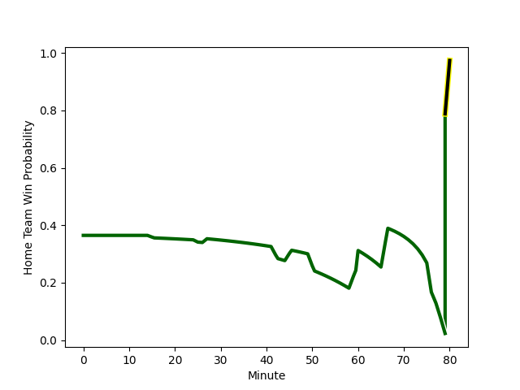

---  
layout: page  
title: Ealing Trailfinders at Caldy; 24-26  
date: 2023-01-07 15:00:00 18:00:00 -0500  
categories: match review  
---
# Ealing Trailfinders (1534.86) at Caldy (1294.11); 24-26

# Prediction: Ealing Trailfinders by 20.1

Ealing Trailfinders by 24.1 on a neutral field
## Scores over Time

## Win Probability over Time

# Pre-Match Prediction: Ealing Trailfinders by 21.4

Ealing Trailfinders by 25.4 on a neutral pitch

|   Away Minutes | Away Player                                                           |   Away elo |   Away Percentile |   Number |   Home Percentile |   Home elo | Home Player                                                   |   Home Minutes |
|---------------:|:----------------------------------------------------------------------|-----------:|------------------:|---------:|------------------:|-----------:|:--------------------------------------------------------------|---------------:|
|             57 | [James Gibbons](..//playerfiles//JamesGibbons_cleaned.md)             |      85.8  |               nan |        1 |                18 |      85.48 | [Nathan Rushton](..//playerfiles//NathanRushton_cleaned.md)   |             60 |
|             50 | [Jan-Henning Campher](..//playerfiles//Jan-HenningCampher_cleaned.md) |      77.37 |                 9 |        2 |                25 |      87.05 | [Oliver Hearn](..//playerfiles//OliverHearn_cleaned.md)       |             80 |
|             80 | [Ross Kane](..//playerfiles//RossKane_cleaned.md)                     |      91.62 |                44 |        3 |               nan |      88.28 | [Joe Jones](..//playerfiles//JoeJones_cleaned.md)             |             51 |
|             80 | [David O'Connor](..//playerfiles//DavidO'Connor_cleaned.md)           |      82.28 |                16 |        4 |                 9 |      77.54 | [Rouben Birch](..//playerfiles//RoubenBirch_cleaned.md)       |             80 |
|             80 | [Daniel Cutmore](..//playerfiles//DanielCutmore_cleaned.md)           |     105.61 |                74 |        5 |                12 |      79.15 | [Thomas Sanders](..//playerfiles//ThomasSanders_cleaned.md)   |             80 |
|             80 | [Rob Farrar](..//playerfiles//RobFarrar_cleaned.md)                   |      88.57 |                29 |        6 |                17 |      80.74 | [Harrison Crowe](..//playerfiles//HarrisonCrowe_cleaned.md)   |             60 |
|             57 | [Simon Uzokwe](..//playerfiles//SimonUzokwe_cleaned.md)               |     100.33 |                64 |        7 |                25 |      85.43 | [Callum Ridgway](..//playerfiles//CallumRidgway_cleaned.md)   |             80 |
|             80 | [Ryan Smid](..//playerfiles//RyanSmid_cleaned.md)                     |     113.31 |                84 |        8 |                51 |      96.18 | [Sam Dickinson](..//playerfiles//SamDickinson_cleaned.md)     |             80 |
|             64 | [Craig Hampson](..//playerfiles//CraigHampson_cleaned.md)             |     117.81 |                91 |        9 |                30 |      85.49 | [Joseph Murray](..//playerfiles//JosephMurray_cleaned.md)     |             60 |
|             80 | [Craig Willis](..//playerfiles//CraigWillis_cleaned.md)               |     147.88 |                99 |       10 |                23 |      80.47 | [Rhys Hayes](..//playerfiles//RhysHayes_cleaned.md)           |             80 |
|             27 | [Cian Kelleher](..//playerfiles//CianKelleher_cleaned.md)             |     118.28 |                89 |       11 |               nan |      92.57 | [Louis Beer](..//playerfiles//LouisBeer_cleaned.md)           |             80 |
|             76 | [Pat Howard](..//playerfiles//PatHoward_cleaned.md)                   |     100.79 |                61 |       12 |                45 |      91.3  | [Michael Barlow](..//playerfiles//MichaelBarlow_cleaned.md)   |             77 |
|             80 | [Reuben Bird-Tulloch](..//playerfiles//ReubenBird-Tulloch_cleaned.md) |      79.55 |                12 |       13 |                15 |      81.46 | [Dan Bibby](..//playerfiles//DanBibby_cleaned.md)             |             80 |
|             80 | [Luke Daniels](..//playerfiles//LukeDaniels_cleaned.md)               |      96.1  |                51 |       14 |                15 |      83.5  | [Nick Royle](..//playerfiles//NickRoyle_cleaned.md)           |             80 |
|             80 | [Jonah Holmes](..//playerfiles//JonahHolmes_cleaned.md)               |     122.88 |                90 |       15 |                34 |      88.82 | [Elliott Gourlay](..//playerfiles//ElliottGourlay_cleaned.md) |             80 |
|             53 | [George Davis](..//playerfiles//GeorgeDavis_cleaned.md)               |      90.58 |                57 |       16 |                54 |      96.43 | [Ryan Higginson](..//playerfiles//RyanHigginson_cleaned.md)   |             29 |
|             30 | [Bobby de Wee](..//playerfiles//BobbydeWee_cleaned.md)                |     122.15 |                92 |       17 |                21 |      86.26 | [Chris Pilgrim](..//playerfiles//ChrisPilgrim_cleaned.md)     |             20 |
|             23 | [Will Davis](..//playerfiles//WillDavis_cleaned.md)                   |     113.11 |                83 |       18 |                63 |     100.61 | [Martin Gerrard](..//playerfiles//MartinGerrard_cleaned.md)   |             20 |
|             23 | [Ollie Newman](..//playerfiles//OllieNewman_cleaned.md)               |     113.64 |                86 |       19 |               nan |      95    | [Jack Parker](..//playerfiles//JackParker_cleaned.md)         |             20 |
|             16 | [Jordan Burns](..//playerfiles//JordanBurns_cleaned.md)               |      99.72 |                77 |       20 |               nan |      95    | [Lewis Barker](..//playerfiles//LewisBarker_cleaned.md)       |              3 |
|              4 | [Steve Shingler](..//playerfiles//SteveShingler_cleaned.md)           |     103.98 |                82 |       21 |               nan |     nan    | nan                                                           |            nan |

