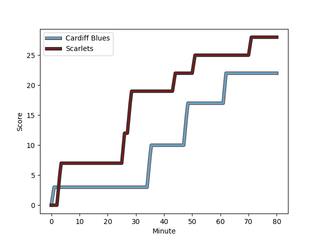
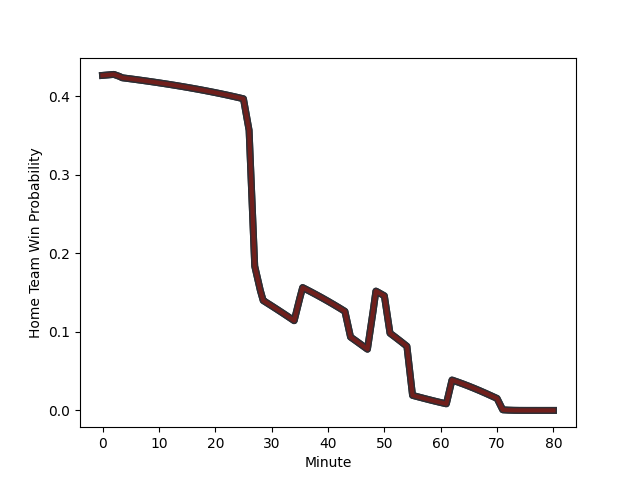

---  
layout: page  
title: Scarlets at Cardiff Blues; 28-22  
date: 2023-01-07 18:15:00 18:00:00 -0500  
categories: match review  
---
# Scarlets (1604.82) at Cardiff Blues (1476.06); 28-22

# Prediction: Scarlets by 8.9

Scarlets by 12.9 on a neutral field
## Scores over Time

## Win Probability over Time

# Pre-Match Prediction: Scarlets by 10.5

Cardiff Blues by 6.5 on a neutral pitch

|   Away Minutes | Away Player                                                     |   Away elo |   Away Percentile |   Number |   Home Percentile |   Home elo | Home Player                                                       |   Home Minutes |
|---------------:|:----------------------------------------------------------------|-----------:|------------------:|---------:|------------------:|-----------:|:------------------------------------------------------------------|---------------:|
|             60 | [Steffan Thomas](..//playerfiles//SteffanThomas_cleaned.md)     |      81.88 |                13 |        1 |                41 |      92.77 | [Rhys Carré](..//playerfiles//RhysCarré_cleaned.md)               |             66 |
|             80 | [Ken Owens](..//playerfiles//KenOwens_cleaned.md)               |     108.97 |                83 |        2 |                27 |      86.99 | [Kirby Myhill](..//playerfiles//KirbyMyhill_cleaned.md)           |             75 |
|             60 | [Javan Sebastian](..//playerfiles//JavanSebastian_cleaned.md)   |      72.54 |                 4 |        3 |                73 |     102.8  | [Dimitri Arhip](..//playerfiles//DimitriArhip_cleaned.md)         |             60 |
|             80 | [Vaea Fifita](..//playerfiles//VaeaFifita_cleaned.md)           |     127.86 |                96 |        4 |                18 |      84.12 | [Lopeti Timani](..//playerfiles//LopetiTimani_cleaned.md)         |             55 |
|             80 | [Sam Lousi](..//playerfiles//SamLousi_cleaned.md)               |     127.83 |                96 |        5 |                25 |      87.1  | [Seb Davies](..//playerfiles//SebDavies_cleaned.md)               |             80 |
|             80 | [Aaron Shingler](..//playerfiles//AaronShingler_cleaned.md)     |      94    |                44 |        6 |                19 |      84.48 | [Josh Turnbull](..//playerfiles//JoshTurnbull_cleaned.md)         |             80 |
|             80 | [Dan Davis](..//playerfiles//DanDavis_cleaned.md)               |     117.23 |                89 |        7 |                92 |     120.86 | [Thomas Young](..//playerfiles//ThomasYoung_cleaned.md)           |             61 |
|             60 | [Carwyn Tuipulotu](..//playerfiles//CarwynTuipulotu_cleaned.md) |      94.92 |               nan |        8 |                40 |      94.09 | [Taulupe Faletau](..//playerfiles//TaulupeFaletau_cleaned.md)     |             80 |
|             49 | [Dane Blacker](..//playerfiles//DaneBlacker_cleaned.md)         |      64.78 |                 2 |        9 |                87 |     113.41 | [Tomos Williams](..//playerfiles//TomosWilliams_cleaned.md)       |             60 |
|             80 | [Rhys Patchell](..//playerfiles//RhysPatchell_cleaned.md)       |     146.86 |                99 |       10 |                81 |     113.14 | [Jarrod Evans](..//playerfiles//JarrodEvans_cleaned.md)           |             80 |
|             80 | [Steffan Evans](..//playerfiles//SteffanEvans_cleaned.md)       |     111.9  |                83 |       11 |                70 |     103.41 | [Josh Adams](..//playerfiles//JoshAdams_cleaned.md)               |             80 |
|             80 | [Jonathan Davies](..//playerfiles//JonathanDavies_cleaned.md)   |     124.77 |                94 |       12 |                66 |     102.73 | [Ben Thomas](..//playerfiles//BenThomas_cleaned.md)               |             80 |
|             80 | [Joe Roberts](..//playerfiles//JoeRoberts_cleaned.md)           |     101.67 |                64 |       13 |                99 |     156.32 | [Rey Lee-Lo](..//playerfiles//ReyLee-Lo_cleaned.md)               |             27 |
|             80 | [Johnny McNicholl](..//playerfiles//JohnnyMcNicholl_cleaned.md) |     118.19 |                89 |       14 |                 6 |      72.78 | [Owen Lane](..//playerfiles//OwenLane_cleaned.md)                 |             80 |
|             80 | [Leigh Halfpenny](..//playerfiles//LeighHalfpenny_cleaned.md)   |     104.98 |                68 |       15 |                97 |     140.06 | [Liam Williams](..//playerfiles//LiamWilliams_cleaned.md)         |             27 |
|             31 | [Gareth Davies](..//playerfiles//GarethDavies_cleaned.md)       |      64.92 |                 2 |       16 |                15 |      87.37 | [Mason Grady](..//playerfiles//MasonGrady_cleaned.md)             |             53 |
|             20 | [Sam Wainwright](..//playerfiles//SamWainwright_cleaned.md)     |      90.52 |                36 |       17 |                20 |      86.85 | [Rhys Priestland](..//playerfiles//RhysPriestland_cleaned.md)     |             53 |
|             20 | [Kemsley Mathias](..//playerfiles//KemsleyMathias_cleaned.md)   |      97.11 |                55 |       18 |                86 |     113.74 | [Ellis Jenkins](..//playerfiles//EllisJenkins_cleaned.md)         |             25 |
|             20 | [Tomas Lezana](..//playerfiles//TomasLezana_cleaned.md)         |      87.26 |                26 |       19 |                88 |     113.66 | [Lloyd Williams](..//playerfiles//LloydWilliams_cleaned.md)       |             20 |
|            nan | nan                                                             |     nan    |               nan |       20 |               nan |      96.27 | [Keiron Assiratti](..//playerfiles//KeironAssiratti_cleaned.md)   |             20 |
|            nan | nan                                                             |     nan    |               nan |       21 |               nan |     100.21 | [Teddy Williams](..//playerfiles//TeddyWilliams_cleaned.md)       |             19 |
|            nan | nan                                                             |     nan    |               nan |       22 |                25 |      85.03 | [Corey Domachowski](..//playerfiles//CoreyDomachowski_cleaned.md) |             14 |
|            nan | nan                                                             |     nan    |               nan |       23 |               nan |      95    | [Efan Daniel](..//playerfiles//EfanDaniel_cleaned.md)             |              5 |

