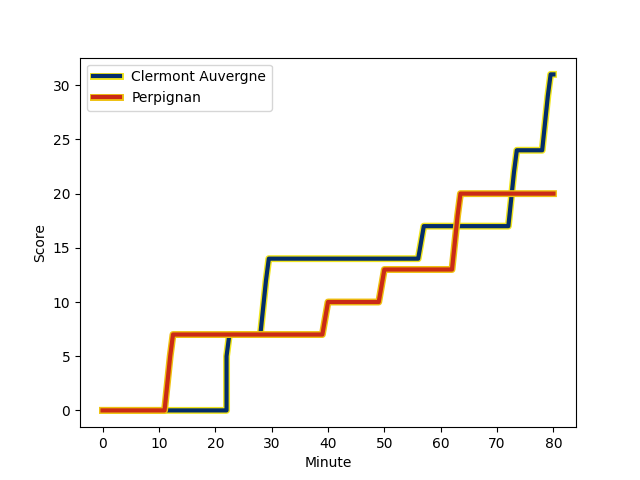
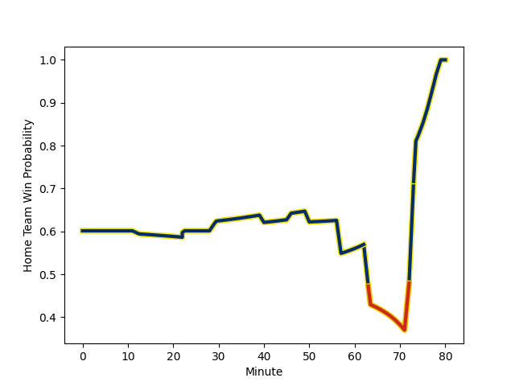

---  
layout: page  
title: Perpignan at Clermont Auvergne; 20-31  
date: 2023-01-07 17:00:00 18:00:00 -0500  
categories: match review  
---
# Perpignan (1399.68) at Clermont Auvergne (1578.17); 20-31

# Prediction: Clermont Auvergne by 21.8

Clermont Auvergne by 17.8 on a neutral field
## Scores over Time

## Win Probability over Time

# Pre-Match Prediction: Clermont Auvergne by 23.2

Clermont Auvergne by 19.2 on a neutral pitch

|   Away Minutes | Away Player                                                             |   Away elo |   Away Percentile |   Number |   Home Percentile |   Home elo | Home Player                                                         |   Home Minutes |
|---------------:|:------------------------------------------------------------------------|-----------:|------------------:|---------:|------------------:|-----------:|:--------------------------------------------------------------------|---------------:|
|             57 | [Giorgi Tetrashvili](..//playerfiles//GiorgiTetrashvili_cleaned.md)     |      85.27 |                18 |        1 |                95 |     120.25 | [Etienne Falgoux](..//playerfiles//EtienneFalgoux_cleaned.md)       |             57 |
|             57 | [Seilala Lam](..//playerfiles//SeilalaLam_cleaned.md)                   |      68.37 |                 2 |        2 |                27 |      87.95 | [Yohan Beheregaray](..//playerfiles//YohanBeheregaray_cleaned.md)   |             46 |
|             46 | [Arthur Joly](..//playerfiles//ArthurJoly_cleaned.md)                   |     124.59 |                97 |        3 |                37 |      91.09 | [Rabah Slimani](..//playerfiles//RabahSlimani_cleaned.md)           |             51 |
|             80 | [Tristan Labouteley](..//playerfiles//TristanLabouteley_cleaned.md)     |      56.93 |                 2 |        4 |                 9 |      76.12 | [Miles Amatosero](..//playerfiles//MilesAmatosero_cleaned.md)       |             70 |
|             80 | [Piula Faasalele](..//playerfiles//PiulaFaasalele_cleaned.md)           |     109.02 |                80 |        5 |                85 |     112.38 | [Tomas Lavanini](..//playerfiles//TomasLavanini_cleaned.md)         |             80 |
|             80 | [Brad Shields](..//playerfiles//BradShields_cleaned.md)                 |     117.48 |                89 |        6 |                97 |     133.72 | [Alexandre Fischer](..//playerfiles//AlexandreFischer_cleaned.md)   |             80 |
|             64 | [Lucas Bachelier](..//playerfiles//LucasBachelier_cleaned.md)           |     122.96 |                94 |        7 |                35 |      90.39 | [Killian Tixeront](..//playerfiles//KillianTixeront_cleaned.md)     |             40 |
|             80 | [Genesis Mamea Lemalu](..//playerfiles//GenesisMameaLemalu_cleaned.md)  |     112.76 |                83 |        8 |                99 |     140.79 | [Fritz Lee](..//playerfiles//FritzLee_cleaned.md)                   |             80 |
|             57 | [Sadek Deghmache](..//playerfiles//SadekDeghmache_cleaned.md)           |      91.24 |                35 |        9 |                95 |     125.25 | [Sebastien Bezy](..//playerfiles//SebastienBezy_cleaned.md)         |             72 |
|             80 | [Jake McIntyre](..//playerfiles//JakeMcIntyre_cleaned.md)               |     111.54 |                77 |       10 |                57 |     100.13 | [Jules Plisson](..//playerfiles//JulesPlisson_cleaned.md)           |             61 |
|             80 | [Ali Crossdale](..//playerfiles//AliCrossdale_cleaned.md)               |     104.03 |                74 |       11 |                88 |     116.28 | [Alivereti Raka](..//playerfiles//AliveretiRaka_cleaned.md)         |             80 |
|             80 | [Jeronimo de la Fuente](..//playerfiles//JeronimodelaFuente_cleaned.md) |      65.63 |                 2 |       12 |                22 |      85.13 | [Irae Simone](..//playerfiles//IraeSimone_cleaned.md)               |             80 |
|             67 | [George Tilsley](..//playerfiles//GeorgeTilsley_cleaned.md)             |      95.87 |                56 |       13 |                12 |      77.46 | [Samuel Ezeala](..//playerfiles//SamuelEzeala_cleaned.md)           |             56 |
|             80 | [Lucas Dubois](..//playerfiles//LucasDubois_cleaned.md)                 |      88.36 |                27 |       14 |                68 |     102.23 | [Bautista Delguy](..//playerfiles//BautistaDelguy_cleaned.md)       |             80 |
|             80 | [Boris Goutard](..//playerfiles//BorisGoutard_cleaned.md)               |      55.97 |                 1 |       15 |                91 |     124.83 | [Alex Newsome](..//playerfiles//AlexNewsome_cleaned.md)             |             80 |
|             34 | [Ma'afu Fia](..//playerfiles//Ma'afuFia_cleaned.md)                     |      99.63 |                66 |       16 |                22 |      86.01 | [Judicael Cancoriet](..//playerfiles//JudicaelCancoriet_cleaned.md) |             40 |
|             23 | [Tom Ecochard](..//playerfiles//TomEcochard_cleaned.md)                 |      95.13 |                57 |       17 |                22 |      84.83 | [Adrien Pelissie](..//playerfiles//AdrienPelissie_cleaned.md)       |             34 |
|             23 | [Xavier Chiocci](..//playerfiles//XavierChiocci_cleaned.md)             |      81.13 |                12 |       18 |                87 |     111.83 | [Davit Kubriashvili](..//playerfiles//DavitKubriashvili_cleaned.md) |             29 |
|             23 | [Victor Montgaillard](..//playerfiles//VictorMontgaillard_cleaned.md)   |      88.63 |                20 |       19 |                 7 |      70.22 | [Cheikh Tiberghien](..//playerfiles//CheikhTiberghien_cleaned.md)   |             24 |
|             16 | [Posolo Tuilagi](..//playerfiles//PosoloTuilagi_cleaned.md)             |      92.54 |               nan |       20 |                72 |      99.49 | [Daniel Bibi Biziwu](..//playerfiles//DanielBibiBiziwu_cleaned.md)  |             23 |
|             13 | [Afusipa Taumoepeau](..//playerfiles//AfusipaTaumoepeau_cleaned.md)     |      99.54 |                58 |       21 |                72 |     106.31 | [Anthony Belleau](..//playerfiles//AnthonyBelleau_cleaned.md)       |             19 |
|            nan | nan                                                                     |     nan    |               nan |       22 |               nan |      81.11 | [Edward Annandale](..//playerfiles//EdwardAnnandale_cleaned.md)     |             10 |
|            nan | nan                                                                     |     nan    |               nan |       23 |                34 |      87.46 | [Baptiste Jauneau](..//playerfiles//BaptisteJauneau_cleaned.md)     |              8 |

