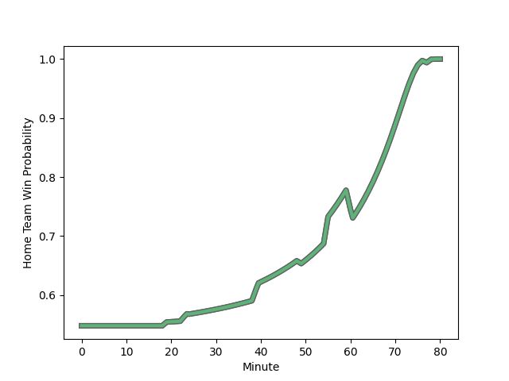

---  
layout: page  
title: Sharks at Connacht; 12-24  
date: 2023-01-07 18:15:00 18:00:00 -0500  
categories: match review  
---
# Sharks (1440.04) at Connacht (1523.53); 12-24

# Prediction: Connacht by 12.3

Connacht by 8.3 on a neutral field
## Scores over Time

## Win Probability over Time

# Pre-Match Prediction: Connacht by 10.8

Connacht by 6.8 on a neutral pitch

|   Away Minutes | Away Player                                                                      |   Away elo |   Away Percentile |   Number |   Home Percentile |   Home elo | Home Player                                                                   |   Home Minutes |
|---------------:|:---------------------------------------------------------------------------------|-----------:|------------------:|---------:|------------------:|-----------:|:------------------------------------------------------------------------------|---------------:|
|             58 | [Ntuthuko Mchunu](..//playerfiles//NtuthukoMchunu_cleaned.md)                    |      99.78 |                64 |        1 |                93 |     117.79 | [Denis Buckley](..//playerfiles//DenisBuckley_cleaned.md)                     |             61 |
|             49 | [Fezokuhle Mbatha](..//playerfiles//FezokuhleMbatha_cleaned.md)                  |      94.82 |                50 |        2 |                90 |     116.21 | [Shane Delahunt](..//playerfiles//ShaneDelahunt_cleaned.md)                   |             53 |
|             49 | [Carlu Sadie](..//playerfiles//CarluSadie_cleaned.md)                            |      94.1  |                42 |        3 |                58 |      97.9  | [Finlay Bealham](..//playerfiles//FinlayBealham_cleaned.md)                   |             61 |
|             78 | [Thembelani Bholi](..//playerfiles//ThembelaniBholi_cleaned.md)                  |      89.14 |                30 |        4 |                18 |      83.15 | [Oisin Dowling](..//playerfiles//OisinDowling_cleaned.md)                     |             24 |
|             80 | [Reniel Hugo](..//playerfiles//RenielHugo_cleaned.md)                            |     120.51 |                88 |        5 |                26 |      87.63 | [Darragh Murray](..//playerfiles//DarraghMurray_cleaned.md)                   |             80 |
|             80 | [James Venter](..//playerfiles//JamesVenter_cleaned.md)                          |      85.87 |                23 |        6 |                95 |     126.34 | [Josh Murphy](..//playerfiles//JoshMurphy_cleaned.md)                         |             80 |
|             80 | [Henco Venter](..//playerfiles//HencoVenter_cleaned.md)                          |      92.61 |                41 |        7 |                85 |     112.58 | [Conor Oliver](..//playerfiles//ConorOliver_cleaned.md)                       |             80 |
|             67 | [Celimpilo Gumede](..//playerfiles//CelimpiloGumede_cleaned.md)                  |      98.52 |                57 |        8 |                45 |      94.09 | [Shamus Hurley-Langton](..//playerfiles//ShamusHurley-Langton_cleaned.md)     |             61 |
|             50 | [Cameron Wright](..//playerfiles//CameronWright_cleaned.md)                      |      89.06 |                30 |        9 |                75 |     105.72 | [Kieran Marmion](..//playerfiles//KieranMarmion_cleaned.md)                   |             80 |
|             80 | [Nevaldo Fleurs](..//playerfiles//NevaldoFleurs_cleaned.md)                      |      85.15 |                26 |       10 |                46 |      95.76 | [Jack Carty](..//playerfiles//JackCarty_cleaned.md)                           |             80 |
|             80 | [Marnus Potgieter](..//playerfiles//MarnusPotgieter_cleaned.md)                  |      99.2  |                61 |       11 |                31 |      89.66 | [Mack Hansen](..//playerfiles//MackHansen_cleaned.md)                         |             80 |
|             80 | [Rohan Janse van Rensburg](..//playerfiles//RohanJansevanRensburg_cleaned.md)    |     121.37 |                92 |       12 |                56 |      98.83 | [Cathal Forde](..//playerfiles//CathalForde_cleaned.md)                       |             80 |
|             78 | [Murray Koster](..//playerfiles//MurrayKoster_cleaned.md)                        |      89.76 |                33 |       13 |                47 |      94.96 | [Tom Farrell](..//playerfiles//TomFarrell_cleaned.md)                         |             64 |
|             80 | [Yaw Penxe](..//playerfiles//YawPenxe_cleaned.md)                                |      69.63 |                 6 |       14 |                91 |     122.26 | [John Porch](..//playerfiles//JohnPorch_cleaned.md)                           |             80 |
|             40 | [Anthony Volmink](..//playerfiles//AnthonyVolmink_cleaned.md)                    |      92.01 |                42 |       15 |                44 |      93.56 | [Tiernan O'Halloran](..//playerfiles//TiernanO'Halloran_cleaned.md)           |             66 |
|             40 | [Lionel Cronje](..//playerfiles//LionelCronje_cleaned.md)                        |     121.35 |                90 |       16 |                13 |      80.27 | [Cian Prendergast](..//playerfiles//CianPrendergast_cleaned.md)               |             56 |
|             31 | [Kerron van Vuuren](..//playerfiles//KerronvanVuuren_cleaned.md)                 |      85.22 |                14 |       17 |                40 |      91.96 | [Dylan Tierney-Martin](..//playerfiles//DylanTierney-Martin_cleaned.md)       |             27 |
|             31 | [Khuthuzani Kingdom Mchunu](..//playerfiles//KhuthuzaniKingdomMchunu_cleaned.md) |      90.86 |                38 |       18 |                58 |      95.74 | [Jordan Duggan](..//playerfiles//JordanDuggan_cleaned.md)                     |             19 |
|             30 | [Grant Williams](..//playerfiles//GrantWilliams_cleaned.md)                      |     116.33 |                90 |       19 |                53 |      96.08 | [Dominic Robertson-McCoy](..//playerfiles//DominicRobertson-McCoy_cleaned.md) |             19 |
|             22 | [Dian Bleuler](..//playerfiles//DianBleuler_cleaned.md)                          |      96.55 |                43 |       20 |                93 |     122.87 | [Leva Fifita](..//playerfiles//LevaFifita_cleaned.md)                         |             19 |
|             13 | [Corne Rahl](..//playerfiles//CorneRahl_cleaned.md)                              |      94    |               nan |       21 |                36 |      89.89 | [Byron Ralston](..//playerfiles//ByronRalston_cleaned.md)                     |             16 |
|              2 | [Ethan Hooker](..//playerfiles//EthanHooker_cleaned.md)                          |      95    |               nan |       22 |                13 |      77.23 | [Conor Fitzgerald](..//playerfiles//ConorFitzgerald_cleaned.md)               |             14 |
|              2 | [Ockie Barnard](..//playerfiles//OckieBarnard_cleaned.md)                        |      92.36 |                39 |       23 |               nan |     nan    | nan                                                                           |            nan |

