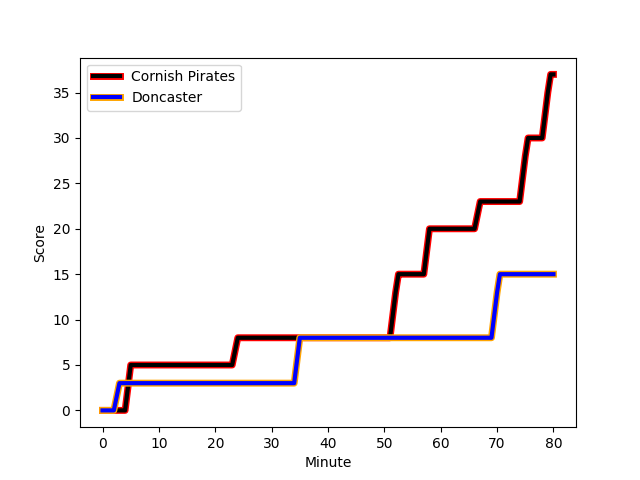
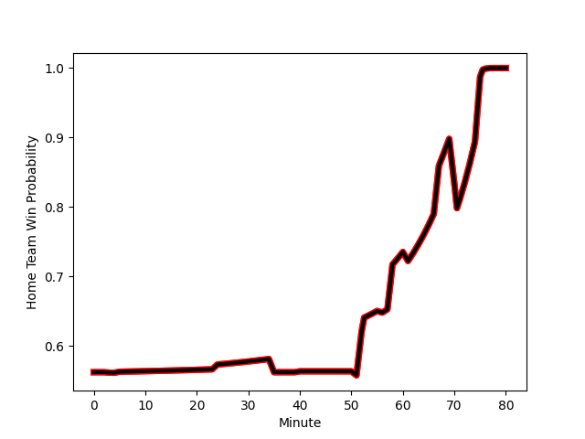

---  
layout: page  
title: Doncaster at Cornish Pirates; 15-37  
date: 2023-01-07 15:30:00 18:00:00 -0500  
categories: match review  
---
# Doncaster (1418.12) at Cornish Pirates (1526.69); 15-37

# Prediction: Cornish Pirates by 14.9

Cornish Pirates by 10.9 on a neutral field
## Scores over Time

## Win Probability over Time

# Pre-Match Prediction: Cornish Pirates by 14.2

Cornish Pirates by 10.2 on a neutral pitch

|   Away Minutes | Away Player                                                 |   Away elo |   Away Percentile |   Number |   Home Percentile |   Home elo | Home Player                                                                 |   Home Minutes |
|---------------:|:------------------------------------------------------------|-----------:|------------------:|---------:|------------------:|-----------:|:----------------------------------------------------------------------------|---------------:|
|             56 | [Ben Carlile](..//playerfiles//BenCarlile_cleaned.md)       |      87.13 |                22 |        1 |                93 |     117.1  | [Marlen Walker](..//playerfiles//MarlenWalker_cleaned.md)                   |             61 |
|             61 | [George Roberts](..//playerfiles//GeorgeRoberts_cleaned.md) |      86.99 |                25 |        2 |                64 |     100.21 | [William Crane](..//playerfiles//WilliamCrane_cleaned.md)                   |             61 |
|             67 | [Jake Armstrong](..//playerfiles//JakeArmstrong_cleaned.md) |     102.38 |                71 |        3 |                63 |      99.47 | [Matt Johnson](..//playerfiles//MattJohnson_cleaned.md)                     |             61 |
|             80 | [Ehize Ehizode](..//playerfiles//EhizeEhizode_cleaned.md)   |      67.95 |                 5 |        4 |                10 |      76.95 | [Cory Teague](..//playerfiles//CoryTeague_cleaned.md)                       |             80 |
|             67 | [Evan Mintern](..//playerfiles//EvanMintern_cleaned.md)     |     107.98 |                78 |        5 |                66 |     101.96 | [Will Britton](..//playerfiles//WillBritton_cleaned.md)                     |             40 |
|             80 | [Sam Hudson](..//playerfiles//SamHudson_cleaned.md)         |     105.73 |                74 |        6 |                63 |     100.72 | [Alex Everett](..//playerfiles//AlexEverett_cleaned.md)                     |             80 |
|             75 | [Thom Smith](..//playerfiles//ThomSmith_cleaned.md)         |      81.8  |                14 |        7 |                14 |      85.83 | [Will Gibson](..//playerfiles//WillGibson_cleaned.md)                       |             51 |
|             80 | [John Kelly](..//playerfiles//JohnKelly_cleaned.md)         |     109.37 |                78 |        8 |                81 |     110.88 | [Sebastian Nagle-Taylor](..//playerfiles//SebastianNagle-Taylor_cleaned.md) |             80 |
|             75 | [Alex Dolly](..//playerfiles//AlexDolly_cleaned.md)         |     110.33 |                83 |        9 |                53 |      97.85 | [Tom Kessell](..//playerfiles//TomKessell_cleaned.md)                       |             75 |
|             75 | [Sam Olver](..//playerfiles//SamOlver_cleaned.md)           |      94.74 |                42 |       10 |                74 |     108.37 | [Harry Bazalgette](..//playerfiles//HarryBazalgette_cleaned.md)             |             67 |
|             80 | [Robbie Smith](..//playerfiles//RobbieSmith_cleaned.md)     |      73.26 |               nan |       11 |                82 |     110.56 | [Tom Wyatt](..//playerfiles//TomWyatt_cleaned.md)                           |             80 |
|             80 | [Connor Edwards](..//playerfiles//ConnorEdwards_cleaned.md) |      86.1  |                25 |       12 |                63 |     107.93 | [Garyn Smith](..//playerfiles//GarynSmith_cleaned.md)                       |             80 |
|             52 | [Joe Margetts](..//playerfiles//JoeMargetts_cleaned.md)     |      93.74 |                44 |       13 |                82 |     111.81 | [Rory Parata](..//playerfiles//RoryParata_cleaned.md)                       |             80 |
|             80 | [George Simpson](..//playerfiles//GeorgeSimpson_cleaned.md) |      93.12 |                42 |       14 |                42 |      93    | [Robin Wedlake](..//playerfiles//RobinWedlake_cleaned.md)                   |             80 |
|             80 | [Maliq Holden](..//playerfiles//MaliqHolden_cleaned.md)     |     127.13 |                95 |       15 |                89 |     122.11 | [Alexander AJ Cant](..//playerfiles//AlexanderAJCant_cleaned.md)            |             75 |
|             28 | [Jack Metcalf](..//playerfiles//JackMetcalf_cleaned.md)     |      61.53 |                 2 |       16 |                 6 |      74.82 | [Rusiate Tuima](..//playerfiles//RusiateTuima_cleaned.md)                   |             29 |
|             24 | [James Wayland](..//playerfiles//JamesWayland_cleaned.md)   |     100.58 |               nan |       17 |               nan |      92.09 | [Max Norey](..//playerfiles//MaxNorey_cleaned.md)                           |             19 |
|             19 | [Will Holling](..//playerfiles//WillHolling_cleaned.md)     |      94.66 |                54 |       18 |                51 |      97.69 | [Harvey Beaton](..//playerfiles//HarveyBeaton_cleaned.md)                   |             19 |
|             13 | [Mak Wilson](..//playerfiles//MakWilson_cleaned.md)         |      99.14 |                66 |       19 |                13 |      82.15 | [Ollie Adkins](..//playerfiles//OllieAdkins_cleaned.md)                     |             19 |
|             13 | [Martin Molina](..//playerfiles//MartinMolina_cleaned.md)   |      83.54 |                16 |       20 |                39 |      93.51 | [Arwel Robson](..//playerfiles//ArwelRobson_cleaned.md)                     |             13 |
|              5 | [Jared Cardew](..//playerfiles//JaredCardew_cleaned.md)     |      88.17 |                25 |       21 |                29 |      89.29 | [Alex Schwarz](..//playerfiles//AlexSchwarz_cleaned.md)                     |              5 |
|              5 | [Billy McBryde](..//playerfiles//BillyMcBryde_cleaned.md)   |     108.65 |                76 |       22 |               nan |      95    | [Will Trewin](..//playerfiles//WillTrewin_cleaned.md)                       |              5 |
|              5 | [Joe Green](..//playerfiles//JoeGreen_cleaned.md)           |      94.47 |                37 |       23 |                65 |     104.43 | [James Fender](..//playerfiles//JamesFender_cleaned.md)                     |             40 |

