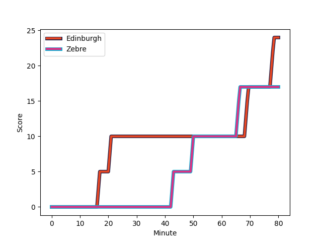

---  
layout: page  
title: Zebre at Edinburgh; 17-24  
date: 2023-01-07 16:00:00 18:00:00 -0500  
categories: match review  
---
# Zebre (1353.11) at Edinburgh (1611.3); 17-24

# Prediction: Edinburgh by 29.8

Edinburgh by 25.8 on a neutral field
## Scores over Time

## Win Probability over Time

# Pre-Match Prediction: Edinburgh by 26.1

Edinburgh by 22.1 on a neutral pitch

|   Away Minutes | Away Player                                                                 |   Away elo |   Away Percentile |   Number |   Home Percentile |   Home elo | Home Player                                                       |   Home Minutes |
|---------------:|:----------------------------------------------------------------------------|-----------:|------------------:|---------:|------------------:|-----------:|:------------------------------------------------------------------|---------------:|
|             64 | [Paolo Buonfiglio](..//playerfiles//PaoloBuonfiglio_cleaned.md)             |      93.41 |                51 |        1 |                53 |      96.07 | [Boan Venter](..//playerfiles//BoanVenter_cleaned.md)             |             68 |
|             63 | [Luca Bigi](..//playerfiles//LucaBigi_cleaned.md)                           |      84.21 |                18 |        2 |                74 |     104.43 | [Dave Cherry](..//playerfiles//DaveCherry_cleaned.md)             |             61 |
|             63 | [Matteo Nocera](..//playerfiles//MatteoNocera_cleaned.md)                   |      97.62 |                57 |        3 |                65 |      98.95 | [Angus Williams](..//playerfiles//AngusWilliams_cleaned.md)       |             49 |
|             60 | [Dennis Visser](..//playerfiles//DennisVisser_cleaned.md)                   |      87.76 |                30 |        4 |                89 |     118.05 | [Sam Skinner](..//playerfiles//SamSkinner_cleaned.md)             |             80 |
|             77 | [Josh Furno](..//playerfiles//JoshFurno_cleaned.md)                         |     121    |                92 |        5 |                57 |      98.22 | [Jamie Hodgson](..//playerfiles//JamieHodgson_cleaned.md)         |             63 |
|             60 | [Giacomo Ferrari](..//playerfiles//GiacomoFerrari_cleaned.md)               |      91.27 |                38 |        6 |                97 |     132.57 | [Luke Crosbie](..//playerfiles//LukeCrosbie_cleaned.md)           |             80 |
|             80 | [MJ Pelser](..//playerfiles//MJPelser_cleaned.md)                           |      64.98 |                 2 |        7 |                70 |     101.63 | [Connor Boyle](..//playerfiles//ConnorBoyle_cleaned.md)           |             80 |
|             80 | [Matt Kvesic](..//playerfiles//MattKvesic_cleaned.md)                       |      96.87 |                52 |        8 |                89 |     117.61 | [Nick Haining](..//playerfiles//NickHaining_cleaned.md)           |             49 |
|             80 | [Alessandro Fusco](..//playerfiles//AlessandroFusco_cleaned.md)             |      84.93 |                18 |        9 |                82 |     109.78 | [Charlie Shiel](..//playerfiles//CharlieShiel_cleaned.md)         |             55 |
|             80 | [Tiff Eden](..//playerfiles//TiffEden_cleaned.md)                           |      88.91 |                25 |       10 |                56 |      97.98 | [Charlie Savala](..//playerfiles//CharlieSavala_cleaned.md)       |             80 |
|             80 | [Simone Gesi](..//playerfiles//SimoneGesi_cleaned.md)                       |      86.47 |                22 |       11 |               100 |     149.9  | [Blair Kinghorn](..//playerfiles//BlairKinghorn_cleaned.md)       |             80 |
|             68 | [Enrico Lucchin](..//playerfiles//EnricoLucchin_cleaned.md)                 |     132.6  |                97 |       12 |                77 |     106.79 | [Cameron Hutchison](..//playerfiles//CameronHutchison_cleaned.md) |             63 |
|             80 | [Tommaso Boni](..//playerfiles//TommasoBoni_cleaned.md)                     |      69.29 |                 4 |       13 |                87 |     115.96 | [Mark Bennett](..//playerfiles//MarkBennett_cleaned.md)           |             80 |
|             77 | [Pierre Bruno](..//playerfiles//PierreBruno_cleaned.md)                     |      99.65 |                62 |       14 |                78 |     107.56 | [Jack Blain](..//playerfiles//JackBlain_cleaned.md)               |             80 |
|             80 | [Jacopo Trulla](..//playerfiles//JacopoTrulla_cleaned.md)                   |      65.11 |                 3 |       15 |                39 |      91    | [Harry Paterson](..//playerfiles//HarryPaterson_cleaned.md)       |             80 |
|             20 | [Leonard Krumov](..//playerfiles//LeonardKrumov_cleaned.md)                 |      71.69 |                 6 |       16 |                20 |      86.44 | [Luan de Bruin](..//playerfiles//LuandeBruin_cleaned.md)          |             31 |
|             20 | [Davide Ruggeri](..//playerfiles//DavideRuggeri_cleaned.md)                 |      99.37 |                59 |       17 |                 0 |      57.08 | [Viliame Mata](..//playerfiles//ViliameMata_cleaned.md)           |             31 |
|             17 | [Muhamed Hasa](..//playerfiles//MuhamedHasa_cleaned.md)                     |      96.59 |                54 |       18 |                82 |     108.84 | [Ben Vellacott](..//playerfiles//BenVellacott_cleaned.md)         |             25 |
|             17 | [Jacques du Toit](..//playerfiles//JacquesduToit_cleaned.md)                |      79.27 |                14 |       19 |                27 |      86.54 | [Patrick Harrison](..//playerfiles//PatrickHarrison_cleaned.md)   |             19 |
|             16 | [Alessio Sanavia](..//playerfiles//AlessioSanavia_cleaned.md)               |      89.45 |               nan |       20 |                59 |      99.97 | [James Lang](..//playerfiles//JamesLang_cleaned.md)               |             17 |
|             12 | [Franco Smith](..//playerfiles//FrancoSmith_cleaned.md)                     |      86.03 |                24 |       21 |                26 |      86.98 | [Marshall Sykes](..//playerfiles//MarshallSykes_cleaned.md)       |             17 |
|              3 | [Ratko Jelic](..//playerfiles//RatkoJelic_cleaned.md)                       |      85.98 |                34 |       22 |               nan |     105.91 | [Nick Auterac](..//playerfiles//NickAuterac_cleaned.md)           |             12 |
|              3 | [Geronimo Prisciantelli](..//playerfiles//GeronimoPrisciantelli_cleaned.md) |     136.79 |                96 |       23 |               nan |     nan    | nan                                                               |            nan |

