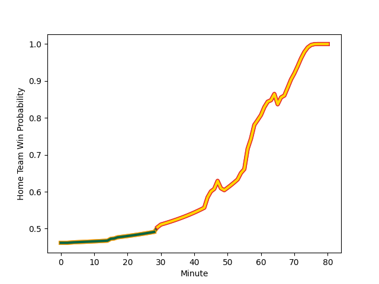

---  
layout: page  
title: Northampton Saints at Exeter Chiefs; 12-35  
date: 2023-01-07 11:30:00 18:00:00 -0500  
categories: match review  
---
# Northampton Saints (1588.11) at Exeter Chiefs (1521.3); 12-35

# Prediction: Northampton Saints by 2.7

Northampton Saints by 6.7 on a neutral field
## Scores over Time

## Win Probability over Time

# Pre-Match Prediction: Northampton Saints by 4.1

Northampton Saints by 8.1 on a neutral pitch

|   Away Minutes | Away Player                                                             |   Away elo |   Away Percentile |   Number |   Home Percentile |   Home elo | Home Player                                                       |   Home Minutes |
|---------------:|:------------------------------------------------------------------------|-----------:|------------------:|---------:|------------------:|-----------:|:------------------------------------------------------------------|---------------:|
|             71 | [Alex Waller](..//playerfiles//AlexWaller_cleaned.md)                   |     141.65 |                99 |        1 |                 7 |      77.1  | [Scott Sio](..//playerfiles//ScottSio_cleaned.md)                 |             63 |
|             58 | [Mike Haywood](..//playerfiles//MikeHaywood_cleaned.md)                 |     148.83 |                99 |        2 |                81 |     108.12 | [Luke Cowan-Dickie](..//playerfiles//LukeCowan-Dickie_cleaned.md) |             56 |
|             61 | [Paul Hill](..//playerfiles//PaulHill_cleaned.md)                       |      99.93 |                65 |        3 |                87 |     112    | [Harry Williams](..//playerfiles//HarryWilliams_cleaned.md)       |             67 |
|             71 | [Alex Coles](..//playerfiles//AlexColes_cleaned.md)                     |      58.18 |                 0 |        4 |                70 |     103.47 | [Dafydd Jenkins](..//playerfiles//DafyddJenkins_cleaned.md)       |             67 |
|             80 | [Alex Moon](..//playerfiles//AlexMoon_cleaned.md)                       |     102.01 |                66 |        5 |                43 |      91.81 | [Jack Dunne](..//playerfiles//JackDunne_cleaned.md)               |             80 |
|             80 | [Lukhan Salakaia-Loto](..//playerfiles//LukhanSalakaia-Loto_cleaned.md) |      90.47 |                36 |        6 |                95 |     128.11 | [Dave Ewers](..//playerfiles//DaveEwers_cleaned.md)               |             80 |
|             63 | [Angus Scott-Young](..//playerfiles//AngusScott-Young_cleaned.md)       |     110.39 |                81 |        7 |                26 |      87.4  | [Christ Tshiunza](..//playerfiles//ChristTshiunza_cleaned.md)     |             80 |
|             80 | [Lewis Ludlam](..//playerfiles//LewisLudlam_cleaned.md)                 |      92.13 |                37 |        8 |                92 |     125.29 | [Sam Simmonds](..//playerfiles//SamSimmonds_cleaned.md)           |             67 |
|             80 | [Alex Mitchell](..//playerfiles//AlexMitchell_cleaned.md)               |     111.1  |                84 |        9 |                 6 |      74.52 | [Sam Maunder](..//playerfiles//SamMaunder_cleaned.md)             |             63 |
|             80 | [George Furbank](..//playerfiles//GeorgeFurbank_cleaned.md)             |     135.84 |                96 |       10 |                89 |     120.86 | [Joe Simmonds](..//playerfiles//JoeSimmonds_cleaned.md)           |             63 |
|             47 | [Courtnall Skosan](..//playerfiles//CourtnallSkosan_cleaned.md)         |     126.38 |                94 |       11 |                88 |     117.96 | [Olly Woodburn](..//playerfiles//OllyWoodburn_cleaned.md)         |             80 |
|             67 | [Fraser Dingwall](..//playerfiles//FraserDingwall_cleaned.md)           |      69.78 |                 4 |       12 |                95 |     127.51 | [Solomone Kata](..//playerfiles//SolomoneKata_cleaned.md)         |             70 |
|             80 | [Matt Proctor](..//playerfiles//MattProctor_cleaned.md)                 |     111.03 |                81 |       13 |                76 |     107.52 | [Henry Slade](..//playerfiles//HenrySlade_cleaned.md)             |             80 |
|             80 | [James Ramm](..//playerfiles//JamesRamm_cleaned.md)                     |     111.51 |                82 |       14 |                27 |      88.29 | [Jack Nowell](..//playerfiles//JackNowell_cleaned.md)             |             80 |
|             55 | [Tommy Freeman](..//playerfiles//TommyFreeman_cleaned.md)               |     119.17 |                90 |       15 |                 3 |      62.52 | [Josh Hodge](..//playerfiles//JoshHodge_cleaned.md)               |             80 |
|             22 | [Robbie Smith](..//playerfiles//RobbieSmith_cleaned.md)                 |      69.92 |                 3 |       16 |                97 |     125.43 | [Jack Yeandle](..//playerfiles//JackYeandle_cleaned.md)           |             24 |
|              9 | [Emmanuel Iyogun](..//playerfiles//EmmanuelIyogun_cleaned.md)           |     117.56 |                95 |       17 |                14 |      77.89 | [James Kenny](..//playerfiles//JamesKenny_cleaned.md)             |             17 |
|             19 | [Alfie Petch](..//playerfiles//AlfiePetch_cleaned.md)                   |      73.68 |                 8 |       18 |                23 |      88.72 | [Josh Iosefa-Scott](..//playerfiles//JoshIosefa-Scott_cleaned.md) |             13 |
|              9 | [Karl Wilkins](..//playerfiles//KarlWilkins_cleaned.md)                 |      81.42 |                13 |       19 |                84 |     111.96 | [Ruben van Heerden](..//playerfiles//RubenvanHeerden_cleaned.md)  |             13 |
|             17 | [Sam Graham](..//playerfiles//SamGraham_cleaned.md)                     |     121.96 |                91 |       20 |                22 |      86.07 | [Greg Fisilau](..//playerfiles//GregFisilau_cleaned.md)           |             13 |
|             13 | [Callum Braley](..//playerfiles//CallumBraley_cleaned.md)               |      81.39 |                12 |       21 |                10 |      80.08 | [Jack Maunder](..//playerfiles//JackMaunder_cleaned.md)           |             17 |
|             33 | [Rory Hutchinson](..//playerfiles//RoryHutchinson_cleaned.md)           |      88.98 |                31 |       22 |                59 |     100.87 | [Harvey Skinner](..//playerfiles//HarveySkinner_cleaned.md)       |             17 |
|             25 | [Tom Collins](..//playerfiles//TomCollins_cleaned.md)                   |     115.39 |                88 |       23 |                34 |      89.81 | [Rory O'Loughlin](..//playerfiles//RoryO'Loughlin_cleaned.md)     |             10 |

