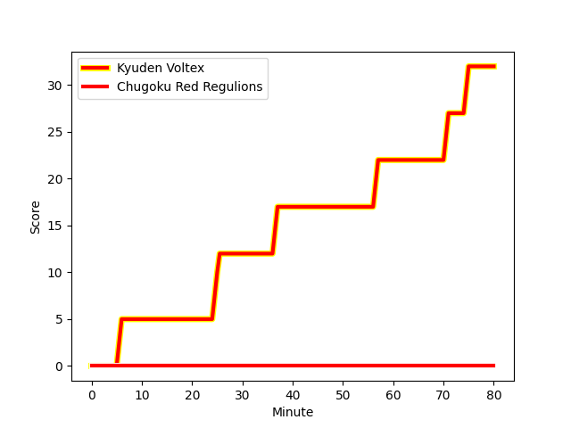
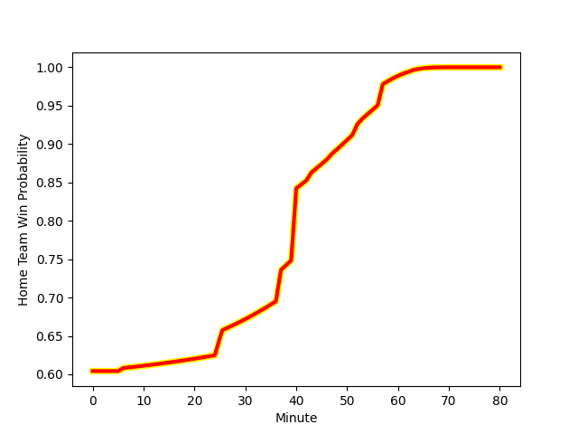

---  
layout: page  
title: Chugoku Red Regulions at Kyuden Voltex; 0-32  
date: 2023-01-07 00:00:00 18:00:00 -0500  
categories: match review  
---
# Chugoku Red Regulions (1173.27) at Kyuden Voltex (1357.0); 0-32

# Prediction: Kyuden Voltex by 22.4

Kyuden Voltex by 18.4 on a neutral field
## Scores over Time

## Win Probability over Time

# Pre-Match Prediction: Kyuden Voltex by 18.9

Kyuden Voltex by 14.9 on a neutral pitch

|   Away Minutes | Away Player                                                       |   Away elo |   Away Percentile |   Number |   Home Percentile |   Home elo | Home Player                                                                |   Home Minutes |
|---------------:|:------------------------------------------------------------------|-----------:|------------------:|---------:|------------------:|-----------:|:---------------------------------------------------------------------------|---------------:|
|             53 | [Kojiro Arito](..//playerfiles//KojiroArito_cleaned.md)           |      81.54 |                12 |        1 |                51 |      95.83 | [Samuel Nozomu Faialaga](..//playerfiles//SamuelNozomuFaialaga_cleaned.md) |             52 |
|             64 | [Kentaro Iwanaga](..//playerfiles//KentaroIwanaga_cleaned.md)     |      79.61 |                10 |        2 |                17 |      83.95 | [Daigo Asato](..//playerfiles//DaigoAsato_cleaned.md)                      |             64 |
|             43 | [Daiki Ishida](..//playerfiles//DaikiIshida_cleaned.md)           |      96.3  |                63 |        3 |                42 |      93.1  | [Shinpei Kamata](..//playerfiles//ShinpeiKamata_cleaned.md)                |             64 |
|             80 | [Taro Nishikawa](..//playerfiles//TaroNishikawa_cleaned.md)       |      50.4  |                 0 |        4 |                61 |      94.89 | [Tomotaka Ishimatsu](..//playerfiles//TomotakaIshimatsu_cleaned.md)        |             52 |
|             40 | [Noriyuki Kureyama](..//playerfiles//NoriyukiKureyama_cleaned.md) |      87.46 |                26 |        5 |                11 |      78.33 | [Tom Rowe](..//playerfiles//TomRowe_cleaned.md)                            |             80 |
|             63 | [Shintaro Matsuda](..//playerfiles//ShintaroMatsuda_cleaned.md)   |      97.61 |                54 |        6 |                40 |      91.84 | [Yuuki Yamada](..//playerfiles//YuukiYamada_cleaned.md)                    |             80 |
|             80 | [Kohei Matsunaga](..//playerfiles//KoheiMatsunaga_cleaned.md)     |      77.58 |                10 |        7 |                 9 |      77.3  | [Colby Fainga'a](..//playerfiles//ColbyFainga'a_cleaned.md)                |             52 |
|             80 | [Ed Quirk](..//playerfiles//EdQuirk_cleaned.md)                   |      39.43 |                 0 |        8 |                22 |      85.61 | [Walker Alex Takuya](..//playerfiles//WalkerAlexTakuya_cleaned.md)         |             80 |
|             80 | [Rintaro Kawashima](..//playerfiles//RintaroKawashima_cleaned.md) |      79.22 |                10 |        9 |                20 |      85.67 | [Shunta Takenouchi](..//playerfiles//ShuntaTakenouchi_cleaned.md)          |             47 |
|             80 | [Hashizo Yoshida](..//playerfiles//HashizoYoshida_cleaned.md)     |      77.23 |                 8 |       10 |                84 |     116.43 | [Phil Burleigh](..//playerfiles//PhilBurleigh_cleaned.md)                  |             80 |
|             80 | [Kentaro Fujii](..//playerfiles//KentaroFujii_cleaned.md)         |      97.61 |                55 |       11 |                 9 |      76.1  | [Ren Hagiwara](..//playerfiles//RenHagiwara_cleaned.md)                    |             40 |
|             80 | [Shinya Hirayama](..//playerfiles//ShinyaHirayama_cleaned.md)     |      95.57 |                48 |       12 |                 3 |      67.28 | [Noriaki Nakazuru](..//playerfiles//NoriakiNakazuru_cleaned.md)            |             80 |
|             80 | [Masaaki Morita](..//playerfiles//MasaakiMorita_cleaned.md)       |      75.94 |                 9 |       13 |                55 |      98.66 | [Sam Vaka](..//playerfiles//SamVaka_cleaned.md)                            |             80 |
|             40 | [Syouhei Kurokawa](..//playerfiles//SyouheiKurokawa_cleaned.md)   |      98.07 |                60 |       14 |                19 |      84.94 | [Yasunari Isoda](..//playerfiles//YasunariIsoda_cleaned.md)                |             70 |
|             52 | [Keigo Hatanaka](..//playerfiles//KeigoHatanaka_cleaned.md)       |      86.17 |                21 |       15 |                43 |      92.74 | [Yusuke Aramaki](..//playerfiles//YusukeAramaki_cleaned.md)                |             80 |
|             40 | [Kouta Moriyama](..//playerfiles//KoutaMoriyama_cleaned.md)       |      52.11 |                 0 |       16 |               nan |     134.39 | [Akihito Yamada](..//playerfiles//AkihitoYamada_cleaned.md)                |             40 |
|             40 | [Masahiro Nakano](..//playerfiles//MasahiroNakano_cleaned.md)     |      69.4  |                 6 |       17 |                40 |      88.72 | [Daisuke Kodama](..//playerfiles//DaisukeKodama_cleaned.md)                |             33 |
|             37 | [Kento Miyata](..//playerfiles//KentoMiyata_cleaned.md)           |      87.48 |                23 |       18 |                94 |     114.9  | [Kazuto Tokunaga](..//playerfiles//KazutoTokunaga_cleaned.md)              |             28 |
|             28 | [Shun Kawaguchi](..//playerfiles//ShunKawaguchi_cleaned.md)       |      70.04 |                 4 |       19 |               nan |      87.12 | [Wataru Obara](..//playerfiles//WataruObara_cleaned.md)                    |             28 |
|             27 | [Toshiyuki Ooki](..//playerfiles//ToshiyukiOoki_cleaned.md)       |      77.79 |                 7 |       20 |                 5 |      71.1  | [Ray Tatafu](..//playerfiles//RayTatafu_cleaned.md)                        |             28 |
|             17 | [Hironori Shojima](..//playerfiles//HironoriShojima_cleaned.md)   |      81.16 |                13 |       21 |               nan |      86.91 | [Genki Nakamura](..//playerfiles//GenkiNakamura_cleaned.md)                |             16 |
|             16 | [Saiya Kitajima](..//playerfiles//SaiyaKitajima_cleaned.md)       |      79.83 |                 8 |       22 |                61 |      97.8  | [Kazuma Ono](..//playerfiles//KazumaOno_cleaned.md)                        |             16 |
|            nan | nan                                                               |     nan    |               nan |       23 |                31 |      89.8  | [Naoki Takaya](..//playerfiles//NaokiTakaya_cleaned.md)                    |             10 |

