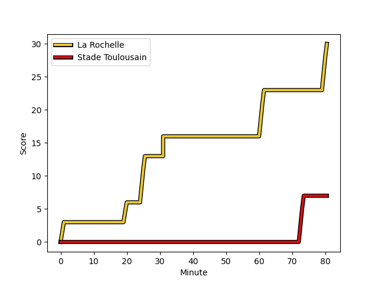
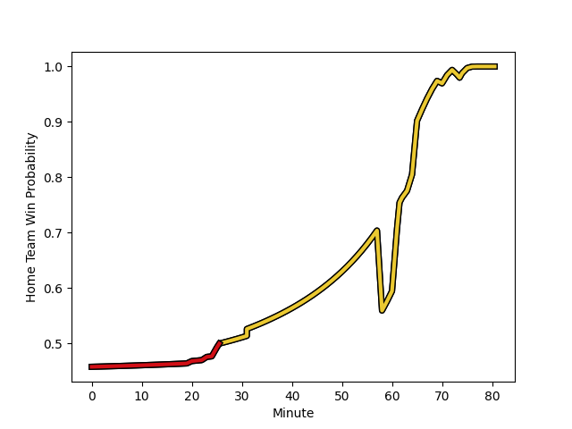

---  
layout: page  
title: Stade Toulousain at La Rochelle; 7-30  
date: 2023-01-07 21:05:00 18:00:00 -0500  
categories: match review  
---
# Stade Toulousain (1690.9) at La Rochelle (1617.21); 7-30

# Prediction: Stade Toulousain by 3.4

Stade Toulousain by 7.4 on a neutral field
## Scores over Time

## Win Probability over Time

# Pre-Match Prediction: Stade Toulousain by 3.2

Stade Toulousain by 7.2 on a neutral pitch

|   Away Minutes | Away Player                                                             |   Away elo |   Away Percentile |   Number |   Home Percentile |   Home elo | Home Player                                                               |   Home Minutes |
|---------------:|:------------------------------------------------------------------------|-----------:|------------------:|---------:|------------------:|-----------:|:--------------------------------------------------------------------------|---------------:|
|             23 | [Maxime Duprat](..//playerfiles//MaximeDuprat_cleaned.md)               |     118.51 |                63 |        1 |                90 |     114.87 | [Reda Wardi](..//playerfiles//RedaWardi_cleaned.md)                       |             62 |
|             65 | [Peato Mauvaka](..//playerfiles//PeatoMauvaka_cleaned.md)               |     111.6  |                85 |        2 |                65 |     101.11 | [Pierre Bourgarit](..//playerfiles//PierreBourgarit_cleaned.md)           |             20 |
|             53 | [Charlie Faumuina](..//playerfiles//CharlieFaumuina_cleaned.md)         |     147.76 |                99 |        3 |                95 |     121.61 | [Uini Atonio](..//playerfiles//UiniAtonio_cleaned.md)                     |             37 |
|             80 | [Yannick Youyoutte](..//playerfiles//YannickYouyoutte_cleaned.md)       |      96.62 |                55 |        4 |                96 |     129.49 | [Romain Sazy](..//playerfiles//RomainSazy_cleaned.md)                     |             63 |
|             53 | [Joshua Brennan](..//playerfiles//JoshuaBrennan_cleaned.md)             |     109.15 |                80 |        5 |                51 |      97.22 | [Remi Picquette](..//playerfiles//RemiPicquette_cleaned.md)               |             63 |
|             58 | [Rynhardt Elstadt](..//playerfiles//RynhardtElstadt_cleaned.md)         |     108.65 |                79 |        6 |                86 |     114.36 | [Levani Botia Veivuke](..//playerfiles//LevaniBotiaVeivuke_cleaned.md)    |             80 |
|             80 | [Alban Placines](..//playerfiles//AlbanPlacines_cleaned.md)             |     113.59 |                85 |        7 |                32 |      90.11 | [Paul Boudehent](..//playerfiles//PaulBoudehent_cleaned.md)               |             32 |
|             40 | [Theo Ntamack](..//playerfiles//TheoNtamack_cleaned.md)                 |      96.58 |                51 |        8 |                70 |     105.88 | [Gregory Alldritt](..//playerfiles//GregoryAlldritt_cleaned.md)           |             80 |
|             80 | [Paul Graou](..//playerfiles//PaulGraou_cleaned.md)                     |     128.69 |                97 |        9 |                37 |      93.13 | [Thomas Berjon](..//playerfiles//ThomasBerjon_cleaned.md)                 |             70 |
|             58 | [Romain Ntamack](..//playerfiles//RomainNtamack_cleaned.md)             |     113.97 |                83 |       10 |                55 |      99.78 | [Antoine Hastoy](..//playerfiles//AntoineHastoy_cleaned.md)               |             80 |
|             80 | [Matthis Lebel](..//playerfiles//MatthisLebel_cleaned.md)               |     131.16 |                96 |       11 |                59 |     100.42 | [Dillyn Leyds](..//playerfiles//DillynLeyds_cleaned.md)                   |             80 |
|             40 | [Lucas Tauzin](..//playerfiles//LucasTauzin_cleaned.md)                 |      95.59 |                45 |       12 |                93 |     126.41 | [Jules Favre](..//playerfiles//JulesFavre_cleaned.md)                     |             58 |
|             80 | [Pierre-Louis Barassi](..//playerfiles//Pierre-LouisBarassi_cleaned.md) |      98.95 |                56 |       13 |                82 |     112.11 | [Raymond Rhule](..//playerfiles//RaymondRhule_cleaned.md)                 |             80 |
|             80 | [Arthur Retiere](..//playerfiles//ArthurRetiere_cleaned.md)             |      99.71 |                62 |       14 |                86 |     115.33 | [Teddy Thomas](..//playerfiles//TeddyThomas_cleaned.md)                   |             80 |
|             80 | [Melvyn Jaminet](..//playerfiles//MelvynJaminet_cleaned.md)             |     131.52 |                94 |       15 |                85 |     116.77 | [Brice Dulin](..//playerfiles//BriceDulin_cleaned.md)                     |             80 |
|             57 | [Cyril Baille](..//playerfiles//CyrilBaille_cleaned.md)                 |     111.21 |                86 |       16 |                56 |      96.92 | [Samuel Lagrange](..//playerfiles//SamuelLagrange_cleaned.md)             |             60 |
|             40 | [Dimitri Delibes](..//playerfiles//DimitriDelibes_cleaned.md)           |     114.3  |                84 |       17 |                 2 |      68.66 | [Georges-Henri Colombe](..//playerfiles//Georges-HenriColombe_cleaned.md) |             43 |
|             40 | [Joel Merkler](..//playerfiles//JoelMerkler_cleaned.md)                 |     102.88 |                73 |       18 |                97 |     134.42 | [Remi Bourdeau](..//playerfiles//RemiBourdeau_cleaned.md)                 |             48 |
|             27 | [David Ainu'u](..//playerfiles//DavidAinu'u_cleaned.md)                 |     102.12 |                71 |       19 |                80 |     106.84 | [Thierry Paiva](..//playerfiles//ThierryPaiva_cleaned.md)                 |             18 |
|             27 | [Richie Arnold](..//playerfiles//RichieArnold_cleaned.md)               |      96.76 |                52 |       20 |                11 |      78.91 | [Kyle Hatherell](..//playerfiles//KyleHatherell_cleaned.md)               |             17 |
|             15 | [Ian Boubila](..//playerfiles//IanBoubila_cleaned.md)                   |      89.07 |                31 |       21 |                58 |      99.28 | [Ultan Dillane](..//playerfiles//UltanDillane_cleaned.md)                 |             17 |
|             22 | [Juan Cruz Mallia](..//playerfiles//JuanCruzMallia_cleaned.md)          |     104.06 |                71 |       22 |               nan |      94.35 | [Lucas Zamora](..//playerfiles//LucasZamora_cleaned.md)                   |             10 |
|             22 | [Alexandre Roumat](..//playerfiles//AlexandreRoumat_cleaned.md)         |     137.99 |                98 |       23 |                81 |     110.35 | [Pierre Boudehent](..//playerfiles//PierreBoudehent_cleaned.md)           |             22 |

