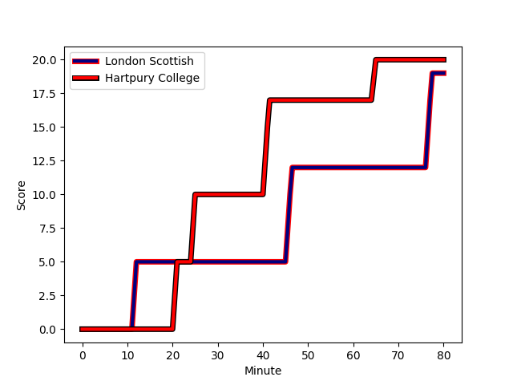
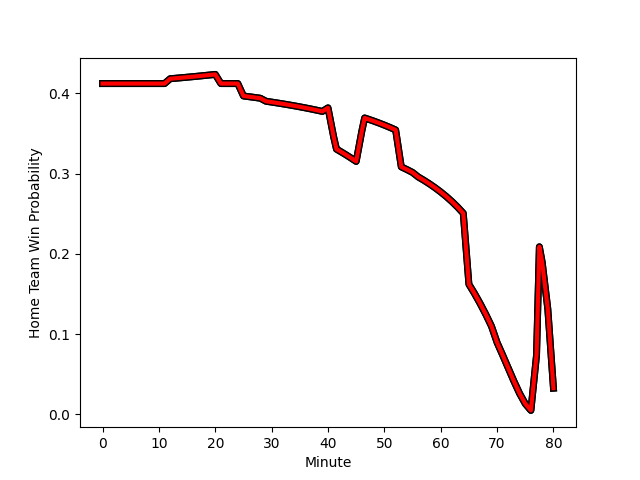

---  
layout: page  
title: Hartpury College at London Scottish; 20-19  
date: 2023-01-07 15:30:00 18:00:00 -0500  
categories: match review  
---
# Hartpury College (1460.95) at London Scottish (1306.74); 20-19

# Prediction: Hartpury College by 11.4

Hartpury College by 15.4 on a neutral field
## Scores over Time

## Win Probability over Time

# Pre-Match Prediction: Hartpury College by 3.1

Hartpury College by 7.1 on a neutral pitch

|   Away Minutes | Away Player                                                               |   Away elo |   Away Percentile |   Number |   Home Percentile |   Home elo | Home Player                                                         |   Home Minutes |
|---------------:|:--------------------------------------------------------------------------|-----------:|------------------:|---------:|------------------:|-----------:|:--------------------------------------------------------------------|---------------:|
|             65 | [Joe Wrafter](..//playerfiles//JoeWrafter_cleaned.md)                     |      99.64 |                63 |        1 |               nan |     103.1  | [Harrison Courtney](..//playerfiles//HarrisonCourtney_cleaned.md)   |             70 |
|             56 | [Will Tanner](..//playerfiles//WillTanner_cleaned.md)                     |      80.14 |                12 |        2 |                34 |      90.14 | [Sam Riley](..//playerfiles//SamRiley_cleaned.md)                   |             70 |
|             80 | [Jonathan Benz-Salomon](..//playerfiles//JonathanBenz-Salomon_cleaned.md) |      88.23 |                25 |        3 |                 3 |      69.76 | [Joe Rees](..//playerfiles//JoeRees_cleaned.md)                     |             65 |
|             80 | [Jack Davies](..//playerfiles//JackDavies_cleaned.md)                     |      97.2  |                54 |        4 |                74 |     101.57 | [Matt Wilkinson](..//playerfiles//MattWilkinson_cleaned.md)         |             80 |
|             80 | [Dale Lemon](..//playerfiles//DaleLemon_cleaned.md)                       |     107.6  |                78 |        5 |                53 |      97.17 | [Matas Jurevicius](..//playerfiles//MatasJurevicius_cleaned.md)     |             80 |
|             80 | [Samuel Lewis](..//playerfiles//SamuelLewis_cleaned.md)                   |      84.7  |                20 |        6 |                37 |      92.11 | [Will Trenholm](..//playerfiles//WillTrenholm_cleaned.md)           |             65 |
|             65 | [Oli Robinson](..//playerfiles//OliRobinson_cleaned.md)                   |      95.53 |                48 |        7 |                 1 |      61.12 | [Jack Ingall](..//playerfiles//JackIngall_cleaned.md)               |             80 |
|             80 | [Joe Howard](..//playerfiles//JoeHoward_cleaned.md)                       |      86.57 |                24 |        8 |               nan |     126.45 | [James Chisholm](..//playerfiles//JamesChisholm_cleaned.md)         |             53 |
|             56 | [Matty Jones](..//playerfiles//MattyJones_cleaned.md)                     |     109.58 |                82 |        9 |                 0 |      54.15 | [Daniel Nutton](..//playerfiles//DanielNutton_cleaned.md)           |             40 |
|             80 | [Tommy Mathews](..//playerfiles//TommyMathews_cleaned.md)                 |     107.27 |                73 |       10 |               nan |      85.71 | [Nathan Chamberlain](..//playerfiles//NathanChamberlain_cleaned.md) |             80 |
|             80 | [Matt Smith](..//playerfiles//MattSmith_cleaned.md)                       |     101.44 |                66 |       11 |                96 |     130.54 | [Aaron Morris](..//playerfiles//AaronMorris_cleaned.md)             |             65 |
|             80 | [Harry Tarling](..//playerfiles//HarryTarling_cleaned.md)                 |     109.71 |                71 |       12 |                24 |      85.77 | [Theo Manihera](..//playerfiles//TheoManihera_cleaned.md)           |             80 |
|             80 | [William Butler](..//playerfiles//WilliamButler_cleaned.md)               |      85.3  |                22 |       13 |                 1 |      60.21 | [Hayden Hyde](..//playerfiles//HaydenHyde_cleaned.md)               |             80 |
|             80 | [Bradley Denty](..//playerfiles//BradleyDenty_cleaned.md)                 |     103.4  |                70 |       14 |                25 |      87.6  | [Luke Mehson](..//playerfiles//LukeMehson_cleaned.md)               |             76 |
|             29 | [Jack Lloyd](..//playerfiles//JackLloyd_cleaned.md)                       |     101.46 |                61 |       15 |                32 |      88.14 | [Cameron Anderson](..//playerfiles//CameronAnderson_cleaned.md)     |             80 |
|             51 | [Arthur William Lennon](..//playerfiles//ArthurWilliamLennon_cleaned.md)  |     105.46 |               nan |       16 |                 1 |      63.03 | [Scott Steele](..//playerfiles//ScottSteele_cleaned.md)             |             40 |
|             24 | [Oscar Lennon](..//playerfiles//OscarLennon_cleaned.md)                   |      87.26 |                17 |       17 |                 1 |      60.38 | [Brian Tuilagi](..//playerfiles//BrianTuilagi_cleaned.md)           |             27 |
|             24 | [Luke Stratford](..//playerfiles//LukeStratford_cleaned.md)               |     105.21 |                74 |       18 |                 0 |      44.41 | [Noah Ferdinand](..//playerfiles//NoahFerdinand_cleaned.md)         |             15 |
|             15 | [Aristot Benz-Salomon](..//playerfiles//AristotBenz-Salomon_cleaned.md)   |      98.59 |                60 |       19 |                90 |     119    | [Bailey Ransom](..//playerfiles//BaileyRansom_cleaned.md)           |             15 |
|             15 | [Jake Holcombe](..//playerfiles//JakeHolcombe_cleaned.md)                 |      95.58 |                37 |       20 |                29 |      89.32 | [Dan Gamble](..//playerfiles//DanGamble_cleaned.md)                 |             15 |
|            nan | nan                                                                       |     nan    |               nan |       21 |                16 |      84.06 | [Maurice Nwakor](..//playerfiles//MauriceNwakor_cleaned.md)         |             10 |
|            nan | nan                                                                       |     nan    |               nan |       22 |                53 |      98.51 | [Connor Slevin](..//playerfiles//ConnorSlevin_cleaned.md)           |              4 |
|            nan | nan                                                                       |     nan    |               nan |       23 |                41 |      92.85 | [Harri Morris](..//playerfiles//HarriMorris_cleaned.md)             |             10 |

