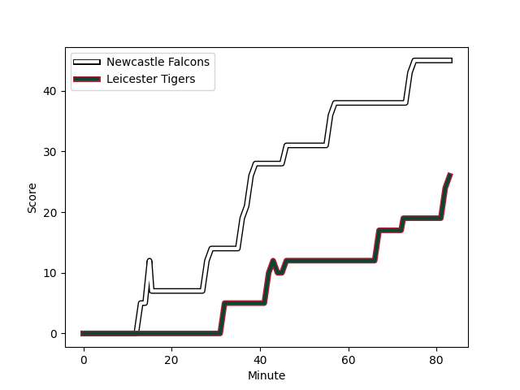
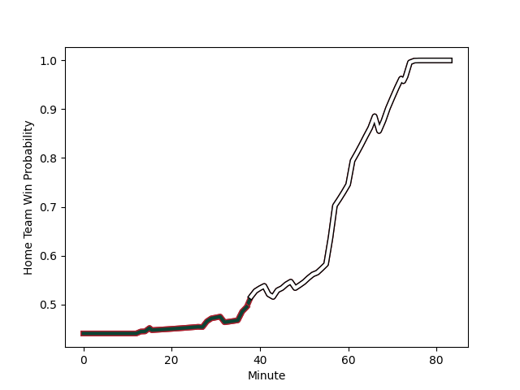

---  
layout: page  
title: Leicester Tigers at Newcastle Falcons; 26-45  
date: 2023-01-07 09:00:00 18:00:00 -0500  
categories: match review  
---
# Leicester Tigers (1573.88) at Newcastle Falcons (1469.7); 26-45

# Prediction: Leicester Tigers by 6.4

Leicester Tigers by 10.4 on a neutral field
## Scores over Time

## Win Probability over Time

# Pre-Match Prediction: Leicester Tigers by 8.1

Leicester Tigers by 12.1 on a neutral pitch

|   Away Minutes | Away Player                                                          |   Away elo |   Away Percentile |   Number |   Home Percentile |   Home elo | Home Player                                                          |   Home Minutes |
|---------------:|:---------------------------------------------------------------------|-----------:|------------------:|---------:|------------------:|-----------:|:---------------------------------------------------------------------|---------------:|
|             57 | [James Cronin](..//playerfiles//JamesCronin_cleaned.md)              |     109.14 |                84 |        1 |                74 |     103.14 | [Adam Brocklebank](..//playerfiles//AdamBrocklebank_cleaned.md)      |             57 |
|             73 | [Charlie Clare](..//playerfiles//CharlieClare_cleaned.md)            |      80.53 |                12 |        2 |                32 |      89.24 | [Jamie Blamire](..//playerfiles//JamieBlamire_cleaned.md)            |             69 |
|             53 | [Dan Cole](..//playerfiles//DanCole_cleaned.md)                      |      90.34 |                32 |        3 |                 1 |      60.45 | [Trevor Davison](..//playerfiles//TrevorDavison_cleaned.md)          |             61 |
|             57 | [Harry Wells](..//playerfiles//HarryWells_cleaned.md)                |     155.57 |                99 |        4 |                38 |      92.08 | [Greg Peterson](..//playerfiles//GregPeterson_cleaned.md)            |             83 |
|             46 | [Calum Green](..//playerfiles//CalumGreen_cleaned.md)                |     108.13 |                80 |        5 |                43 |      93.84 | [Sebastian de Chaves](..//playerfiles//SebastiandeChaves_cleaned.md) |             83 |
|             83 | [Ollie Chessum](..//playerfiles//OllieChessum_cleaned.md)            |     122.83 |                93 |        6 |                22 |      85.68 | [Gary Graham](..//playerfiles//GaryGraham_cleaned.md)                |             65 |
|             79 | [Tommy Reffell](..//playerfiles//TommyReffell_cleaned.md)            |     113.6  |                85 |        7 |                43 |      93.4  | [Callum Chick](..//playerfiles//CallumChick_cleaned.md)              |             83 |
|             83 | [Hanro Liebenberg](..//playerfiles//HanroLiebenberg_cleaned.md)      |     120.96 |                92 |        8 |                94 |     126.99 | [Carl Fearns](..//playerfiles//CarlFearns_cleaned.md)                |             48 |
|             53 | [Ben Youngs](..//playerfiles//BenYoungs_cleaned.md)                  |      94.83 |                46 |        9 |                 0 |      52.07 | [Sam Stuart](..//playerfiles//SamStuart_cleaned.md)                  |             61 |
|             83 | [Charlie Atkinson](..//playerfiles//CharlieAtkinson_cleaned.md)      |      96.13 |                47 |       10 |                37 |      92.73 | [Brett Connon](..//playerfiles//BrettConnon_cleaned.md)              |             83 |
|             69 | [Harry Simmons](..//playerfiles//HarrySimmons_cleaned.md)            |     113.9  |                85 |       11 |                60 |      98.9  | [Mateo Carreras](..//playerfiles//MateoCarreras_cleaned.md)          |             51 |
|             83 | [Dan Kelly](..//playerfiles//DanKelly_cleaned.md)                    |     112.73 |                84 |       12 |                14 |      80.84 | [Matias Orlando](..//playerfiles//MatiasOrlando_cleaned.md)          |             66 |
|             83 | [Matt Scott](..//playerfiles//MattScott_cleaned.md)                  |      80.19 |                13 |       13 |                73 |     105.88 | [Matias Moroni](..//playerfiles//MatiasMoroni_cleaned.md)            |             70 |
|             83 | [Harry Potter](..//playerfiles//HarryPotter_cleaned.md)              |      96.3  |                51 |       14 |                97 |     135.31 | [Adam Radwan](..//playerfiles//AdamRadwan_cleaned.md)                |             83 |
|             83 | [Freddie Steward](..//playerfiles//FreddieSteward_cleaned.md)        |     106.1  |                71 |       15 |                99 |     146.24 | [Tom Penny](..//playerfiles//TomPenny_cleaned.md)                    |             83 |
|             10 | [Joe Taufete'e](..//playerfiles//JoeTaufete'e_cleaned.md)            |      86.48 |                24 |       16 |               nan |      87.73 | [Charlie Maddison](..//playerfiles//CharlieMaddison_cleaned.md)      |             14 |
|             26 | [Nephi Leatigaga](..//playerfiles//NephiLeatigaga_cleaned.md)        |      83.16 |               nan |       17 |                76 |     104.74 | [Logovi'i Mulipola](..//playerfiles//Logovi'iMulipola_cleaned.md)    |             26 |
|             30 | [Joe Heyes](..//playerfiles//JoeHeyes_cleaned.md)                    |      95.92 |                53 |       18 |                48 |      92.95 | [Richard Palframan](..//playerfiles//RichardPalframan_cleaned.md)    |             22 |
|             37 | [Cameron Henderson](..//playerfiles//CameronHenderson_cleaned.md)    |     113.79 |                83 |       19 |                12 |      79.43 | [Matthew Dalton](..//playerfiles//MatthewDalton_cleaned.md)          |             18 |
|              4 | [Emeka Ilione](..//playerfiles//EmekaIlione_cleaned.md)              |      95    |               nan |       20 |                19 |      81.25 | [Tom Marshall](..//playerfiles//TomMarshall_cleaned.md)              |             35 |
|             26 | [Sean Jansen](..//playerfiles//SeanJansen_cleaned.md)                |      87.97 |                39 |       21 |                95 |     124.08 | [Michael Young](..//playerfiles//MichaelYoung_cleaned.md)            |             22 |
|             30 | [Jack van Poortvliet](..//playerfiles//JackvanPoortvliet_cleaned.md) |      99.15 |                57 |       22 |                65 |     103.39 | [Tian Schoeman](..//playerfiles//TianSchoeman_cleaned.md)            |             17 |
|             14 | [Jimmy Gopperth](..//playerfiles//JimmyGopperth_cleaned.md)          |      90.24 |                35 |       23 |                64 |     102.76 | [Elliott Obatoyinbo](..//playerfiles//ElliottObatoyinbo_cleaned.md)  |             45 |

