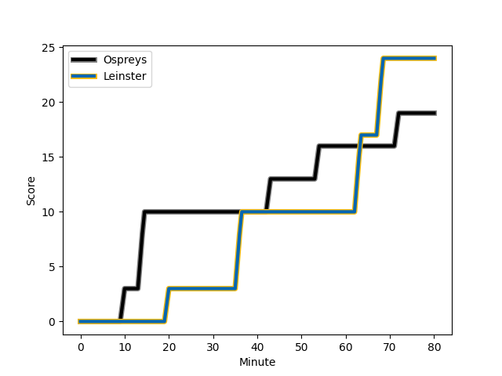
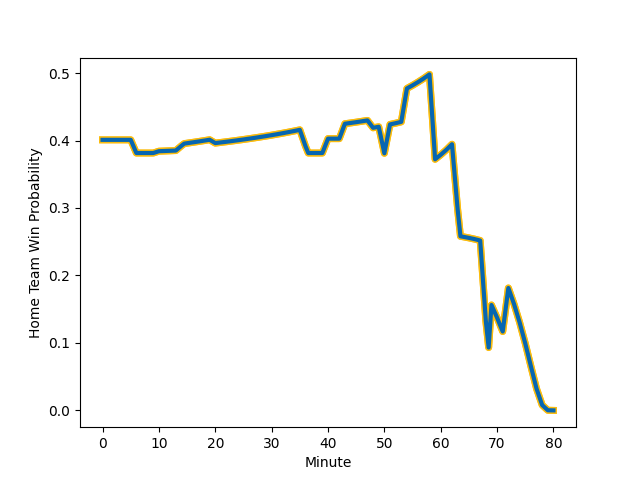

---  
layout: page  
title: Leinster at Ospreys; 24-19  
date: 2023-01-07 20:35:00 18:00:00 -0500  
categories: match review  
---
# Leinster (1714.04) at Ospreys (1539.73); 24-19

# Prediction: Leinster by 13.4

Leinster by 17.4 on a neutral field
## Scores over Time

## Win Probability over Time

# Pre-Match Prediction: Leinster by 14.4

Leinster by 18.4 on a neutral pitch

|   Away Minutes | Away Player                                                       |   Away elo |   Away Percentile |   Number |   Home Percentile |   Home elo | Home Player                                                                 |   Home Minutes |
|---------------:|:------------------------------------------------------------------|-----------:|------------------:|---------:|------------------:|-----------:|:----------------------------------------------------------------------------|---------------:|
|             51 | [Cian Healy](..//playerfiles//CianHealy_cleaned.md)               |     141.46 |                99 |        1 |                17 |      84.93 | [Nicky Smith](..//playerfiles//NickySmith_cleaned.md)                       |             50 |
|             80 | [Dan Sheehan](..//playerfiles//DanSheehan_cleaned.md)             |      99.2  |                61 |        2 |                22 |      86.55 | [Dewi Lake](..//playerfiles//DewiLake_cleaned.md)                           |             63 |
|             51 | [Michael Alaalatoa](..//playerfiles//MichaelAlaalatoa_cleaned.md) |      88.74 |                27 |        3 |                97 |     125.42 | [Tomas Francis](..//playerfiles//TomasFrancis_cleaned.md)                   |             50 |
|             54 | [Ross Molony](..//playerfiles//RossMolony_cleaned.md)             |     119.65 |                91 |        4 |                75 |     106.75 | [Rhys Davies](..//playerfiles//RhysDavies_cleaned.md)                       |             80 |
|             80 | [Brian Deeny](..//playerfiles//BrianDeeny_cleaned.md)             |      96.62 |                52 |        5 |                88 |     115.83 | [Alun Wyn Jones](..//playerfiles//AlunWynJones_cleaned.md)                  |             80 |
|             80 | [Rhys Ruddock](..//playerfiles//RhysRuddock_cleaned.md)           |     119.12 |                90 |        6 |                84 |     113.9  | [Ethan Roots](..//playerfiles//EthanRoots_cleaned.md)                       |             48 |
|             69 | [Scott Penny](..//playerfiles//ScottPenny_cleaned.md)             |     111.4  |                82 |        7 |                96 |     128.4  | [Justin Tipuric](..//playerfiles//JustinTipuric_cleaned.md)                 |             80 |
|             80 | [Jack Conan](..//playerfiles//JackConan_cleaned.md)               |     145.23 |                99 |        8 |                24 |      86.68 | [Morgan Morris](..//playerfiles//MorganMorris_cleaned.md)                   |             59 |
|             51 | [Cormac Foley](..//playerfiles//CormacFoley_cleaned.md)           |      92.26 |                31 |        9 |                74 |     106.59 | [Reuben Morgan-Williams](..//playerfiles//ReubenMorgan-Williams_cleaned.md) |             80 |
|             51 | [Harry Byrne](..//playerfiles//HarryByrne_cleaned.md)             |     122.47 |                89 |       10 |                71 |     106.42 | [Jack Walsh](..//playerfiles//JackWalsh_cleaned.md)                         |             80 |
|             80 | [Jimmy O'Brien](..//playerfiles//JimmyO'Brien_cleaned.md)         |     133.34 |                95 |       11 |                18 |      84.98 | [Keelan Giles](..//playerfiles//KeelanGiles_cleaned.md)                     |             80 |
|             40 | [Charlie Ngatai](..//playerfiles//CharlieNgatai_cleaned.md)       |     131.48 |                96 |       12 |                87 |     115.53 | [Keiran Williams](..//playerfiles//KeiranWilliams_cleaned.md)               |             80 |
|             80 | [Jamie Osborne](..//playerfiles//JamieOsborne_cleaned.md)         |     104.7  |                68 |       13 |                94 |     125.4  | [Michael Collins](..//playerfiles//MichaelCollins_cleaned.md)               |             80 |
|             80 | [Jordan Larmour](..//playerfiles//JordanLarmour_cleaned.md)       |     106.05 |                74 |       14 |                84 |     114.46 | [Matt Protheroe](..//playerfiles//MattProtheroe_cleaned.md)                 |              6 |
|             80 | [Hugo Keenan](..//playerfiles//HugoKeenan_cleaned.md)             |     134.45 |                96 |       15 |               nan |      94.28 | [Cai Evans](..//playerfiles//CaiEvans_cleaned.md)                           |             80 |
|             40 | [Rob Russell](..//playerfiles//RobRussell_cleaned.md)             |      98.31 |                58 |       16 |                19 |      84.03 | [Joe Hawkins](..//playerfiles//JoeHawkins_cleaned.md)                       |             74 |
|             29 | [Joe McCarthy](..//playerfiles//JoeMcCarthy_cleaned.md)           |     108.07 |                79 |       17 |                 1 |      60.4  | [Gareth Thomas](..//playerfiles//GarethThomas_cleaned.md)                   |             30 |
|             26 | [James Ryan](..//playerfiles//JamesRyan_cleaned.md)               |     115    |                87 |       18 |                21 |      86.72 | [Tom Botha](..//playerfiles//TomBotha_cleaned.md)                           |             30 |
|             29 | [Michael Milne](..//playerfiles//MichaelMilne_cleaned.md)         |      99.75 |                64 |       19 |               nan |      95    | [Huw Sutton](..//playerfiles//HuwSutton_cleaned.md)                         |             32 |
|             29 | [Vakh Abdaladze](..//playerfiles//VakhAbdaladze_cleaned.md)       |      97.22 |               nan |       20 |                29 |      90.25 | [Harri Deaves](..//playerfiles//HarriDeaves_cleaned.md)                     |             21 |
|             29 | [Ross Byrne](..//playerfiles//RossByrne_cleaned.md)               |      95.69 |                45 |       21 |                55 |      96.45 | [Scott Baldwin](..//playerfiles//ScottBaldwin_cleaned.md)                   |             17 |
|             11 | [Josh van der Flier](..//playerfiles//JoshvanderFlier_cleaned.md) |     125.88 |                94 |       22 |               nan |     nan    | nan                                                                         |            nan |

