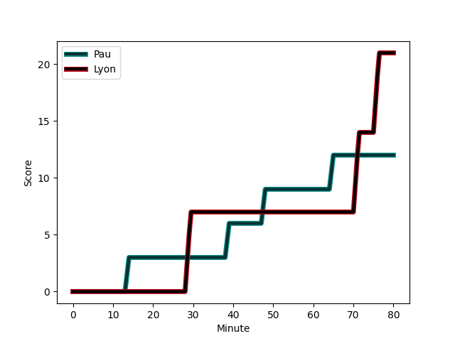
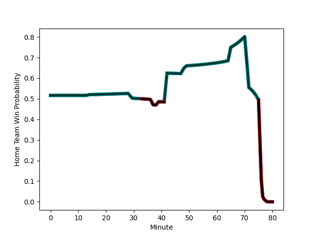

---  
layout: page  
title: Lyon at Pau; 21-12  
date: 2023-01-07 17:00:00 18:00:00 -0500  
categories: match review  
---
# Lyon (1472.91) at Pau (1501.3); 21-12

# Prediction: Pau by 6.8

Pau by 2.8 on a neutral field
## Scores over Time

## Win Probability over Time

# Pre-Match Prediction: Pau by 4.7

Pau by 0.7 on a neutral pitch

|   Away Minutes | Away Player                                                                            |   Away elo |   Away Percentile |   Number |   Home Percentile |   Home elo | Home Player                                                           |   Home Minutes |
|---------------:|:---------------------------------------------------------------------------------------|-----------:|------------------:|---------:|------------------:|-----------:|:----------------------------------------------------------------------|---------------:|
|             51 | [Jerome Rey](..//playerfiles//JeromeRey_cleaned.md)                                    |      78.25 |                10 |        1 |                86 |     111.26 | [Ignacio Calles](..//playerfiles//IgnacioCalles_cleaned.md)           |             51 |
|             58 | [Guillaume Marchand](..//playerfiles//GuillaumeMarchand_cleaned.md)                    |      73.49 |                11 |        2 |                10 |      76.53 | [Lucas Rey](..//playerfiles//LucasRey_cleaned.md)                     |             58 |
|             51 | [Demba Bamba](..//playerfiles//DembaBamba_cleaned.md)                                  |     113.71 |                89 |        3 |                52 |      95.88 | [Siate Tokolahi](..//playerfiles//SiateTokolahi_cleaned.md)           |             51 |
|             80 | [Felix Lambey](..//playerfiles//FelixLambey_cleaned.md)                                |     129.27 |                96 |        4 |                13 |      79.47 | [Guillaume Ducat](..//playerfiles//GuillaumeDucat_cleaned.md)         |             78 |
|             66 | [Temo Mayanavanua](..//playerfiles//TemoMayanavanua_cleaned.md)                        |      90.46 |                35 |        5 |                96 |     127.92 | [Mickael Capelli](..//playerfiles//MickaelCapelli_cleaned.md)         |             80 |
|             80 | [Dylan Cretin](..//playerfiles//DylanCretin_cleaned.md)                                |      97.62 |                50 |        6 |                88 |     118.24 | [Beka Gorgadze](..//playerfiles//BekaGorgadze_cleaned.md)             |             37 |
|             52 | [Mickael Guillard](..//playerfiles//MickaelGuillard_cleaned.md)                        |     101.87 |                73 |        7 |                43 |      93.31 | [Reece Hewat](..//playerfiles//ReeceHewat_cleaned.md)                 |             80 |
|             42 | [Jordan Taufua](..//playerfiles//JordanTaufua_cleaned.md)                              |     124.7  |                92 |        8 |                25 |      86.96 | [Jordan Joseph](..//playerfiles//JordanJoseph_cleaned.md)             |             80 |
|             80 | [Jonathan Pelissie](..//playerfiles//JonathanPelissie_cleaned.md)                      |      85.68 |                21 |        9 |                75 |     105.73 | [Dan Robson](..//playerfiles//DanRobson_cleaned.md)                   |             70 |
|             51 | [Leo Berdeu](..//playerfiles//LeoBerdeu_cleaned.md)                                    |      68.97 |                 2 |       10 |                95 |     132.38 | [Zack Henry](..//playerfiles//ZackHenry_cleaned.md)                   |             80 |
|             80 | [Ethan Dumortier](..//playerfiles//EthanDumortier_cleaned.md)                          |      90.65 |                34 |       11 |                94 |     126.75 | [Tumua Manu](..//playerfiles//TumuaManu_cleaned.md)                   |             80 |
|             80 | [Thibault Regard](..//playerfiles//ThibaultRegard_cleaned.md)                          |     105.53 |                72 |       12 |                25 |      86.29 | [Jale Vatubua](..//playerfiles//JaleVatubua_cleaned.md)               |             80 |
|             80 | [Josiah Maraku](..//playerfiles//JosiahMaraku_cleaned.md)                              |      68.35 |                 4 |       13 |                62 |      99.45 | [Émilien Gailleton](..//playerfiles//ÉmilienGailleton_cleaned.md)     |             80 |
|             80 | [Josua Tuisova Ratulevu](..//playerfiles//JosuaTuisovaRatulevu_cleaned.md)             |     148.48 |                99 |       14 |                 9 |      76.27 | [Elliot Roudil](..//playerfiles//ElliotRoudil_cleaned.md)             |             31 |
|             49 | [Alexandre Tchaptchet Noutcha](..//playerfiles//AlexandreTchaptchetNoutcha_cleaned.md) |      98.47 |                53 |       15 |                28 |      86.09 | [Jack Maddocks](..//playerfiles//JackMaddocks_cleaned.md)             |             80 |
|             28 | [Patrick Sobela](..//playerfiles//PatrickSobela_cleaned.md)                            |     102.57 |                62 |       16 |                 9 |      76.58 | [Mathias Colombet](..//playerfiles//MathiasColombet_cleaned.md)       |             49 |
|             31 | [Tavite Veredamu](..//playerfiles//TaviteVeredamu_cleaned.md)                          |      81.54 |                13 |       17 |                81 |     109.4  | [Martin Puech](..//playerfiles//MartinPuech_cleaned.md)               |             43 |
|             29 | [Romain Taofifenua](..//playerfiles//RomainTaofifenua_cleaned.md)                      |     108.18 |                79 |       18 |                 6 |      75.17 | [Guram Papidze](..//playerfiles//GuramPapidze_cleaned.md)             |             29 |
|             29 | [Jean-Marc Doussain](..//playerfiles//Jean-MarcDoussain_cleaned.md)                    |     109.05 |                82 |       19 |                96 |     122.78 | [Siegfried Fisi'ihoi](..//playerfiles//SiegfriedFisi'ihoi_cleaned.md) |             29 |
|             29 | [Paulo Tafili](..//playerfiles//PauloTafili_cleaned.md)                                |      83.45 |                15 |       20 |                19 |      84.92 | [Youri Delhommel](..//playerfiles//YouriDelhommel_cleaned.md)         |             22 |
|             38 | [Maxime Gouzou](..//playerfiles//MaximeGouzou_cleaned.md)                              |      76.52 |                 7 |       21 |                99 |     138.2  | [Thibault Daubagna](..//playerfiles//ThibaultDaubagna_cleaned.md)     |             10 |
|             22 | [Liam Coltman](..//playerfiles//LiamColtman_cleaned.md)                                |     115.97 |                90 |       22 |                41 |      90.83 | [Hugo Auradou](..//playerfiles//HugoAuradou_cleaned.md)               |              2 |
|             14 | [Joel Kpoku](..//playerfiles//JoelKpoku_cleaned.md)                                    |      93.35 |                43 |       23 |               nan |     nan    | nan                                                                   |            nan |

