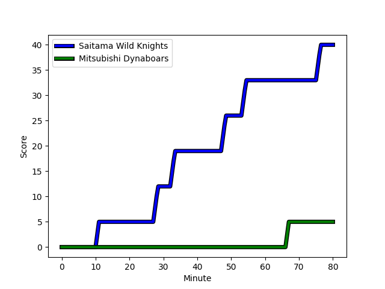
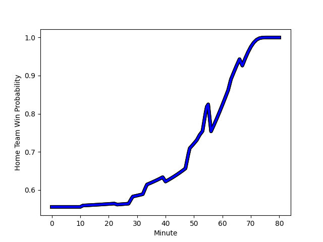

---  
layout: page  
title: Mitsubishi Dynaboars at Saitama Wild Knights; 5-40  
date: 2023-01-07 04:00:00 18:00:00 -0500  
categories: match review  
---
# Mitsubishi Dynaboars (1511.17) at Saitama Wild Knights (1607.94); 5-40

# Prediction: Saitama Wild Knights by 13.7

Saitama Wild Knights by 9.7 on a neutral field
## Scores over Time

## Win Probability over Time

# Pre-Match Prediction: Saitama Wild Knights by 17.6

Saitama Wild Knights by 13.6 on a neutral pitch

|   Away Minutes | Away Player                                                                 |   Away elo |   Away Percentile |   Number |   Home Percentile |   Home elo | Home Player                                                      |   Home Minutes |
|---------------:|:----------------------------------------------------------------------------|-----------:|------------------:|---------:|------------------:|-----------:|:-----------------------------------------------------------------|---------------:|
|             40 | [Naoki Kawamata](..//playerfiles//NaokiKawamata_cleaned.md)                 |     103.88 |                75 |        1 |                93 |     117.79 | [Keita Inagaki](..//playerfiles//KeitaInagaki_cleaned.md)        |             52 |
|             40 | [Yuki Miyazato](..//playerfiles//YukiMiyazato_cleaned.md)                   |      81.83 |                15 |        2 |                75 |     104.46 | [Atsushi Sakate](..//playerfiles//AtsushiSakate_cleaned.md)      |             52 |
|             52 | [Jun Morimoto](..//playerfiles//JunMorimoto_cleaned.md)                     |      96.85 |                55 |        3 |                70 |     101.84 | [Shohei Hirano](..//playerfiles//ShoheiHirano_cleaned.md)        |             52 |
|             80 | [Daniel Linde](..//playerfiles//DanielLinde_cleaned.md)                     |      94.07 |                45 |        4 |                 8 |      74.93 | [Liam Mitchell](..//playerfiles//LiamMitchell_cleaned.md)        |             80 |
|             80 | [Walt Steenkamp](..//playerfiles//WaltSteenkamp_cleaned.md)                 |     105.67 |                74 |        5 |                36 |      91.27 | [Lood de Jager](..//playerfiles//LooddeJager_cleaned.md)         |             56 |
|             80 | [Masataka Tsuruya](..//playerfiles//MasatakaTsuruya_cleaned.md)             |     127.06 |                95 |        6 |                48 |      95.81 | [Shota Fukui](..//playerfiles//ShotaFukui_cleaned.md)            |             56 |
|             80 | [Yusuke Sakamoto](..//playerfiles//YusukeSakamoto_cleaned.md)               |      92.18 |                40 |        7 |                28 |      86.62 | [Itsuki Onishi](..//playerfiles//ItsukiOnishi_cleaned.md)        |             80 |
|             49 | [Epineri Uluiviti](..//playerfiles//EpineriUluiviti_cleaned.md)             |      89.55 |                30 |        8 |                87 |     116.62 | [Jack Cornelsen](..//playerfiles//JackCornelsen_cleaned.md)      |             80 |
|             59 | [Kota Iwamura](..//playerfiles//KotaIwamura_cleaned.md)                     |     118.3  |                92 |        9 |                74 |     105.55 | [Keisuke Uchida](..//playerfiles//KeisukeUchida_cleaned.md)      |             56 |
|             80 | [James Shillcock](..//playerfiles//JamesShillcock_cleaned.md)               |     113.01 |                80 |       10 |                90 |     122.12 | [Takuya Yamasawa](..//playerfiles//TakuyaYamasawa_cleaned.md)    |             80 |
|             80 | [Honeti Taumoha'apai](..//playerfiles//HonetiTaumoha'apai_cleaned.md)       |     104.36 |                72 |       11 |                19 |      85.51 | [Marika Koroibete](..//playerfiles//MarikaKoroibete_cleaned.md)  |             63 |
|             80 | [Brackin Karauria-Henry](..//playerfiles//BrackinKarauria-Henry_cleaned.md) |      68.91 |                 3 |       12 |                93 |     125.21 | [Damian de Allende](..//playerfiles//DamiandeAllende_cleaned.md) |             80 |
|             40 | [Curtis Rona](..//playerfiles//CurtisRona_cleaned.md)                       |      87.43 |                27 |       13 |                86 |     115.47 | [Dylan Riley](..//playerfiles//DylanRiley_cleaned.md)            |             80 |
|             23 | [Ben Paltridge](..//playerfiles//BenPaltridge_cleaned.md)                   |      96.42 |                51 |       14 |                99 |     151.99 | [Koki Takeyama](..//playerfiles//KokiTakeyama_cleaned.md)        |             63 |
|             80 | [Roland Alaiasa](..//playerfiles//RolandAlaiasa_cleaned.md)                 |     100.36 |                59 |       15 |                64 |     102.09 | [Ryuji Noguchi](..//playerfiles//RyujiNoguchi_cleaned.md)        |             80 |
|             57 | [Kazuki Ishida](..//playerfiles//KazukiIshida_cleaned.md)                   |     103.18 |                58 |       16 |                65 |      97.1  | [Craig Millar](..//playerfiles//CraigMillar_cleaned.md)          |             28 |
|             40 | [Shunsuke Sakamoto](..//playerfiles//ShunsukeSakamoto_cleaned.md)           |      93.22 |               nan |       17 |                99 |     138.66 | [Shota Horie](..//playerfiles//ShotaHorie_cleaned.md)            |             28 |
|             40 | [Yoshimitsu Yasue](..//playerfiles//YoshimitsuYasue_cleaned.md)             |     116.24 |                89 |       18 |                28 |      88.96 | [Taiki Fujii](..//playerfiles//TaikiFujii_cleaned.md)            |             28 |
|             40 | [Matt Vaega](..//playerfiles//MattVaega_cleaned.md)                         |      98.06 |                57 |       19 |                93 |     119.31 | [Taiki Koyama](..//playerfiles//TaikiKoyama_cleaned.md)          |             24 |
|             31 | [Heiden Bedwell-Curtis](..//playerfiles//HeidenBedwell-Curtis_cleaned.md)   |      86.77 |                24 |       20 |                98 |     135.6  | [Ryota Hasegawa](..//playerfiles//RyotaHasegawa_cleaned.md)      |             24 |
|             28 | [Tomoaki Ishii](..//playerfiles//TomoakiIshii_cleaned.md)                   |     144.21 |                99 |       21 |                52 |      97.05 | [Lachlan Boshier](..//playerfiles//LachlanBoshier_cleaned.md)    |             24 |
|             21 | [Taichi Takahashi](..//playerfiles//TaichiTakahashi_cleaned.md)             |      94.68 |               nan |       22 |                46 |      96.11 | [Rikiya Matsuda](..//playerfiles//RikiyaMatsuda_cleaned.md)      |             17 |
|            nan | nan                                                                         |     nan    |               nan |       23 |                75 |     106.8  | [Vince Aso](..//playerfiles//VinceAso_cleaned.md)                |             17 |

