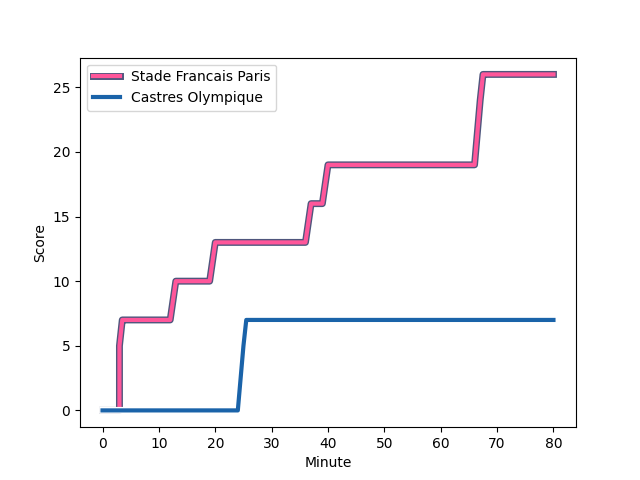
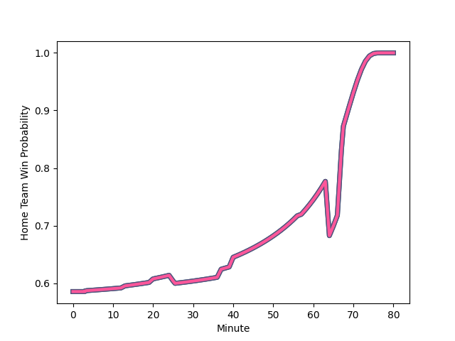

---  
layout: page  
title: Castres Olympique at Stade Francais Paris; 7-26  
date: 2023-01-07 17:00:00 18:00:00 -0500  
categories: match review  
---
# Castres Olympique (1591.32) at Stade Francais Paris (1741.51); 7-26

# Prediction: Stade Francais Paris by 19.0

Stade Francais Paris by 15.0 on a neutral field
## Scores over Time

## Win Probability over Time

# Pre-Match Prediction: Stade Francais Paris by 19.6

Stade Francais Paris by 15.6 on a neutral pitch

|   Away Minutes | Away Player                                                             |   Away elo |   Away Percentile |   Number |   Home Percentile |   Home elo | Home Player                                                                   |   Home Minutes |
|---------------:|:------------------------------------------------------------------------|-----------:|------------------:|---------:|------------------:|-----------:|:------------------------------------------------------------------------------|---------------:|
|             64 | [Quentin Walcker](..//playerfiles//QuentinWalcker_cleaned.md)           |     103.16 |                74 |        1 |                87 |     112.08 | [Clement Castets](..//playerfiles//ClementCastets_cleaned.md)                 |             60 |
|             64 | [Gaetan Barlot](..//playerfiles//GaetanBarlot_cleaned.md)               |     130.46 |                98 |        2 |                31 |      89.04 | [Mickael Ivaldi](..//playerfiles//MickaelIvaldi_cleaned.md)                   |             65 |
|             64 | [Wilfrid Hounkpatin](..//playerfiles//WilfridHounkpatin_cleaned.md)     |     108.27 |                83 |        3 |                92 |     116.36 | [Giorgi Melikidze](..//playerfiles//GiorgiMelikidze_cleaned.md)               |             57 |
|             57 | [Leone Nakarawa](..//playerfiles//LeoneNakarawa_cleaned.md)             |     113.38 |                85 |        4 |                47 |      94.71 | [Marcos Kremer](..//playerfiles//MarcosKremer_cleaned.md)                     |             60 |
|             64 | [Tom Staniforth](..//playerfiles//TomStaniforth_cleaned.md)             |      93.85 |                44 |        5 |                89 |     118.06 | [Sitaleki Timani](..//playerfiles//SitalekiTimani_cleaned.md)                 |             80 |
|             80 | [Asier Usarraga](..//playerfiles//AsierUsarraga_cleaned.md)             |     103.01 |                67 |        6 |                63 |     100.73 | [Romain Briatte](..//playerfiles//RomainBriatte_cleaned.md)                   |             64 |
|             80 | [Josaia Raisuqe](..//playerfiles//JosaiaRaisuqe_cleaned.md)             |     100.68 |                72 |        7 |                84 |     112.91 | [Sekou Macalou](..//playerfiles//SekouMacalou_cleaned.md)                     |             80 |
|             80 | [Tyler Ardron](..//playerfiles//TylerArdron_cleaned.md)                 |     106.79 |                73 |        8 |                99 |     149.36 | [Giovanni Habel-Kueffner](..//playerfiles//GiovanniHabel-Kueffner_cleaned.md) |             70 |
|             64 | [Gauthier Doubrere](..//playerfiles//GauthierDoubrere_cleaned.md)       |     104.86 |                65 |        9 |                70 |     103.76 | [Morgan Parra](..//playerfiles//MorganParra_cleaned.md)                       |             64 |
|             80 | [Benjamin Urdapilleta](..//playerfiles//BenjaminUrdapilleta_cleaned.md) |     111.87 |                78 |       10 |                99 |     146.45 | [Joris Segonds](..//playerfiles//JorisSegonds_cleaned.md)                     |             80 |
|             80 | [Filipo Nakosi](..//playerfiles//FilipoNakosi_cleaned.md)               |     106.45 |                76 |       11 |                95 |     129.17 | [Lester Etien](..//playerfiles//LesterEtien_cleaned.md)                       |             80 |
|             70 | [Vilimoni Botitu](..//playerfiles//VilimoniBotitu_cleaned.md)           |      87.5  |                27 |       12 |                98 |     136.99 | [Julien Delbouis](..//playerfiles//JulienDelbouis_cleaned.md)                 |             75 |
|             80 | [Antoine Zeghdar](..//playerfiles//AntoineZeghdar_cleaned.md)           |      93.5  |                43 |       13 |                92 |     122.05 | [Jeremy Ward](..//playerfiles//JeremyWard_cleaned.md)                         |             80 |
|             80 | [Geoffrey Palis](..//playerfiles//GeoffreyPalis_cleaned.md)             |     126.07 |                92 |       14 |                51 |     103.01 | [Paolo Odogwu](..//playerfiles//PaoloOdogwu_cleaned.md)                       |             80 |
|             80 | [Julien Dumora](..//playerfiles//JulienDumora_cleaned.md)               |     108.02 |                70 |       15 |                89 |     125.47 | [Kylan Hamdaoui](..//playerfiles//KylanHamdaoui_cleaned.md)                   |             80 |
|             23 | [Gauthier Maravat](..//playerfiles//GauthierMaravat_cleaned.md)         |     100.58 |                63 |       16 |                44 |      93.07 | [Paul Alo-Emile](..//playerfiles//PaulAlo-Emile_cleaned.md)                   |             23 |
|             16 | [Florent Vanverberghe](..//playerfiles//FlorentVanverberghe_cleaned.md) |     116.27 |                88 |       17 |                89 |     117.39 | [JJ van der Mescht](..//playerfiles//JJvanderMescht_cleaned.md)               |             20 |
|             16 | [Levan Chilachava](..//playerfiles//LevanChilachava_cleaned.md)         |      95.76 |               nan |       18 |                73 |     104.61 | [Moses Alo-Emile](..//playerfiles//MosesAlo-Emile_cleaned.md)                 |             20 |
|             16 | [Rory Kockott](..//playerfiles//RoryKockott_cleaned.md)                 |     113.16 |                86 |       19 |                 5 |      69.26 | [Ryan Chapuis](..//playerfiles//RyanChapuis_cleaned.md)                       |             16 |
|             16 | [Loïs Guerois](..//playerfiles//LoïsGuerois_cleaned.md)                 |      94.37 |               nan |       20 |                30 |      87.36 | [Arthur Coville](..//playerfiles//ArthurCoville_cleaned.md)                   |             16 |
|             16 | [Pierre Colonna](..//playerfiles//PierreColonna_cleaned.md)             |      97.88 |                54 |       21 |                82 |     107.97 | [Lucas Peyresblanques](..//playerfiles//LucasPeyresblanques_cleaned.md)       |             15 |
|             10 | [Adrien Seguret](..//playerfiles//AdrienSeguret_cleaned.md)             |     101.52 |                63 |       22 |                 9 |      79.17 | [Mathieu Hirigoyen](..//playerfiles//MathieuHirigoyen_cleaned.md)             |             10 |
|            nan | nan                                                                     |     nan    |               nan |       23 |                88 |     121.43 | [Leo Barre](..//playerfiles//LeoBarre_cleaned.md)                             |              5 |

