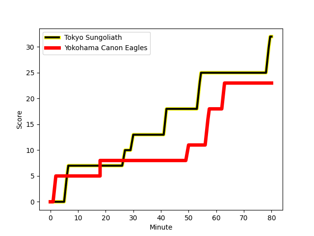
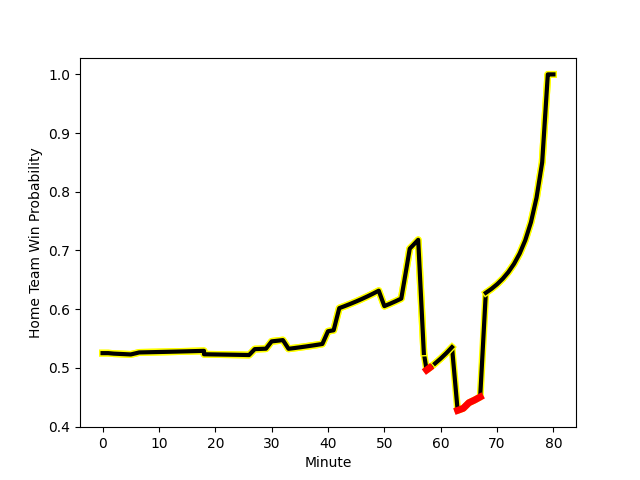

---  
layout: page  
title: Yokohama Canon Eagles at Tokyo Sungoliath; 23-32  
date: 2023-01-07 06:30:00 18:00:00 -0500  
categories: match review  
---
# Yokohama Canon Eagles (1616.01) at Tokyo Sungoliath (1659.7); 23-32

# Prediction: Tokyo Sungoliath by 8.4

Tokyo Sungoliath by 4.4 on a neutral field
## Scores over Time

## Win Probability over Time

# Pre-Match Prediction: Tokyo Sungoliath by 8.1

Tokyo Sungoliath by 4.1 on a neutral pitch

|   Away Minutes | Away Player                                                     |   Away elo |   Away Percentile |   Number |   Home Percentile |   Home elo | Home Player                                                           |   Home Minutes |
|---------------:|:----------------------------------------------------------------|-----------:|------------------:|---------:|------------------:|-----------:|:----------------------------------------------------------------------|---------------:|
|             68 | [Takato Okabe](..//playerfiles//TakatoOkabe_cleaned.md)         |     123.83 |                96 |        1 |                93 |     117.6  | [Yukio Morikawa](..//playerfiles//YukioMorikawa_cleaned.md)           |             54 |
|             79 | [Shin Kawamura](..//playerfiles//ShinKawamura_cleaned.md)       |      77.64 |                 9 |        2 |                96 |     125.21 | [Shunta Nakamura](..//playerfiles//ShuntaNakamura_cleaned.md)         |             79 |
|             33 | [Tatsuro Sugimoto](..//playerfiles//TatsuroSugimoto_cleaned.md) |      75.99 |                 7 |        3 |                59 |      98.55 | [Shinnosuke Kakinaga](..//playerfiles//ShinnosukeKakinaga_cleaned.md) |             65 |
|             80 | [Cory Hill](..//playerfiles//CoryHill_cleaned.md)               |     150.12 |                99 |        4 |                37 |      91.58 | [Hendrik Tui](..//playerfiles//HendrikTui_cleaned.md)                 |             68 |
|             80 | [Liaki Moli](..//playerfiles//LiakiMoli_cleaned.md)             |      85.85 |                22 |        5 |                97 |     133.97 | [Harry Hockings](..//playerfiles//HarryHockings_cleaned.md)           |             80 |
|             57 | [Kobus Van Dyk](..//playerfiles//KobusVanDyk_cleaned.md)        |     108.1  |                74 |        6 |                68 |     102.77 | [Ryuga Hashimoto](..//playerfiles//RyugaHashimoto_cleaned.md)         |             80 |
|             40 | [Ryota Yasui](..//playerfiles//RyotaYasui_cleaned.md)           |      86.96 |                25 |        7 |                33 |      90.63 | [Kai Yamamoto](..//playerfiles//KaiYamamoto_cleaned.md)               |             80 |
|             80 | [Amanaki Mafi](..//playerfiles//AmanakiMafi_cleaned.md)         |     113.35 |                84 |        8 |                47 |      96.49 | [Tevita Tatafu](..//playerfiles//TevitaTatafu_cleaned.md)             |             57 |
|             79 | [Faf de Klerk](..//playerfiles//FafdeKlerk_cleaned.md)          |      95.69 |                48 |        9 |                44 |      94.83 | [Naoto Saito](..//playerfiles//NaotoSaito_cleaned.md)                 |             40 |
|             80 | [Yu Tamura](..//playerfiles//YuTamura_cleaned.md)               |     109.35 |                75 |       10 |                77 |     111.27 | [Aaron Cruden](..//playerfiles//AaronCruden_cleaned.md)               |             80 |
|             54 | [Chihito Matsui](..//playerfiles//ChihitoMatsui_cleaned.md)     |     106.66 |                80 |       11 |                97 |     133    | [Tevita Li](..//playerfiles//TevitaLi_cleaned.md)                     |             79 |
|             80 | [Yusuke Kajimura](..//playerfiles//YusukeKajimura_cleaned.md)   |     102.09 |                64 |       12 |                75 |     107.13 | [Ryoto Nakamura](..//playerfiles//RyotoNakamura_cleaned.md)           |             80 |
|             80 | [Jesse Kriel](..//playerfiles//JesseKriel_cleaned.md)           |     134.48 |                97 |       13 |                55 |      98.6  | [Shogo Nakano](..//playerfiles//ShogoNakano_cleaned.md)               |             40 |
|             80 | [Inoke Burua](..//playerfiles//InokeBurua_cleaned.md)           |     106.17 |                75 |       14 |                91 |     120.25 | [Seiya Ozaki](..//playerfiles//SeiyaOzaki_cleaned.md)                 |             80 |
|             79 | [Jumpei Ogura](..//playerfiles//JumpeiOgura_cleaned.md)         |     119.47 |                87 |       15 |                79 |     110.67 | [Kotaro Matsushima](..//playerfiles//KotaroMatsushima_cleaned.md)     |             80 |
|             47 | [Rento Tsukayama](..//playerfiles//RentoTsukayama_cleaned.md)   |      99.52 |                53 |       16 |                93 |     130.4  | [Keisuke Moriya](..//playerfiles//KeisukeMoriya_cleaned.md)           |             40 |
|             40 | [Sione Halasili](..//playerfiles//SioneHalasili_cleaned.md)     |     101.92 |                66 |       17 |                73 |     107.66 | [Yutaka Nagare](..//playerfiles//YutakaNagare_cleaned.md)             |             40 |
|             26 | [Viliame Takayawa](..//playerfiles//ViliameTakayawa_cleaned.md) |     119.9  |                90 |       18 |                86 |     111.5  | [Shintaro Ishihara](..//playerfiles//ShintaroIshihara_cleaned.md)     |             26 |
|             23 | [Max Douglas](..//playerfiles//MaxDouglas_cleaned.md)           |     103.73 |                70 |       19 |                76 |     106.66 | [Kanji Shimokawa](..//playerfiles//KanjiShimokawa_cleaned.md)         |             23 |
|             12 | [Sioeli Vakalahi](..//playerfiles//SioeliVakalahi_cleaned.md)   |      95    |               nan |       20 |               nan |      96.51 | [Ryosuke Iwaihara](..//playerfiles//RyosukeIwaihara_cleaned.md)       |             15 |
|              1 | [Kouki Arai](..//playerfiles//KoukiArai_cleaned.md)             |      93.95 |                46 |       21 |                94 |     125.63 | [Tom Savage](..//playerfiles//TomSavage_cleaned.md)                   |             12 |
|              1 | [Song Ho Park](..//playerfiles//SongHoPark_cleaned.md)          |      95.07 |               nan |       22 |                65 |     100.04 | [Taiga Ozaki](..//playerfiles//TaigaOzaki_cleaned.md)                 |              1 |
|              1 | [SP Marais](..//playerfiles//SPMarais_cleaned.md)               |     124.54 |                91 |       23 |               nan |      93.12 | [Kienori Go](..//playerfiles//KienoriGo_cleaned.md)                   |              1 |

