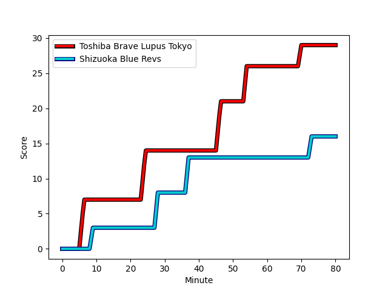
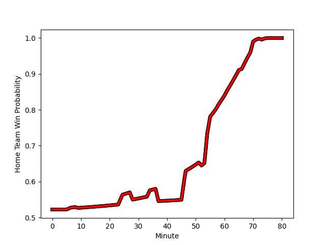

---  
layout: page  
title: Shizuoka Blue Revs at Toshiba Brave Lupus Tokyo; 16-29  
date: 2023-01-07 06:30:00 18:00:00 -0500  
categories: match review  
---
# Shizuoka Blue Revs (1509.71) at Toshiba Brave Lupus Tokyo (1548.51); 16-29

# Prediction: Toshiba Brave Lupus Tokyo by 7.9

Toshiba Brave Lupus Tokyo by 3.9 on a neutral field
## Scores over Time

## Win Probability over Time

# Pre-Match Prediction: Toshiba Brave Lupus Tokyo by 6.3

Toshiba Brave Lupus Tokyo by 2.3 on a neutral pitch

|   Away Minutes | Away Player                                                         |   Away elo |   Away Percentile |   Number |   Home Percentile |   Home elo | Home Player                                                         |   Home Minutes |
|---------------:|:--------------------------------------------------------------------|-----------:|------------------:|---------:|------------------:|-----------:|:--------------------------------------------------------------------|---------------:|
|             61 | [Kazuhiro Kawata](..//playerfiles//KazuhiroKawata_cleaned.md)       |     101.71 |                69 |        1 |                48 |      94.89 | [Sena Kimura](..//playerfiles//SenaKimura_cleaned.md)               |             61 |
|             71 | [Takeshi Hino](..//playerfiles//TakeshiHino_cleaned.md)             |     100.24 |                64 |        2 |                47 |      93.86 | [Mamoru Harada](..//playerfiles//MamoruHarada_cleaned.md)           |             52 |
|             61 | [Takayoshi Mohara](..//playerfiles//TakayoshiMohara_cleaned.md)     |      96.19 |               nan |        3 |                80 |     106.13 | [Yuta Kokaji](..//playerfiles//YutaKokaji_cleaned.md)               |             52 |
|             80 | [Yuya Odo](..//playerfiles//YuyaOdo_cleaned.md)                     |     111.49 |                83 |        4 |                64 |     100.85 | [Warner Dearns](..//playerfiles//WarnerDearns_cleaned.md)           |             80 |
|             55 | [Eishin Kuwano](..//playerfiles//EishinKuwano_cleaned.md)           |     110.73 |                81 |        5 |                94 |     123.96 | [Jacob Pierce](..//playerfiles//JacobPierce_cleaned.md)             |             73 |
|             80 | [Riki Sugihara](..//playerfiles//RikiSugihara_cleaned.md)           |      96.78 |                51 |        6 |                33 |      89.81 | [Shin Ito](..//playerfiles//ShinIto_cleaned.md)                     |             58 |
|             66 | [Shoji Takuma](..//playerfiles//ShojiTakuma_cleaned.md)             |      92.65 |                41 |        7 |                50 |      96.16 | [Yoshitaka Tokunaga](..//playerfiles//YoshitakaTokunaga_cleaned.md) |             80 |
|             80 | [Kwagga Smith](..//playerfiles//KwaggaSmith_cleaned.md)             |     126.32 |                93 |        8 |                93 |     125.86 | [Michael Leitch](..//playerfiles//MichaelLeitch_cleaned.md)         |             80 |
|             55 | [Bryn Hall](..//playerfiles//BrynHall_cleaned.md)                   |     121.92 |                94 |        9 |                54 |      98.18 | [Takahiro Ogawa](..//playerfiles//TakahiroOgawa_cleaned.md)         |             52 |
|             80 | [Sam Greene](..//playerfiles//SamGreene_cleaned.md)                 |      77.56 |                 9 |       10 |                59 |     101.08 | [Tom Taylor](..//playerfiles//TomTaylor_cleaned.md)                 |             73 |
|             80 | [Hironori Yatomi](..//playerfiles//HironoriYatomi_cleaned.md)       |      91.32 |                36 |       11 |                41 |      92.85 | [Masaki Hamada](..//playerfiles//MasakiHamada_cleaned.md)           |             80 |
|             55 | [Atomu Shirai](..//playerfiles//AtomuShirai_cleaned.md)             |      95.52 |               nan |       12 |                91 |     119.38 | [Burger Odendaal](..//playerfiles//BurgerOdendaal_cleaned.md)       |             52 |
|             80 | [Malo Tuitama](..//playerfiles//MaloTuitama_cleaned.md)             |     112.27 |                83 |       13 |                86 |     114.53 | [Seta Tamanivalu](..//playerfiles//SetaTamanivalu_cleaned.md)       |             80 |
|             34 | [Chikara Ito](..//playerfiles//ChikaraIto_cleaned.md)               |      87.35 |                24 |       14 |                61 |      99.3  | [Jone Naikabula](..//playerfiles//JoneNaikabula_cleaned.md)         |             80 |
|             80 | [Keagan Faria](..//playerfiles//KeaganFaria_cleaned.md)             |     110.03 |                81 |       15 |                61 |     100.83 | [Takuro Matsunaga](..//playerfiles//TakuroMatsunaga_cleaned.md)     |             80 |
|             46 | [Sho Kiyohara](..//playerfiles//ShoKiyohara_cleaned.md)             |      68.88 |                 2 |       16 |                33 |      87.78 | [Daigo Hashimoto](..//playerfiles//DaigoHashimoto_cleaned.md)       |             28 |
|             25 | [Samuela Anise](..//playerfiles//SamuelaAnise_cleaned.md)           |      77.6  |                11 |       17 |               nan |      95    | [Latu Taufa](..//playerfiles//LatuTaufa_cleaned.md)                 |             28 |
|             25 | [Viliami Tahitu'a](..//playerfiles//ViliamiTahitu'a_cleaned.md)     |      90.41 |                36 |       18 |                92 |     118.29 | [Jack Stratton](..//playerfiles//JackStratton_cleaned.md)           |             28 |
|             25 | [Minoru Tanoue](..//playerfiles//MinoruTanoue_cleaned.md)           |     107.39 |                75 |       19 |                56 |      98.93 | [Nicholas McCurran](..//playerfiles//NicholasMcCurran_cleaned.md)   |             28 |
|             19 | [Yuji Ueki](..//playerfiles//YujiUeki_cleaned.md)                   |     100.02 |                68 |       20 |               nan |      93.81 | [Takeshi Sasaki](..//playerfiles//TakeshiSasaki_cleaned.md)         |             22 |
|             14 | [Ryosuke Funahashi](..//playerfiles//RyosukeFunahashi_cleaned.md)   |     127.33 |                94 |       21 |                62 |      95.57 | [Yuma Fujino](..//playerfiles//YumaFujino_cleaned.md)               |             19 |
|             19 | [Bunkei Kaku](..//playerfiles//BunkeiKaku_cleaned.md)               |      95    |               nan |       22 |                 5 |      70.41 | [Kyosuke Kajikawa](..//playerfiles//KyosukeKajikawa_cleaned.md)     |              7 |
|              9 | [Richmond Tongatama](..//playerfiles//RichmondTongatama_cleaned.md) |      94.59 |               nan |       23 |                67 |     105.82 | [Shohei Toyoshima](..//playerfiles//ShoheiToyoshima_cleaned.md)     |              7 |

