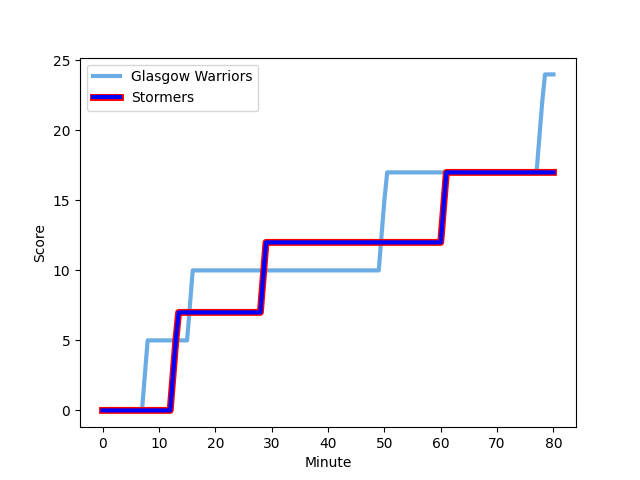
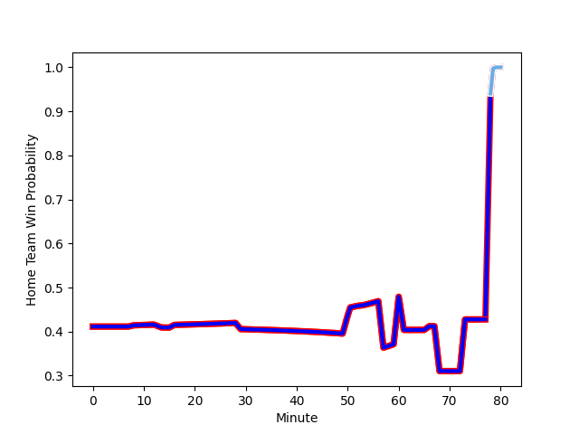

---  
layout: page  
title: Stormers at Glasgow Warriors; 17-24  
date: 2023-01-08 16:00:00 18:00:00 -0500  
categories: match review  
---
# Stormers (1669.34) at Glasgow Warriors (1513.76); 17-24

# Prediction: Stormers by 11.6

Stormers by 15.6 on a neutral field
## Scores over Time

## Win Probability over Time

# Pre-Match Prediction: Stormers by 17.1

Stormers by 21.1 on a neutral pitch

|   Away Minutes | Away Player                                                              |   Away elo |   Away Percentile |   Number |   Home Percentile |   Home elo | Home Player                                                               |   Home Minutes |
|---------------:|:-------------------------------------------------------------------------|-----------:|------------------:|---------:|------------------:|-----------:|:--------------------------------------------------------------------------|---------------:|
|             70 | [Steven Kitshoff](..//playerfiles//StevenKitshoff_cleaned.md)            |     120.23 |                95 |        1 |                93 |     117.38 | [Jamie Bhatti](..//playerfiles//JamieBhatti_cleaned.md)                   |             68 |
|             53 | [Joseph Dweba](..//playerfiles//JosephDweba_cleaned.md)                  |     101.49 |                67 |        2 |                98 |     130.75 | [George Turner](..//playerfiles//GeorgeTurner_cleaned.md)                 |             57 |
|             70 | [Neethling Fouche](..//playerfiles//NeethlingFouche_cleaned.md)          |     112.52 |                87 |        3 |                82 |     107.54 | [Lucio Sordoni](..//playerfiles//LucioSordoni_cleaned.md)                 |             57 |
|             60 | [Ben-Jason Dixon](..//playerfiles//Ben-JasonDixon_cleaned.md)            |     106.63 |                76 |        4 |                25 |      87.78 | [JP du Preez](..//playerfiles//JPduPreez_cleaned.md)                      |             80 |
|             80 | [Marvin Orie](..//playerfiles//MarvinOrie_cleaned.md)                    |     106.1  |                75 |        5 |                48 |      97.63 | [Lewis Bean](..//playerfiles//LewisBean_cleaned.md)                       |             80 |
|             66 | [Deon Fourie](..//playerfiles//DeonFourie_cleaned.md)                    |     139    |                98 |        6 |                87 |     114.37 | [Matt Fagerson](..//playerfiles//MattFagerson_cleaned.md)                 |             80 |
|             52 | [Willie Engelbrecht](..//playerfiles//WillieEngelbrecht_cleaned.md)      |     107.96 |                79 |        7 |                35 |      90.24 | [Sione Vailanu](..//playerfiles//SioneVailanu_cleaned.md)                 |             80 |
|             80 | [Hacjivah Dayimani](..//playerfiles//HacjivahDayimani_cleaned.md)        |     127.29 |                94 |        8 |                19 |      84.63 | [Jack Dempsey](..//playerfiles//JackDempsey_cleaned.md)                   |             80 |
|             73 | [Albertus Paul de Wet](..//playerfiles//AlbertusPauldeWet_cleaned.md)    |     102.13 |                65 |        9 |                97 |     129.18 | [George Horne](..//playerfiles//GeorgeHorne_cleaned.md)                   |             63 |
|             80 | [Manie Libbok](..//playerfiles//ManieLibbok_cleaned.md)                  |     111.08 |                77 |       10 |                33 |      91.33 | [Tom Jordan](..//playerfiles//TomJordan_cleaned.md)                       |             68 |
|             34 | [Leolin Zas](..//playerfiles//LeolinZas_cleaned.md)                      |     109.53 |                80 |       11 |                79 |     108.96 | [Kyle Steyn](..//playerfiles//KyleSteyn_cleaned.md)                       |             80 |
|             80 | [Damian Willemse](..//playerfiles//DamianWillemse_cleaned.md)            |     130.8  |                94 |       12 |                16 |      82.14 | [Huw Jones](..//playerfiles//HuwJones_cleaned.md)                         |             80 |
|             80 | [Daniel du Plessis](..//playerfiles//DanielduPlessis_cleaned.md)         |     119.95 |                91 |       13 |                30 |      88.56 | [Sione Tuipulotu](..//playerfiles//SioneTuipulotu_cleaned.md)             |             80 |
|             80 | [Suleiman  Hartzenberg](..//playerfiles//SuleimanHartzenberg_cleaned.md) |      97.39 |                53 |       14 |                78 |     107.74 | [Sebastian Cancelliere](..//playerfiles//SebastianCancelliere_cleaned.md) |             80 |
|             80 | [Clayton Blommetjies](..//playerfiles//ClaytonBlommetjies_cleaned.md)    |     102.52 |                62 |       15 |                33 |      88.89 | [Ollie Smith](..//playerfiles//OllieSmith_cleaned.md)                     |             80 |
|             46 | [Angelo Davids](..//playerfiles//AngeloDavids_cleaned.md)                |     104.08 |                71 |       16 |                97 |     126.13 | [Fraser Brown](..//playerfiles//FraserBrown_cleaned.md)                   |             23 |
|             28 | [Junior Pokomela](..//playerfiles//JuniorPokomela_cleaned.md)            |      83.87 |                19 |       17 |                33 |      91.08 | [Simon Berghan](..//playerfiles//SimonBerghan_cleaned.md)                 |             23 |
|             27 | [JJ Kotze](..//playerfiles//JJKotze_cleaned.md)                          |      97.49 |                58 |       18 |                71 |     104.25 | [Ali Price](..//playerfiles//AliPrice_cleaned.md)                         |             17 |
|             20 | [Connor Evans](..//playerfiles//ConnorEvans_cleaned.md)                  |      97.92 |                56 |       19 |               nan |      92.38 | [Nathan McBeth](..//playerfiles//NathanMcBeth_cleaned.md)                 |             12 |
|             14 | [Marcel Theunissen](..//playerfiles//MarcelTheunissen_cleaned.md)        |      87.82 |                26 |       20 |                64 |     102.93 | [Domingo Miotti](..//playerfiles//DomingoMiotti_cleaned.md)               |             12 |
|             10 | [Sazi Sandi](..//playerfiles//SaziSandi_cleaned.md)                      |      91.72 |                27 |       21 |               nan |     nan    | nan                                                                       |            nan |
|             10 | [Brok Harris](..//playerfiles//BrokHarris_cleaned.md)                    |     136.15 |                99 |       22 |               nan |     nan    | nan                                                                       |            nan |
|              7 | [Imad Khan](..//playerfiles//ImadKhan_cleaned.md)                        |      95    |               nan |       23 |               nan |     nan    | nan                                                                       |            nan |

