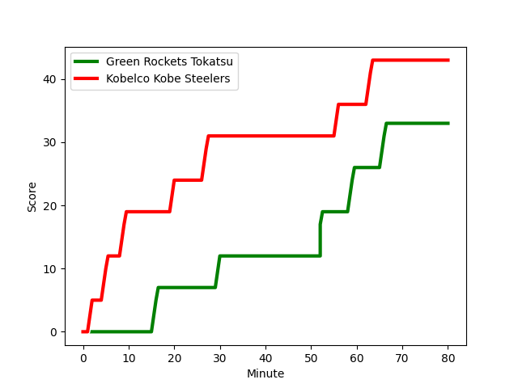
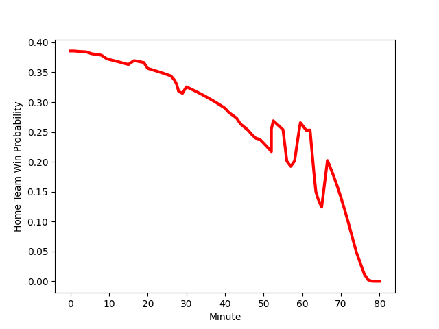

---  
layout: page  
title: Kobelco Kobe Steelers at Green Rockets Tokatsu; 43-33  
date: 2023-01-08 06:30:00 18:00:00 -0500  
categories: match review  
---
# Kobelco Kobe Steelers (1620.09) at Green Rockets Tokatsu (1417.84); 43-33

# Prediction: Kobelco Kobe Steelers by 16.2

Kobelco Kobe Steelers by 20.2 on a neutral field
## Scores over Time

## Win Probability over Time

# Pre-Match Prediction: Kobelco Kobe Steelers by 16.1

Kobelco Kobe Steelers by 20.1 on a neutral pitch

|   Away Minutes | Away Player                                                                    |   Away elo |   Away Percentile |   Number |   Home Percentile |   Home elo | Home Player                                                       |   Home Minutes |
|---------------:|:-------------------------------------------------------------------------------|-----------:|------------------:|---------:|------------------:|-----------:|:------------------------------------------------------------------|---------------:|
|             44 | [Isileli Nakajima Vakauta](..//playerfiles//IsileliNakajimaVakauta_cleaned.md) |      97.94 |                57 |        1 |                84 |     108.76 | [Gakuto Ishida](..//playerfiles//GakutoIshida_cleaned.md)         |             47 |
|             64 | [Kenta Matsuoka](..//playerfiles//KentaMatsuoka_cleaned.md)                    |      93.41 |                44 |        2 |                57 |      97.3  | [Myuu Arai](..//playerfiles//MyuuArai_cleaned.md)                 |             58 |
|             62 | [Hiroshi Yamashita](..//playerfiles//HiroshiYamashita_cleaned.md)              |     126.54 |                97 |        3 |                 4 |      72.11 | [Takahiro Doi](..//playerfiles//TakahiroDoi_cleaned.md)           |             47 |
|             80 | [Takara Imamura](..//playerfiles//TakaraImamura_cleaned.md)                    |     108.15 |                79 |        4 |                55 |      97.88 | [Yoshida Hosoda](..//playerfiles//YoshidaHosoda_cleaned.md)       |             28 |
|             80 | [JD Schickerling](..//playerfiles//JDSchickerling_cleaned.md)                  |      85.62 |                22 |        5 |                26 |      87.21 | [Luke Porter](..//playerfiles//LukePorter_cleaned.md)             |             80 |
|             41 | [Hikaru Hashimoto](..//playerfiles//HikaruHashimoto_cleaned.md)                |     102.45 |                67 |        6 |                31 |      89.06 | [Kavaia Tagivetaua](..//playerfiles//KavaiaTagivetaua_cleaned.md) |             80 |
|             80 | [Marcell Coetzee](..//playerfiles//MarcellCoetzee_cleaned.md)                  |     113.49 |                85 |        7 |                26 |      87.32 | [Ryoi Kamei](..//playerfiles//RyoiKamei_cleaned.md)               |             49 |
|             63 | [Ataata Moeakiola](..//playerfiles//AtaataMoeakiola_cleaned.md)                |     126.95 |                93 |        8 |                71 |     106.34 | [Aseri Masivou](..//playerfiles//AseriMasivou_cleaned.md)         |             80 |
|             64 | [Daiki Nakajima](..//playerfiles//DaikiNakajima_cleaned.md)                    |      88.2  |                26 |        9 |                86 |     112.24 | [Nick Phipps](..//playerfiles//NickPhipps_cleaned.md)             |             49 |
|             80 | [Seungsin Lee](..//playerfiles//SeungsinLee_cleaned.md)                        |     112.74 |                80 |       10 |                50 |      97.76 | [Taisetsu Kanai](..//playerfiles//TaisetsuKanai_cleaned.md)       |             80 |
|             75 | [Rakuhei Yamashita](..//playerfiles//RakuheiYamashita_cleaned.md)              |     136.82 |                98 |       11 |                91 |     121.92 | [Kenta Omata](..//playerfiles//KentaOmata_cleaned.md)             |             80 |
|             80 | [Ngani Laumape](..//playerfiles//NganiLaumape_cleaned.md)                      |     115.18 |                86 |       12 |                 2 |      65.7  | [Maritino Nemani](..//playerfiles//MaritinoNemani_cleaned.md)     |             58 |
|             63 | [Michael Little](..//playerfiles//MichaelLittle_cleaned.md)                    |     107.55 |                76 |       13 |                10 |      77.59 | [Koichi Matsura](..//playerfiles//KoichiMatsura_cleaned.md)       |             27 |
|             80 | [Shinsuke Iseki](..//playerfiles//ShinsukeIseki_cleaned.md)                    |     111.04 |                82 |       14 |                77 |     107.37 | [Lomano Lemeki](..//playerfiles//LomanoLemeki_cleaned.md)         |             80 |
|             80 | [Ryohei Yamanaka](..//playerfiles//RyoheiYamanaka_cleaned.md)                  |      96.11 |                48 |       15 |                19 |      83.26 | [Tom Marshall](..//playerfiles//TomMarshall_cleaned.md)           |             80 |
|             39 | [Go Maeda](..//playerfiles//GoMaeda_cleaned.md)                                |     108.5  |                78 |       16 |                42 |      92.31 | [Tim Bennetts](..//playerfiles//TimBennetts_cleaned.md)           |             53 |
|             36 | [Shigure Takao](..//playerfiles//ShigureTakao_cleaned.md)                      |     108.46 |                83 |       17 |                10 |      78.11 | [Tatsuru Owada](..//playerfiles//TatsuruOwada_cleaned.md)         |             52 |
|             18 | [Sho Maeda](..//playerfiles//ShoMaeda_cleaned.md)                              |     104.64 |                70 |       18 |                95 |     122.61 | [Satoshi Ueda](..//playerfiles//SatoshiUeda_cleaned.md)           |             33 |
|             17 | [Timothy Lafaele](..//playerfiles//TimothyLafaele_cleaned.md)                  |     108.51 |                77 |       19 |                 0 |      54.01 | [Sunao Takizawa](..//playerfiles//SunaoTakizawa_cleaned.md)       |             33 |
|             17 | [Seokhwan Jang](..//playerfiles//SeokhwanJang_cleaned.md)                      |     103.8  |                69 |       20 |                42 |      94.74 | [Whetu Douglas](..//playerfiles//WhetuDouglas_cleaned.md)         |             31 |
|             16 | [Kyungmun Wang](..//playerfiles//KyungmunWang_cleaned.md)                      |      97.18 |               nan |       21 |                55 |      98.27 | [Tatsuya Fujii](..//playerfiles//TatsuyaFujii_cleaned.md)         |             31 |
|             16 | [Kentaro Obata](..//playerfiles//KentaroObata_cleaned.md)                      |      96.68 |               nan |       22 |                90 |     115.95 | [Ash Dixon](..//playerfiles//AshDixon_cleaned.md)                 |             22 |
|              5 | [Kanta Matsunaga](..//playerfiles//KantaMatsunaga_cleaned.md)                  |      95.35 |                48 |       23 |                49 |      95.77 | [Teruya Goto](..//playerfiles//TeruyaGoto_cleaned.md)             |             22 |

