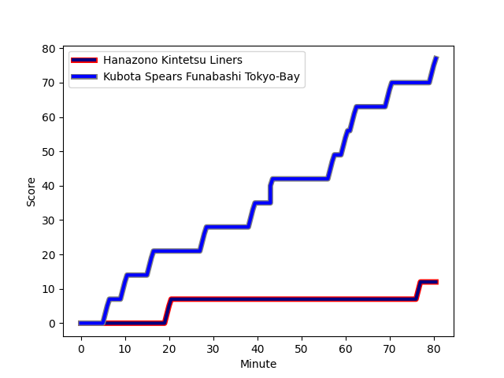
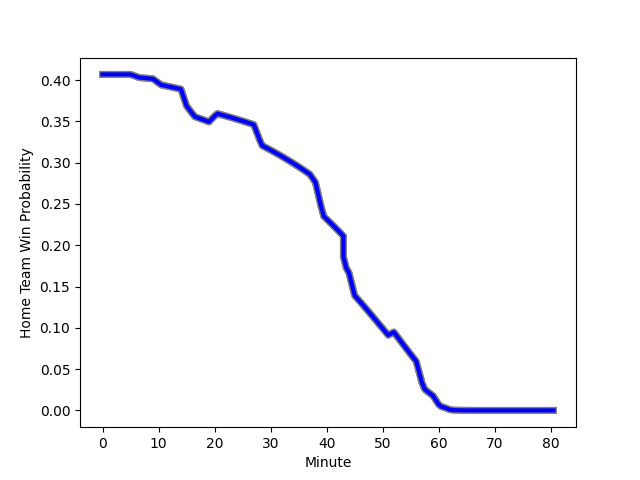

---  
layout: page  
title: Kubota Spears Funabashi Tokyo-Bay at Hanazono Kintetsu Liners; 77-12  
date: 2023-01-08 04:00:00 18:00:00 -0500  
categories: match review  
---
# Kubota Spears Funabashi Tokyo-Bay (1629.22) at Hanazono Kintetsu Liners (1465.55); 77-12

# Prediction: Kubota Spears Funabashi Tokyo-Bay by 12.4

Kubota Spears Funabashi Tokyo-Bay by 16.4 on a neutral field
## Scores over Time

## Win Probability over Time

# Pre-Match Prediction: Kubota Spears Funabashi Tokyo-Bay by 10.6

Kubota Spears Funabashi Tokyo-Bay by 14.6 on a neutral pitch

|   Away Minutes | Away Player                                                               |   Away elo |   Away Percentile |   Number |   Home Percentile |   Home elo | Home Player                                                               |   Home Minutes |
|---------------:|:--------------------------------------------------------------------------|-----------:|------------------:|---------:|------------------:|-----------:|:--------------------------------------------------------------------------|---------------:|
|             49 | [Kota Kaishi](..//playerfiles//KotaKaishi_cleaned.md)                     |     101.51 |                69 |        1 |                16 |      83.6  | [Shun Sasaki](..//playerfiles//ShunSasaki_cleaned.md)                     |             54 |
|             49 | [Malcolm Marx](..//playerfiles//MalcolmMarx_cleaned.md)                   |     124.19 |                96 |        2 |                68 |     101.77 | [Keiichi Kaneko](..//playerfiles//KeiichiKaneko_cleaned.md)               |             63 |
|             44 | [Opeti Helu](..//playerfiles//OpetiHelu_cleaned.md)                       |     110.5  |                82 |        3 |                32 |      90.16 | [Lata Tangimana](..//playerfiles//LataTangimana_cleaned.md)               |             54 |
|             52 | [Uwe Helu](..//playerfiles//UweHelu_cleaned.md)                           |     111.57 |                83 |        4 |                24 |      86.86 | [Sam Caird](..//playerfiles//SamCaird_cleaned.md)                         |             80 |
|             80 | [David Bulbring](..//playerfiles//DavidBulbring_cleaned.md)               |     100.74 |                63 |        5 |                97 |     134.14 | [Ben Toolis](..//playerfiles//BenToolis_cleaned.md)                       |             45 |
|             80 | [Lappies Labuschagne](..//playerfiles//LappiesLabuschagne_cleaned.md)     |     105.34 |                73 |        6 |                73 |     105.08 | [Takahito Sugahara](..//playerfiles//TakahitoSugahara_cleaned.md)         |             80 |
|             80 | [Takeo Suenaga](..//playerfiles//TakeoSuenaga_cleaned.md)                 |     105.5  |                73 |        7 |                81 |     110.05 | [Hayato Yokoi](..//playerfiles//HayatoYokoi_cleaned.md)                   |             80 |
|             52 | [Faulua Makisi](..//playerfiles//FauluaMakisi_cleaned.md)                 |     100.95 |                58 |        8 |                84 |     114.26 | [Jose Seru](..//playerfiles//JoseSeru_cleaned.md)                         |             15 |
|             44 | [Shinobu Fujiwara](..//playerfiles//ShinobuFujiwara_cleaned.md)           |     100.14 |                59 |        9 |                31 |      89.78 | [Will Genia](..//playerfiles//WillGenia_cleaned.md)                       |             54 |
|             49 | [Bernard Foley](..//playerfiles//BernardFoley_cleaned.md)                 |     148.01 |               100 |       10 |                80 |     112.72 | [Jackson Garden-Bachop](..//playerfiles//JacksonGarden-Bachop_cleaned.md) |             80 |
|             80 | [Haruto Kida](..//playerfiles//HarutoKida_cleaned.md)                     |      94.5  |                45 |       11 |                64 |     100.76 | [Semisi Masirewa](..//playerfiles//SemisiMasirewa_cleaned.md)             |             80 |
|             80 | [Harumichi Tatekawa](..//playerfiles//HarumichiTatekawa_cleaned.md)       |     116.11 |                87 |       12 |                39 |      91.63 | [Koji Okamura](..//playerfiles//KojiOkamura_cleaned.md)                   |             80 |
|             44 | [Sione Teaupa](..//playerfiles//SioneTeaupa_cleaned.md)                   |      99.46 |                58 |       13 |                12 |      80.73 | [Siosaia Fifita](..//playerfiles//SiosaiaFifita_cleaned.md)               |             80 |
|             80 | [Koga Nezuka](..//playerfiles//KogaNezuka_cleaned.md)                     |      96.92 |                53 |       14 |               nan |      93.25 | [Liekina Kaufusi](..//playerfiles//LiekinaKaufusi_cleaned.md)             |             38 |
|             80 | [Gerhard van den Heever](..//playerfiles//GerhardvandenHeever_cleaned.md) |     130.41 |                94 |       15 |                66 |     102.71 | [Yoshizumi Takeda](..//playerfiles//YoshizumiTakeda_cleaned.md)           |             54 |
|             36 | [Satoshi Saita](..//playerfiles//SatoshiSaita_cleaned.md)                 |      95    |               nan |       16 |                16 |      83.21 | [Daiki Miyashita](..//playerfiles//DaikiMiyashita_cleaned.md)             |             65 |
|             36 | [Kazuhiro Taniguchi](..//playerfiles//KazuhiroTaniguchi_cleaned.md)       |     115.26 |                89 |       17 |                20 |      84.09 | [Akihide Onogi](..//playerfiles//AkihideOnogi_cleaned.md)                 |             42 |
|             36 | [Ryan Crotty](..//playerfiles//RyanCrotty_cleaned.md)                     |     104.82 |                70 |       18 |                16 |      82.63 | [Patrick Tafa](..//playerfiles//PatrickTafa_cleaned.md)                   |             35 |
|             31 | [Kazuki Kato](..//playerfiles//KazukiKato_cleaned.md)                     |      87.51 |                23 |       19 |                77 |     102.76 | [Kenta Tanaka](..//playerfiles//KentaTanaka_cleaned.md)                   |             26 |
|             31 | [Hiraoki Sugimoto](..//playerfiles//HiraokiSugimoto_cleaned.md)           |     110.23 |                84 |       20 |                89 |     111.52 | [Fumihiro Toru](..//playerfiles//FumihiroToru_cleaned.md)                 |             26 |
|             31 | [Atsushi Oshikawa](..//playerfiles//AtsushiOshikawa_cleaned.md)           |      95    |               nan |       21 |                60 |      98.91 | [Joshua Nohra](..//playerfiles//JoshuaNohra_cleaned.md)                   |             26 |
|             28 | [Ruan Botha](..//playerfiles//RuanBotha_cleaned.md)                       |     122.59 |                93 |       22 |                71 |     102.43 | [Keitaro Hitora](..//playerfiles//KeitaroHitora_cleaned.md)               |             26 |
|             28 | [Finau Tupa](..//playerfiles//FinauTupa_cleaned.md)                       |     125.63 |                95 |       23 |                96 |     123.34 | [Atsushi Kashimoto](..//playerfiles//AtsushiKashimoto_cleaned.md)         |             17 |

