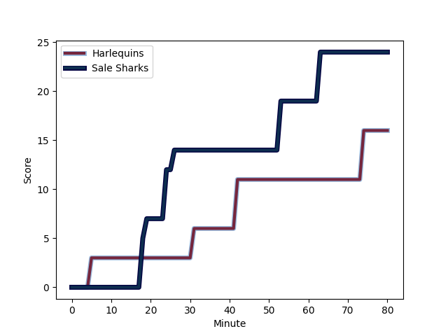
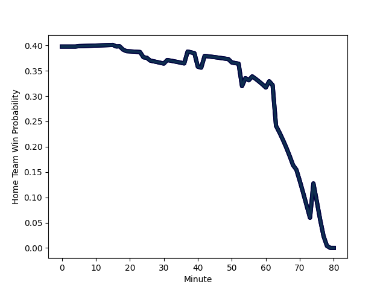

---  
layout: page  
title: Sale Sharks at Harlequins; 24-16  
date: 2023-01-08 10:00:00 18:00:00 -0500  
categories: match review  
---
# Sale Sharks (1632.45) at Harlequins (1452.53); 24-16

# Prediction: Sale Sharks by 14.0

Sale Sharks by 18.0 on a neutral field
## Scores over Time

## Win Probability over Time

# Pre-Match Prediction: Sale Sharks by 14.1

Sale Sharks by 18.1 on a neutral pitch

|   Away Minutes | Away Player                                                         |   Away elo |   Away Percentile |   Number |   Home Percentile |   Home elo | Home Player                                                       |   Home Minutes |
|---------------:|:--------------------------------------------------------------------|-----------:|------------------:|---------:|------------------:|-----------:|:------------------------------------------------------------------|---------------:|
|             54 | [Simon McIntyre](..//playerfiles//SimonMcIntyre_cleaned.md)         |     112.56 |                87 |        1 |                28 |      89.12 | [Fin Baxter](..//playerfiles//FinBaxter_cleaned.md)               |             61 |
|             61 | [Akker van der Merwe](..//playerfiles//AkkervanderMerwe_cleaned.md) |     127.8  |                98 |        2 |                 4 |      73.37 | [Jack Walker](..//playerfiles//JackWalker_cleaned.md)             |             69 |
|             50 | [Nic Schonert](..//playerfiles//NicSchonert_cleaned.md)             |      87.04 |                22 |        3 |                90 |     114.54 | [Wilco Louw](..//playerfiles//WilcoLouw_cleaned.md)               |             54 |
|             80 | [Cobus Wiese](..//playerfiles//CobusWiese_cleaned.md)               |      96.81 |                52 |        4 |                 6 |      72.79 | [George Hammond](..//playerfiles//GeorgeHammond_cleaned.md)       |             69 |
|             80 | [Jonny Hill](..//playerfiles//JonnyHill_cleaned.md)                 |      94.23 |                45 |        5 |                81 |     109.97 | [Irne Herbst](..//playerfiles//IrneHerbst_cleaned.md)             |             80 |
|             16 | [Tom Curry](..//playerfiles//TomCurry_cleaned.md)                   |      94.02 |                45 |        6 |                17 |      83.21 | [Archie White](..//playerfiles//ArchieWhite_cleaned.md)           |             54 |
|             80 | [Ben Curry](..//playerfiles//BenCurry_cleaned.md)                   |      92.75 |                42 |        7 |                 2 |      64.27 | [Luke Wallace](..//playerfiles//LukeWallace_cleaned.md)           |             80 |
|             69 | [Jean-Luc du Preez](..//playerfiles//Jean-LucduPreez_cleaned.md)    |     108.71 |                77 |        8 |                99 |     140.77 | [Alex Dombrandt](..//playerfiles//AlexDombrandt_cleaned.md)       |             80 |
|             80 | [Gus Warr](..//playerfiles//GusWarr_cleaned.md)                     |      94.22 |                42 |        9 |                87 |     113    | [Danny Care](..//playerfiles//DannyCare_cleaned.md)               |             80 |
|             80 | [Robert du Preez](..//playerfiles//RobertduPreez_cleaned.md)        |      87.2  |                22 |       10 |                41 |      93.74 | [Tommaso Allan](..//playerfiles//TommasoAllan_cleaned.md)         |             56 |
|             80 | [Tom O'Flaherty](..//playerfiles//TomO'Flaherty_cleaned.md)         |     128.7  |                95 |       11 |                71 |     103.96 | [Josh Bassett](..//playerfiles//JoshBassett_cleaned.md)           |             61 |
|             80 | [Manu Tuilagi](..//playerfiles//ManuTuilagi_cleaned.md)             |     108.29 |                77 |       12 |                84 |     113.2  | [Andre Esterhuizen](..//playerfiles//AndreEsterhuizen_cleaned.md) |             80 |
|             80 | [Sam James](..//playerfiles//SamJames_cleaned.md)                   |     158.29 |               100 |       13 |                40 |      91.86 | [Joe Marchant](..//playerfiles//JoeMarchant_cleaned.md)           |             80 |
|             80 | [Arron Reed](..//playerfiles//ArronReed_cleaned.md)                 |     126.82 |                94 |       14 |                18 |      84.76 | [Cadan Murley](..//playerfiles//CadanMurley_cleaned.md)           |             80 |
|             51 | [Luke James](..//playerfiles//LukeJames_cleaned.md)                 |     132.69 |                94 |       15 |                40 |      91.7  | [Nick David](..//playerfiles//NickDavid_cleaned.md)               |             80 |
|             19 | [Ewan Ashman](..//playerfiles//EwanAshman_cleaned.md)               |      87.73 |                26 |       16 |                81 |     107.62 | [Jack Musk](..//playerfiles//JackMusk_cleaned.md)                 |             11 |
|             26 | [Bevan Rodd](..//playerfiles//BevanRodd_cleaned.md)                 |     115.8  |                91 |       17 |                17 |      83.01 | [Jordan Els](..//playerfiles//JordanEls_cleaned.md)               |             19 |
|             30 | [James Harper](..//playerfiles//JamesHarper_cleaned.md)             |      98.57 |               nan |       18 |                35 |      91.01 | [Simon Kerrod](..//playerfiles//SimonKerrod_cleaned.md)           |             26 |
|             11 | [Josh Beaumont](..//playerfiles//JoshBeaumont_cleaned.md)           |     111.65 |                83 |       19 |                19 |      78.31 | [Charlie Matthews](..//playerfiles//CharlieMatthews_cleaned.md)   |             11 |
|             64 | [Jono Ross](..//playerfiles//JonoRoss_cleaned.md)                   |     100.81 |                60 |       20 |                63 |     100.4  | [Tom Lawday](..//playerfiles//TomLawday_cleaned.md)               |             26 |
|              0 | [Aneurin Nye Thomas](..//playerfiles//AneurinNyeThomas_cleaned.md)  |      95.34 |               nan |       21 |                52 |      97.58 | [Lewis Gjaltema](..//playerfiles//LewisGjaltema_cleaned.md)       |              0 |
|              0 | [Tom Curtis](..//playerfiles//TomCurtis_cleaned.md)                 |      92.7  |               nan |       22 |                90 |     120.75 | [Will Edwards](..//playerfiles//WillEdwards_cleaned.md)           |             24 |
|             29 | [Joe Carpenter](..//playerfiles//JoeCarpenter_cleaned.md)           |      79.28 |                15 |       23 |                86 |     113.28 | [Oscar Beard](..//playerfiles//OscarBeard_cleaned.md)             |             19 |

