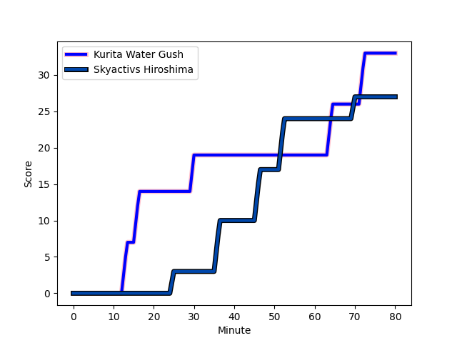
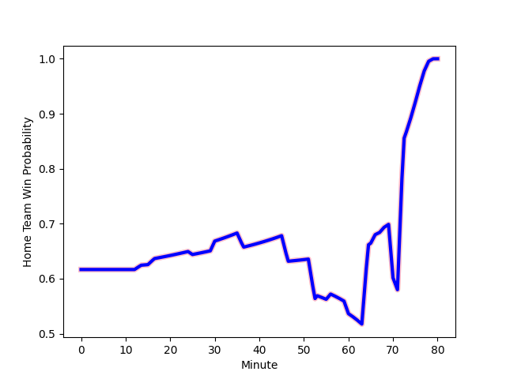

---  
layout: page  
title: Skyactivs Hiroshima at Kurita Water Gush; 27-33  
date: 2023-01-08 00:00:00 18:00:00 -0500  
categories: match review  
---
# Skyactivs Hiroshima (1127.41) at Kurita Water Gush (1333.95); 27-33

# Prediction: Kurita Water Gush by 24.7

Kurita Water Gush by 20.7 on a neutral field
## Scores over Time

## Win Probability over Time

# Pre-Match Prediction: Kurita Water Gush by 23.2

Kurita Water Gush by 19.2 on a neutral pitch

|   Away Minutes | Away Player                                                       |   Away elo |   Away Percentile |   Number |   Home Percentile |   Home elo | Home Player                                                               |   Home Minutes |
|---------------:|:------------------------------------------------------------------|-----------:|------------------:|---------:|------------------:|-----------:|:--------------------------------------------------------------------------|---------------:|
|             66 | [Tomonori Koyanagi](..//playerfiles//TomonoriKoyanagi_cleaned.md) |      95.78 |                55 |        1 |                21 |      86.71 | [Shoya Koyama](..//playerfiles//ShoyaKoyama_cleaned.md)                   |             60 |
|             65 | [Tomohiro Takeda](..//playerfiles//TomohiroTakeda_cleaned.md)     |      72.89 |                 7 |        2 |                15 |      81.86 | [Ryota Kuribara](..//playerfiles//RyotaKuribara_cleaned.md)               |             66 |
|             56 | [Tomoya Otake](..//playerfiles//TomoyaOtake_cleaned.md)           |      69.22 |                 3 |        3 |                15 |      83.32 | [Kuriyama Rui](..//playerfiles//KuriyamaRui_cleaned.md)                   |             66 |
|             80 | [Kaiha Noda](..//playerfiles//KaihaNoda_cleaned.md)               |      87.98 |                27 |        4 |                30 |      89.02 | [Kota Nakamura](..//playerfiles//KotaNakamura_cleaned.md)                 |             71 |
|             80 | [Lachlan Osborne](..//playerfiles//LachlanOsborne_cleaned.md)     |      58.88 |                 1 |        5 |                40 |      92.31 | [Daymon Leasuasu](..//playerfiles//DaymonLeasuasu_cleaned.md)             |             80 |
|             60 | [Tomoki Ashida](..//playerfiles//TomokiAshida_cleaned.md)         |      53.89 |                 0 |        6 |               nan |      86.28 | [Kengo Nakamura](..//playerfiles//KengoNakamura_cleaned.md)               |             65 |
|             80 | [Tevin Ferris](..//playerfiles//TevinFerris_cleaned.md)           |      98.96 |                58 |        7 |                45 |      94.23 | [Yosuke Ishii](..//playerfiles//YosukeIshii_cleaned.md)                   |             80 |
|             68 | [Koki Nakano](..//playerfiles//KokiNakano_cleaned.md)             |      95    |               nan |        8 |                50 |      97.69 | [Feinga Kihe Lotu Fakai](..//playerfiles//FeingaKiheLotuFakai_cleaned.md) |             80 |
|             60 | [Rikuto Nakashima](..//playerfiles//RikutoNakashima_cleaned.md)   |      88.77 |                28 |        9 |                39 |      92.62 | [Ryo Omasa](..//playerfiles//RyoOmasa_cleaned.md)                         |             66 |
|             66 | [Ryoutarou Saito](..//playerfiles//RyoutarouSaito_cleaned.md)     |      68.86 |                 4 |       10 |                21 |      84.81 | [Takuro Hayashida](..//playerfiles//TakuroHayashida_cleaned.md)           |             53 |
|             79 | [Tevita Tai](..//playerfiles//TevitaTai_cleaned.md)               |      85.94 |                24 |       11 |                11 |      78.12 | [Keigo Hamazoe](..//playerfiles//KeigoHamazoe_cleaned.md)                 |             80 |
|             80 | [Sora Ohchi](..//playerfiles//SoraOhchi_cleaned.md)               |      76.96 |                 9 |       12 |               nan |      95    | [Jamie Vakalahi](..//playerfiles//JamieVakalahi_cleaned.md)               |             56 |
|             80 | [Shuhei Lee](..//playerfiles//ShuheiLee_cleaned.md)               |      43.37 |                 0 |       13 |                61 |     100.47 | [Antonio Mikaele-Tu'u](..//playerfiles//AntonioMikaele-Tu'u_cleaned.md)   |             80 |
|             80 | [Haruki Kitajima](..//playerfiles//HarukiKitajima_cleaned.md)     |      80.9  |                13 |       14 |                32 |      89.63 | [Ayato Sakamoto](..//playerfiles//AyatoSakamoto_cleaned.md)               |             80 |
|             80 | [Ginjiro Sakiguchi](..//playerfiles//GinjiroSakiguchi_cleaned.md) |      42.63 |                 0 |       15 |                 4 |      69.35 | [Kentaro Sugimori](..//playerfiles//KentaroSugimori_cleaned.md)           |             80 |
|             24 | [Yuta Takami](..//playerfiles//YutaTakami_cleaned.md)             |      63.49 |                 1 |       16 |                46 |      96.03 | [Andrew Deegan](..//playerfiles//AndrewDeegan_cleaned.md)                 |             27 |
|             20 | [Tsubasa Kono](..//playerfiles//TsubasaKono_cleaned.md)           |      92.17 |               nan |       17 |                82 |     111.93 | [Tom English](..//playerfiles//TomEnglish_cleaned.md)                     |             24 |
|             20 | [Rame Sato](..//playerfiles//RameSato_cleaned.md)                 |      90.13 |                37 |       18 |               nan |      95.95 | [Kei Shibuya](..//playerfiles//KeiShibuya_cleaned.md)                     |             20 |
|             15 | [Ryo Nagata](..//playerfiles//RyoNagata_cleaned.md)               |      83.73 |                17 |       19 |                59 |      99.37 | [Tebita Oto](..//playerfiles//TebitaOto_cleaned.md)                       |             15 |
|             14 | [Koshiro Shigenobu](..//playerfiles//KoshiroShigenobu_cleaned.md) |      74.46 |               nan |       20 |               nan |      85.8  | [Masachi Debuchi](..//playerfiles//MasachiDebuchi_cleaned.md)             |             14 |
|             14 | [Kotaro Tatsuno](..//playerfiles//KotaroTatsuno_cleaned.md)       |      81.08 |                11 |       21 |                39 |      89.37 | [Kota Hojo](..//playerfiles//KotaHojo_cleaned.md)                         |             14 |
|             12 | [Yutaro Tanaka](..//playerfiles//YutaroTanaka_cleaned.md)         |      86.16 |                27 |       22 |               nan |      95.95 | [Kakeru Sugihara](..//playerfiles//KakeruSugihara_cleaned.md)             |             14 |
|              1 | [Kaito Sasaoka](..//playerfiles//KaitoSasaoka_cleaned.md)         |      92.74 |               nan |       23 |                 1 |      58.65 | [Mitsuo Nakao](..//playerfiles//MitsuoNakao_cleaned.md)                   |              9 |

