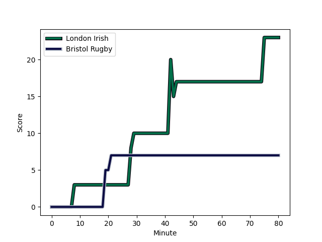
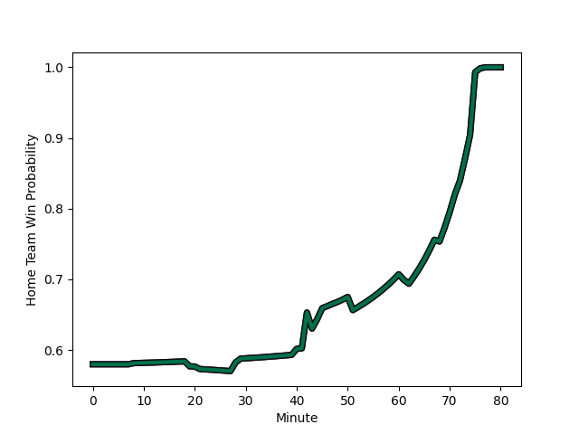

---  
layout: page  
title: Bristol Rugby at London Irish; 7-23  
date: 2023-01-08 10:00:00 18:00:00 -0500  
categories: match review  
---
# Bristol Rugby (1505.74) at London Irish (1645.79); 7-23

# Prediction: London Irish by 18.0

London Irish by 14.0 on a neutral field
## Scores over Time

## Win Probability over Time

# Pre-Match Prediction: London Irish by 16.2

London Irish by 12.2 on a neutral pitch

|   Away Minutes | Away Player                                                   |   Away elo |   Away Percentile |   Number |   Home Percentile |   Home elo | Home Player                                                                       |   Home Minutes |
|---------------:|:--------------------------------------------------------------|-----------:|------------------:|---------:|------------------:|-----------:|:----------------------------------------------------------------------------------|---------------:|
|             67 | [Ellis Genge](..//playerfiles//EllisGenge_cleaned.md)         |      90.99 |                34 |        1 |                82 |     108.03 | [Will Goodrick-Clarke](..//playerfiles//WillGoodrick-Clarke_cleaned.md)           |             51 |
|             77 | [Harry Thacker](..//playerfiles//HarryThacker_cleaned.md)     |     100.85 |                65 |        2 |                33 |      89.65 | [Mike Willemse](..//playerfiles//MikeWillemse_cleaned.md)                         |             68 |
|             61 | [Kyle Sinckler](..//playerfiles//KyleSinckler_cleaned.md)     |     109.72 |                85 |        3 |                31 |      92.53 | [Lovejoy Chawatama](..//playerfiles//LovejoyChawatama_cleaned.md)                 |             40 |
|             80 | [Joe Batley](..//playerfiles//JoeBatley_cleaned.md)           |     115.6  |                87 |        4 |                94 |     123.44 | [Chunya Munga](..//playerfiles//ChunyaMunga_cleaned.md)                           |             68 |
|             62 | [Chris Vui](..//playerfiles//ChrisVui_cleaned.md)             |     108.45 |                80 |        5 |                97 |     131.91 | [Rob Simmons](..//playerfiles//RobSimmons_cleaned.md)                             |             80 |
|             80 | [Steven Luatua](..//playerfiles//StevenLuatua_cleaned.md)     |     134.2  |                97 |        6 |                65 |     105.12 | [Josh Basham](..//playerfiles//JoshBasham_cleaned.md)                             |             51 |
|             51 | [Jake Heenan](..//playerfiles//JakeHeenan_cleaned.md)         |      89.47 |                32 |        7 |                98 |     137.31 | [Tom Pearson](..//playerfiles//TomPearson_cleaned.md)                             |             80 |
|             80 | [Magnus Bradbury](..//playerfiles//MagnusBradbury_cleaned.md) |      91.71 |                36 |        8 |                80 |     110.07 | [Matt Rogerson](..//playerfiles//MattRogerson_cleaned.md)                         |             68 |
|             80 | [Andy Uren](..//playerfiles//AndyUren_cleaned.md)             |      83.18 |                15 |        9 |               nan |     148.63 | [Ben White](..//playerfiles//BenWhite_cleaned.md)                                 |             61 |
|             72 | [AJ MacGinty](..//playerfiles//AJMacGinty_cleaned.md)         |     108.81 |                75 |       10 |                77 |     107.77 | [Rory Jennings](..//playerfiles//RoryJennings_cleaned.md)                         |             80 |
|             45 | [Gabriel Ibitoye](..//playerfiles//GabrielIbitoye_cleaned.md) |     114.23 |                85 |       11 |                54 |      97.04 | [Ollie Hassell-Collins](..//playerfiles//OllieHassell-Collins_cleaned.md)         |             80 |
|             80 | [Ioan Lloyd](..//playerfiles//IoanLloyd_cleaned.md)           |      77.01 |                 9 |       12 |                32 |      89.36 | [Benhard Janse van Rensburg](..//playerfiles//BenhardJansevanRensburg_cleaned.md) |             80 |
|             80 | [Semi Radradra](..//playerfiles//SemiRadradra_cleaned.md)     |     118.17 |                89 |       13 |                71 |     105.33 | [Luca Morisi](..//playerfiles//LucaMorisi_cleaned.md)                             |             80 |
|             80 | [Toby Fricker](..//playerfiles//TobyFricker_cleaned.md)       |      64.12 |                 2 |       14 |                53 |      97    | [Lucio Cinti](..//playerfiles//LucioCinti_cleaned.md)                             |             78 |
|             48 | [Noah Heward](..//playerfiles//NoahHeward_cleaned.md)         |      98.95 |                55 |       15 |                93 |     126.63 | [Ben Loader](..//playerfiles//BenLoader_cleaned.md)                               |             80 |
|              3 | [Jake Kerr](..//playerfiles//JakeKerr_cleaned.md)             |      91.79 |                40 |       16 |               nan |      92.33 | [Ignacio Ruiz](..//playerfiles//IgnacioRuiz_cleaned.md)                           |             12 |
|             13 | [Yann Thomas](..//playerfiles//YannThomas_cleaned.md)         |      91.09 |                35 |       17 |                25 |      89.67 | [Danilo Fischetti](..//playerfiles//DaniloFischetti_cleaned.md)                   |             29 |
|             19 | [Max Lahiff](..//playerfiles//MaxLahiff_cleaned.md)           |      84.33 |                17 |       18 |                84 |     108.99 | [Oli Hoskins](..//playerfiles//OliHoskins_cleaned.md)                             |             40 |
|             18 | [Joe Joyce](..//playerfiles//JoeJoyce_cleaned.md)             |     142.36 |                98 |       19 |                 8 |      75.24 | [Api Ratuniyarawa](..//playerfiles//ApiRatuniyarawa_cleaned.md)                   |             12 |
|             29 | [Daniel Thomas](..//playerfiles//DanielThomas_cleaned.md)     |     113.04 |                80 |       20 |                71 |     104.6  | [Juan Martin Gonzalez](..//playerfiles//JuanMartinGonzalez_cleaned.md)            |             12 |
|             32 | [Tom Whiteley](..//playerfiles//TomWhiteley_cleaned.md)       |      99.82 |                59 |       21 |                51 |      96.83 | [Chandler Cunningham-South](..//playerfiles//ChandlerCunningham-South_cleaned.md) |             29 |
|              8 | [Callum Sheedy](..//playerfiles//CallumSheedy_cleaned.md)     |     136.06 |                96 |       22 |                18 |      85.41 | [Joe Powell](..//playerfiles//JoePowell_cleaned.md)                               |             19 |
|             35 | [Jack Bates](..//playerfiles//JackBates_cleaned.md)           |      85.42 |                16 |       23 |                57 |      99.63 | [James Stokes](..//playerfiles//JamesStokes_cleaned.md)                           |              2 |

