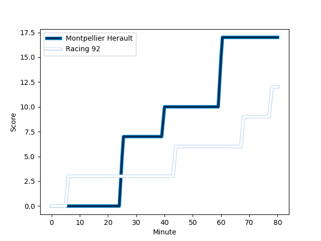
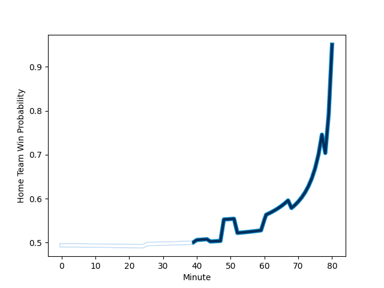

---  
layout: page  
title: Racing 92 at Montpellier Herault; 12-17  
date: 2023-01-08 21:05:00 18:00:00 -0500  
categories: match review  
---
# Racing 92 (1593.19) at Montpellier Herault (1582.41); 12-17

# Prediction: Montpellier Herault by 2.9

Racing 92 by 1.1 on a neutral field
## Scores over Time

## Win Probability over Time

# Pre-Match Prediction: Racing 92 by 0.3

Racing 92 by 3.7 on a neutral pitch

|   Away Minutes | Away Player                                                           |   Away elo |   Away Percentile |   Number |   Home Percentile |   Home elo | Home Player                                                             |   Home Minutes |
|---------------:|:----------------------------------------------------------------------|-----------:|------------------:|---------:|------------------:|-----------:|:------------------------------------------------------------------------|---------------:|
|             48 | [Guram Gogichashvili](..//playerfiles//GuramGogichashvili_cleaned.md) |     124.12 |                96 |        1 |                62 |      99.35 | [Enzo Forletta](..//playerfiles//EnzoForletta_cleaned.md)               |             75 |
|             48 | [Camille Chat](..//playerfiles//CamilleChat_cleaned.md)               |     117.61 |                91 |        2 |                57 |      97.25 | [Brandon Paenga-Amosa](..//playerfiles//BrandonPaenga-Amosa_cleaned.md) |             67 |
|             57 | [Trevor Nyakane](..//playerfiles//TrevorNyakane_cleaned.md)           |     105.78 |                79 |        3 |                43 |      93.53 | [Titi Lamositele](..//playerfiles//TitiLamositele_cleaned.md)           |             52 |
|             80 | [Cameron Woki](..//playerfiles//CameronWoki_cleaned.md)               |      74.13 |                 8 |        4 |                92 |     120.97 | [Yacouba Camara](..//playerfiles//YacoubaCamara_cleaned.md)             |             80 |
|             78 | [Boris Palu](..//playerfiles//BorisPalu_cleaned.md)                   |     109.25 |                80 |        5 |                98 |     137.85 | [Paul Willemse](..//playerfiles//PaulWillemse_cleaned.md)               |             57 |
|             65 | [Wenceslas Lauret](..//playerfiles//WenceslasLauret_cleaned.md)       |     119.21 |                91 |        6 |                48 |      96.65 | [Marco Tauleigne](..//playerfiles//MarcoTauleigne_cleaned.md)           |             57 |
|             80 | [Ibrahim Diallo](..//playerfiles//IbrahimDiallo_cleaned.md)           |      86.01 |                22 |        7 |                17 |      83.36 | [Alexandre Becognee](..//playerfiles//AlexandreBecognee_cleaned.md)     |             80 |
|             80 | [Maxime Baudonne](..//playerfiles//MaximeBaudonne_cleaned.md)         |      91.8  |                36 |        8 |                60 |     101.9  | [Zach Mercer](..//playerfiles//ZachMercer_cleaned.md)                   |             80 |
|             61 | [Nolann Le Garrec](..//playerfiles//NolannLeGarrec_cleaned.md)        |      97.38 |                56 |        9 |                69 |     103.47 | [Cobus Reinach](..//playerfiles//CobusReinach_cleaned.md)               |             48 |
|             61 | [Antoine Gibert](..//playerfiles//AntoineGibert_cleaned.md)           |     107.2  |                73 |       10 |                57 |     100.48 | [Louis Carbonel](..//playerfiles//LouisCarbonel_cleaned.md)             |             80 |
|             80 | [Juan Imhoff](..//playerfiles//JuanImhoff_cleaned.md)                 |     135.18 |                97 |       11 |                95 |     128.63 | [Vincent Rattez](..//playerfiles//VincentRattez_cleaned.md)             |             78 |
|             39 | [Henry Chavancy](..//playerfiles//HenryChavancy_cleaned.md)           |     120.65 |                91 |       12 |                58 |      99.28 | [Jan Serfontein](..//playerfiles//JanSerfontein_cleaned.md)             |             80 |
|             80 | [Francis Saili](..//playerfiles//FrancisSaili_cleaned.md)             |     108.21 |                77 |       13 |                25 |      87.29 | [Thomas Darmon](..//playerfiles//ThomasDarmon_cleaned.md)               |             48 |
|             80 | [Donovan Taofifenua](..//playerfiles//DonovanTaofifenua_cleaned.md)   |     105.74 |                74 |       14 |                89 |     118.07 | [Julien Tisseron](..//playerfiles//JulienTisseron_cleaned.md)           |             80 |
|             80 | [Warrick Gelant](..//playerfiles//WarrickGelant_cleaned.md)           |     108.26 |                75 |       15 |                68 |     104.74 | [Anthony Bouthier](..//playerfiles//AnthonyBouthier_cleaned.md)         |             80 |
|             41 | [Olivier Klemenczak](..//playerfiles//OlivierKlemenczak_cleaned.md)   |     115.01 |                86 |       16 |                74 |     105.29 | [Léo Coly](..//playerfiles//LéoColy_cleaned.md)                         |             32 |
|             32 | [Janick Tarrit](..//playerfiles//JanickTarrit_cleaned.md)             |      94.36 |                48 |       17 |                95 |     129.33 | [Geoffrey Doumayrou](..//playerfiles//GeoffreyDoumayrou_cleaned.md)     |             32 |
|             32 | [Eddy Ben Arous](..//playerfiles//EddyBenArous_cleaned.md)            |     106.64 |                81 |       18 |                17 |      84.8  | [Mohamed Haouas](..//playerfiles//MohamedHaouas_cleaned.md)             |             28 |
|             23 | [Cedate Gomes Sa](..//playerfiles//CedateGomesSa_cleaned.md)          |      89.35 |                29 |       19 |                97 |     130.76 | [Bastien Chalureau](..//playerfiles//BastienChalureau_cleaned.md)       |             23 |
|             19 | [Finn Russell](..//playerfiles//FinnRussell_cleaned.md)               |     140.03 |                97 |       20 |                19 |      83.88 | [Clément Doumenc](..//playerfiles//ClémentDoumenc_cleaned.md)           |             23 |
|             19 | [Teddy Iribaren](..//playerfiles//TeddyIribaren_cleaned.md)           |     128.35 |                96 |       21 |                80 |     107.11 | [Vincent Giudicelli](..//playerfiles//VincentGiudicelli_cleaned.md)     |             13 |
|             15 | [Baptiste Chouzenoux](..//playerfiles//BaptisteChouzenoux_cleaned.md) |      74.45 |                 7 |       22 |               nan |     102.78 | [Karl Tu'inukuafe](..//playerfiles//KarlTu'inukuafe_cleaned.md)         |              5 |
|              2 | [Anthime Hemery](..//playerfiles//AnthimeHemery_cleaned.md)           |     101.45 |                65 |       23 |                29 |      88.14 | [Pierre Lucas](..//playerfiles//PierreLucas_cleaned.md)                 |              2 |

