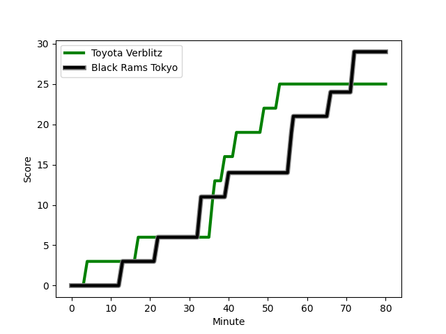
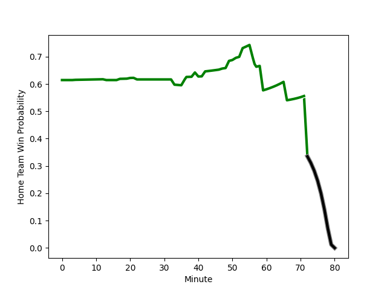

---  
layout: page  
title: Black Rams Tokyo at Toyota Verblitz; 29-25  
date: 2023-01-08 06:30:00 18:00:00 -0500  
categories: match review  
---
# Black Rams Tokyo (1417.9) at Toyota Verblitz (1620.16); 29-25

# Prediction: Toyota Verblitz by 24.2

Toyota Verblitz by 20.2 on a neutral field
## Scores over Time

## Win Probability over Time

# Pre-Match Prediction: Toyota Verblitz by 25.3

Toyota Verblitz by 21.3 on a neutral pitch

|   Away Minutes | Away Player                                                         |   Away elo |   Away Percentile |   Number |   Home Percentile |   Home elo | Home Player                                                                            |   Home Minutes |
|---------------:|:--------------------------------------------------------------------|-----------:|------------------:|---------:|------------------:|-----------:|:---------------------------------------------------------------------------------------|---------------:|
|             57 | [Yuichiro Taniguchi](..//playerfiles//YuichiroTaniguchi_cleaned.md) |      97.12 |                48 |        1 |                36 |      97.07 | [Gaku Shimizu](..//playerfiles//GakuShimizu_cleaned.md)                                |             20 |
|             79 | [Hinata Takei](..//playerfiles//HinataTakei_cleaned.md)             |     114.3  |                88 |        2 |                38 |      96.86 | [Ryusei Kato](..//playerfiles//RyuseiKato_cleaned.md)                                  |             51 |
|             80 | [Daigo Sasagawa](..//playerfiles//DaigoSasagawa_cleaned.md)         |      85.73 |                12 |        3 |                78 |     106.39 | [Yusuke Kizu](..//playerfiles//YusukeKizu_cleaned.md)                                  |             51 |
|             80 | [Josh Goodhue](..//playerfiles//JoshGoodhue_cleaned.md)             |      88.8  |                29 |        4 |                95 |     127.07 | [Ryoma Nishimura](..//playerfiles//RyomaNishimura_cleaned.md)                          |             80 |
|             80 | [Pohiva Lotoahea](..//playerfiles//PohivaLotoahea_cleaned.md)       |     104.9  |                73 |        5 |                40 |      92.3  | [Daichi Akiyama](..//playerfiles//DaichiAkiyama_cleaned.md)                            |             80 |
|             54 | [Mike Stolberg](..//playerfiles//MikeStolberg_cleaned.md)           |      65.07 |                 4 |        6 |                27 |      87.9  | [Pieter-Steph du Toit](..//playerfiles//Pieter-StephduToit_cleaned.md)                 |             66 |
|             71 | [Shuhei Matsuhashi](..//playerfiles//ShuheiMatsuhashi_cleaned.md)   |      91.69 |                37 |        7 |                71 |     104.73 | [Masato Furukawa](..//playerfiles//MasatoFurukawa_cleaned.md)                          |             59 |
|             80 | [Talau Fakatava](..//playerfiles//TalauFakatava_cleaned.md)         |      79.87 |                12 |        8 |                68 |     105.72 | [Kazuki Himeno](..//playerfiles//KazukiHimeno_cleaned.md)                              |             80 |
|             59 | [Syota Yamamoto](..//playerfiles//SyotaYamamoto_cleaned.md)         |     108.18 |                80 |        9 |                72 |     106.16 | [Kaito Shigeno](..//playerfiles//KaitoShigeno_cleaned.md)                              |             51 |
|             54 | [Kohei Horigome](..//playerfiles//KoheiHorigome_cleaned.md)         |      82.59 |                17 |       10 |                77 |     111.59 | [Tiaan Falcon](..//playerfiles//TiaanFalcon_cleaned.md)                                |             80 |
|             80 | [Netani Vakayalia](..//playerfiles//NetaniVakayalia_cleaned.md)     |      84.68 |                17 |       11 |                63 |     102.97 | [Yuki Okada](..//playerfiles//YukiOkada_cleaned.md)                                    |             80 |
|             54 | [Hadleigh Parkes](..//playerfiles//HadleighParkes_cleaned.md)       |     104.19 |                69 |       12 |                96 |     131.71 | [Rob Thompson](..//playerfiles//RobThompson_cleaned.md)                                |             80 |
|             80 | [Ryohei Isoda](..//playerfiles//RyoheiIsoda_cleaned.md)             |     103.97 |                68 |       13 |                64 |     101.54 | [Dick Wilson](..//playerfiles//DickWilson_cleaned.md)                                  |             47 |
|             80 | [Main Taira](..//playerfiles//MainTaira_cleaned.md)                 |      83.27 |                24 |       14 |                58 |      98.49 | [Taichi Takahashi](..//playerfiles//TaichiTakahashi_cleaned.md)                        |             74 |
|             80 | [Matt McGahan](..//playerfiles//MattMcGahan_cleaned.md)             |     112.28 |                81 |       15 |                96 |     136.6  | [Willie le Roux](..//playerfiles//WillieleRoux_cleaned.md)                             |             80 |
|             26 | [Nathan Hughes](..//playerfiles//NathanHughes_cleaned.md)           |     115.25 |                85 |       16 |                68 |     101.13 | [Shogo Miura](..//playerfiles//ShogoMiura_cleaned.md)                                  |             60 |
|             26 | [Isaac Lucas](..//playerfiles//IsaacLucas_cleaned.md)               |      90.59 |                31 |       17 |                70 |     105.62 | [Vatiliai Tuidraki](..//playerfiles//VatiliaiTuidraki_cleaned.md)                      |             33 |
|             26 | [Yuki Ikeda](..//playerfiles//YukiIkeda_cleaned.md)                 |      99.79 |                59 |       18 |                91 |     117.06 | [Yoshikatsu Hikosaka](..//playerfiles//YoshikatsuHikosaka_cleaned.md)                  |             29 |
|             23 | [Kazuma Nishi](..//playerfiles//KazumaNishi_cleaned.md)             |      82.38 |                14 |       19 |                68 |     103.28 | [Kenta Fukuda](..//playerfiles//KentaFukuda_cleaned.md)                                |             29 |
|             21 | [Toshiya Takahashi](..//playerfiles//ToshiyaTakahashi_cleaned.md)   |      90.17 |                32 |       20 |                56 |      97.37 | [Shunsuke Asaoka](..//playerfiles//ShunsukeAsaoka_cleaned.md)                          |             29 |
|              9 | [Brodi McCurran](..//playerfiles//BrodiMcCurran_cleaned.md)         |     119.93 |                91 |       21 |                73 |     106.77 | [Lautaimi Fetuani](..//playerfiles//LautaimiFetuani_cleaned.md)                        |             21 |
|              1 | [Masaaki Onishi](..//playerfiles//MasaakiOnishi_cleaned.md)         |      80.46 |                16 |       22 |                91 |     119.62 | [Kyo Yoshida](..//playerfiles//KyoYoshida_cleaned.md)                                  |             14 |
|            nan | nan                                                                 |     nan    |               nan |       23 |                27 |      88.44 | [Jone Turaganivalu Nabetelevu](..//playerfiles//JoneTuraganivaluNabetelevu_cleaned.md) |              6 |

