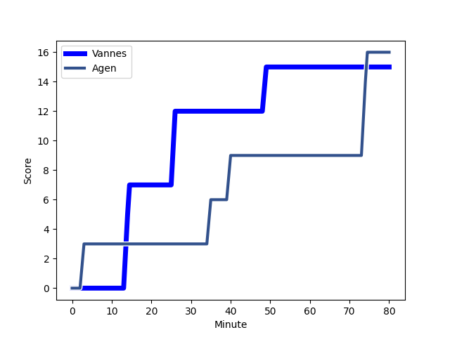
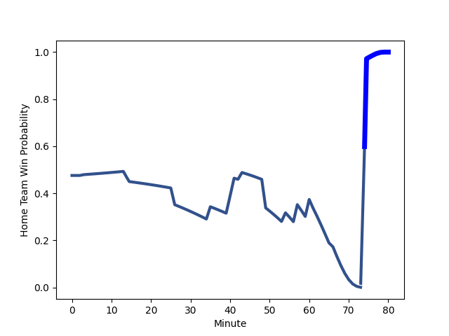

---  
layout: page  
title: Agen at Vannes; 16-15  
date: 2023-01-12 21:00:00 18:00:00 -0500  
categories: match review  
---
# Agen (1448.8) at Vannes (1407.1); 16-15

# Prediction: Agen by 0.2

Agen by 4.2 on a neutral field
## Scores over Time

## Win Probability over Time

# Pre-Match Prediction: Agen by 3.4

Agen by 0.6 on a neutral pitch

|   Away Minutes | Away Player                                                         |   Away elo |   Away Percentile |   Number |   Home Percentile |   Home elo | Home Player                                                                  |   Home Minutes |
|---------------:|:--------------------------------------------------------------------|-----------:|------------------:|---------:|------------------:|-----------:|:-----------------------------------------------------------------------------|---------------:|
|             57 | [Hans Lombard-Buret](..//playerfiles//HansLombard-Buret_cleaned.md) |      88.93 |                27 |        1 |                44 |      93.27 | [Charles-Henri Berguet](..//playerfiles//Charles-HenriBerguet_cleaned.md)    |             49 |
|             60 | [Clement Martinez](..//playerfiles//ClementMartinez_cleaned.md)     |     110.82 |                85 |        2 |                84 |     108.13 | [Pat Leafa](..//playerfiles//PatLeafa_cleaned.md)                            |             49 |
|             61 | [Alex Burin](..//playerfiles//AlexBurin_cleaned.md)                 |      99.01 |                61 |        3 |                36 |      91.56 | [Phil Kite](..//playerfiles//PhilKite_cleaned.md)                            |             43 |
|             80 | [Joe Maksymiw](..//playerfiles//JoeMaksymiw_cleaned.md)             |      82.58 |                17 |        4 |                 0 |      46.01 | [Eric Marks](..//playerfiles//EricMarks_cleaned.md)                          |             80 |
|             54 | [William Demotte](..//playerfiles//WilliamDemotte_cleaned.md)       |     100.67 |                63 |        5 |                47 |      94.82 | [Ewan Thomas Johnson](..//playerfiles//EwanThomasJohnson_cleaned.md)         |             60 |
|             80 | [Arnaud Duputs](..//playerfiles//ArnaudDuputs_cleaned.md)           |      95.11 |                47 |        6 |                 4 |      69.97 | [Karl Chateau](..//playerfiles//KarlChateau_cleaned.md)                      |             80 |
|             57 | [Evan Olmstead](..//playerfiles//EvanOlmstead_cleaned.md)           |      92.35 |                41 |        7 |               100 |     164.78 | [Francisco Gorrissen](..//playerfiles//FranciscoGorrissen_cleaned.md)        |             80 |
|             54 | [Martin Devergie](..//playerfiles//MartinDevergie_cleaned.md)       |      90.44 |                33 |        8 |                82 |     111.48 | [Léon Boulier](..//playerfiles//LéonBoulier_cleaned.md)                      |             60 |
|             80 | [Tane Takulua](..//playerfiles//TaneTakulua_cleaned.md)             |      89.96 |                32 |        9 |                44 |      94.95 | [Alexandre Gouaux](..//playerfiles//AlexandreGouaux_cleaned.md)              |             66 |
|             60 | [Thomas Vincent](..//playerfiles//ThomasVincent_cleaned.md)         |     117.82 |                86 |       10 |                59 |      97.89 | [Maxime Lafage](..//playerfiles//MaximeLafage_cleaned.md)                    |             80 |
|             80 | [Loris Tolot](..//playerfiles//LorisTolot_cleaned.md)               |      62.25 |                 2 |       11 |                43 |      93.5  | [Romaric Camou](..//playerfiles//RomaricCamou_cleaned.md)                    |             80 |
|             80 | [Kolinio Ramoka](..//playerfiles//KolinioRamoka_cleaned.md)         |     108.43 |                77 |       12 |                32 |      89.1  | [Sacha Valleau](..//playerfiles//SachaValleau_cleaned.md)                    |             78 |
|             80 | [Clement Garrigues](..//playerfiles//ClementGarrigues_cleaned.md)   |      89.57 |                41 |       13 |                47 |      95.02 | [Nicolas Freitas](..//playerfiles//NicolasFreitas_cleaned.md)                |             80 |
|             80 | [Tevita Railevu](..//playerfiles//TevitaRailevu_cleaned.md)         |      93.71 |                44 |       14 |                40 |      92.45 | [Nathanael Hulleu](..//playerfiles//NathanaelHulleu_cleaned.md)              |             80 |
|             80 | [Mathieu Lamoulie](..//playerfiles//MathieuLamoulie_cleaned.md)     |     113.53 |                82 |       15 |                59 |     100.22 | [Nick Abendanon](..//playerfiles//NickAbendanon_cleaned.md)                  |             41 |
|             26 | [Zak Farrance](..//playerfiles//ZakFarrance_cleaned.md)             |      89.31 |                29 |       16 |                 7 |      73.36 | [Gregoire Bazin](..//playerfiles//GregoireBazin_cleaned.md)                  |             39 |
|             26 | [Fotu Lokotui](..//playerfiles//FotuLokotui_cleaned.md)             |     122.3  |                91 |       17 |                11 |      80.29 | [John Afoa](..//playerfiles//JohnAfoa_cleaned.md)                            |             37 |
|             23 | [Antoine Erbani](..//playerfiles//AntoineErbani_cleaned.md)         |     114.56 |                86 |       18 |                78 |     106.51 | [Cyril Blanchard](..//playerfiles//CyrilBlanchard_cleaned.md)                |             31 |
|             23 | [Richard Barrington](..//playerfiles//RichardBarrington_cleaned.md) |     101.83 |                74 |       19 |                29 |      88.6  | [Ximun Bessonart](..//playerfiles//XimunBessonart_cleaned.md)                |             31 |
|             20 | [Mike Sosene-Feagai](..//playerfiles//MikeSosene-Feagai_cleaned.md) |     100.02 |                63 |       20 |                 3 |      63.58 | [Myles Edwards](..//playerfiles//MylesEdwards_cleaned.md)                    |             20 |
|             20 | [Elton Jantjies](..//playerfiles//EltonJantjies_cleaned.md)         |     117.87 |                88 |       21 |                28 |      88.15 | [Juan Bautista Pedemonte](..//playerfiles//JuanBautistaPedemonte_cleaned.md) |             20 |
|             19 | [Beau Farrance](..//playerfiles//BeauFarrance_cleaned.md)           |      97.19 |               nan |       22 |                16 |      83.04 | [Will Percillier](..//playerfiles//WillPercillier_cleaned.md)                |             14 |
|            nan | nan                                                                 |     nan    |               nan |       23 |                69 |     105.73 | [Quentin Etienne Lecoq](..//playerfiles//QuentinEtienneLecoq_cleaned.md)     |              2 |

