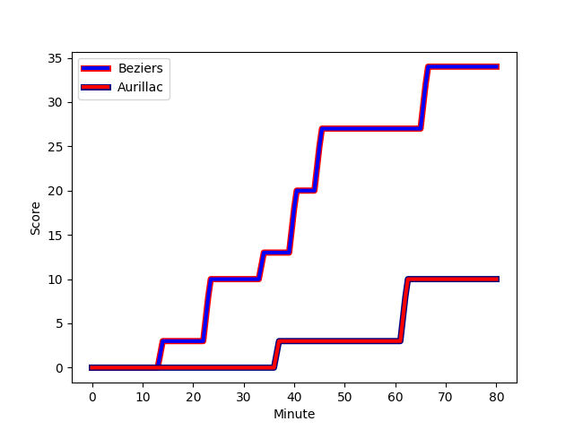
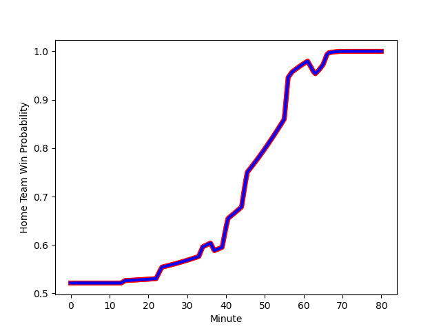

---  
layout: page  
title: Aurillac at Beziers; 10-34  
date: 2023-01-13 19:30:00 18:00:00 -0500  
categories: match review  
---
# Aurillac (1489.59) at Beziers (1526.94); 10-34

# Prediction: Beziers by 7.7

Beziers by 3.7 on a neutral field
## Scores over Time

## Win Probability over Time

# Pre-Match Prediction: Beziers by 8.3

Beziers by 4.3 on a neutral pitch

|   Away Minutes | Away Player                                                               |   Away elo |   Away Percentile |   Number |   Home Percentile |   Home elo | Home Player                                                                          |   Home Minutes |
|---------------:|:--------------------------------------------------------------------------|-----------:|------------------:|---------:|------------------:|-----------:|:-------------------------------------------------------------------------------------|---------------:|
|             56 | [Alexandre Plantier](..//playerfiles//AlexandrePlantier_cleaned.md)       |     118.95 |                94 |        1 |                95 |     120.26 | [Francisco Fernandes Moreira](..//playerfiles//FranciscoFernandesMoreira_cleaned.md) |             56 |
|             56 | [Adrian Smith](..//playerfiles//AdrianSmith_cleaned.md)                   |     118.33 |                92 |        2 |                 3 |      73.14 | [Clément Esteriola](..//playerfiles//ClémentEsteriola_cleaned.md)                    |             57 |
|             56 | [Henzo Kiteau](..//playerfiles//HenzoKiteau_cleaned.md)                   |      85.11 |                19 |        3 |                85 |     109.55 | [Jon Zabala Arrieta](..//playerfiles//JonZabalaArrieta_cleaned.md)                   |             56 |
|             80 | [Cam Dodson](..//playerfiles//CamDodson_cleaned.md)                       |     114.77 |                86 |        4 |                68 |     103.11 | [Clément Bitz](..//playerfiles//ClémentBitz_cleaned.md)                              |             80 |
|             56 | [Georgi Javakhia](..//playerfiles//GeorgiJavakhia_cleaned.md)             |      96.43 |                51 |        5 |                65 |     101.42 | [Pierre Gayraud](..//playerfiles//PierreGayraud_cleaned.md)                          |             63 |
|             80 | [Eoghan Masterson](..//playerfiles//EoghanMasterson_cleaned.md)           |     102.22 |                67 |        6 |                 7 |      75.15 | [Jean-Baptiste Barrère](..//playerfiles//Jean-BaptisteBarrère_cleaned.md)            |             65 |
|             41 | [Maxime Profit](..//playerfiles//MaximeProfit_cleaned.md)                 |      85.03 |                20 |        7 |                83 |     111.98 | [Gillian Benoy](..//playerfiles//GillianBenoy_cleaned.md)                            |             80 |
|             56 | [Latuka Maituku](..//playerfiles//LatukaMaituku_cleaned.md)               |      89.48 |                26 |        8 |                44 |      95.45 | [Sias Koen](..//playerfiles//SiasKoen_cleaned.md)                                    |             80 |
|             56 | [David Delarue](..//playerfiles//DavidDelarue_cleaned.md)                 |      83.06 |                15 |        9 |                77 |     106.23 | [Josh Valentine](..//playerfiles//JoshValentine_cleaned.md)                          |             63 |
|             80 | [Marc Palmier](..//playerfiles//MarcPalmier_cleaned.md)                   |     122.47 |                90 |       10 |                19 |      84.11 | [Victor Dreuille](..//playerfiles//VictorDreuille_cleaned.md)                        |             69 |
|             80 | [Giorgi Gogoladze](..//playerfiles//GiorgiGogoladze_cleaned.md)           |     118.41 |                89 |       11 |                70 |     103.64 | [Gabin Lorre](..//playerfiles//GabinLorre_cleaned.md)                                |             80 |
|             56 | [Lucas Vaccaro](..//playerfiles//LucasVaccaro_cleaned.md)                 |      91.83 |                40 |       12 |                80 |     110.39 | [Paul Recor](..//playerfiles//PaulRecor_cleaned.md)                                  |             80 |
|             80 | [Jimmy Yobo](..//playerfiles//JimmyYobo_cleaned.md)                       |      99.63 |                59 |       13 |                97 |     133.33 | [Maxime Espeut](..//playerfiles//MaximeEspeut_cleaned.md)                            |             63 |
|             80 | [Simeli Yabaki](..//playerfiles//SimeliYabaki_cleaned.md)                 |      93.5  |                43 |       14 |                86 |     115.15 | [Raffaele Storti](..//playerfiles//RaffaeleStorti_cleaned.md)                        |             80 |
|             80 | [Anderson Neisen](..//playerfiles//AndersonNeisen_cleaned.md)             |      77.39 |                13 |       15 |                17 |      80.42 | [Charly Malie](..//playerfiles//CharlyMalie_cleaned.md)                              |             80 |
|             39 | [Théo Cambon](..//playerfiles//ThéoCambon_cleaned.md)                     |      84    |                16 |       16 |                53 |      96.08 | [Giorgi Akhaladze](..//playerfiles//GiorgiAkhaladze_cleaned.md)                      |             24 |
|             24 | [Robert Rodgers](..//playerfiles//RobertRodgers_cleaned.md)               |      79.18 |                11 |       17 |                96 |     124.39 | [Jamie Hagan](..//playerfiles//JamieHagan_cleaned.md)                                |             24 |
|             24 | [Giorgi Kartvelishvili](..//playerfiles//GiorgiKartvelishvili_cleaned.md) |     123.96 |                96 |       18 |                45 |      96.47 | [Yvann Lalevee](..//playerfiles//YvannLalevee_cleaned.md)                            |             23 |
|             24 | [Theo Lachaud](..//playerfiles//TheoLachaud_cleaned.md)                   |      86.99 |                27 |       19 |                12 |      80.38 | [Yassine Maamry](..//playerfiles//YassineMaamry_cleaned.md)                          |             17 |
|             24 | [Dylan Cretin](..//playerfiles//DylanCretin_cleaned.md)                   |      98.87 |                58 |       20 |                91 |     117.26 | [Jean Victor Goillot](..//playerfiles//JeanVictorGoillot_cleaned.md)                 |             17 |
|             24 | [Antoine Aucagne](..//playerfiles//AntoineAucagne_cleaned.md)             |      89.92 |                26 |       21 |                63 |     100.09 | [Watisoni Votu](..//playerfiles//WatisoniVotu_cleaned.md)                            |             17 |
|             24 | [Jean-Baptiste Singer](..//playerfiles//Jean-BaptisteSinger_cleaned.md)   |      91.14 |                35 |       22 |                54 |      97.11 | [William van Bost](..//playerfiles//WilliamvanBost_cleaned.md)                       |             15 |
|             24 | [Mikheil Alania](..//playerfiles//MikheilAlania_cleaned.md)               |      91.4  |                36 |       23 |                87 |     118.97 | [Adrien Latorre](..//playerfiles//AdrienLatorre_cleaned.md)                          |             11 |

