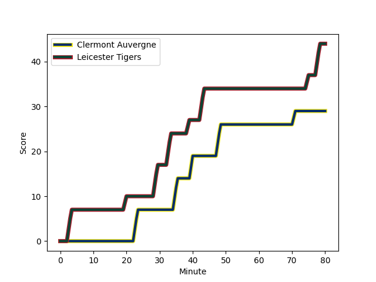
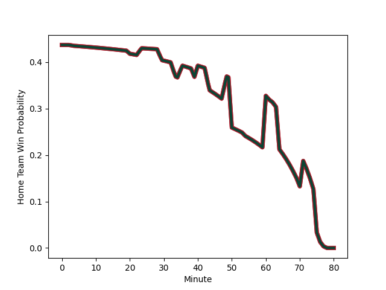

---  
layout: page  
title: Leicester Tigers at Clermont Auvergne; 44-29  
date: 2023-01-13 21:00:00 18:00:00 -0500  
categories: match review  
---
# Leicester Tigers (1561.25) at Clermont Auvergne (1451.6); 44-29

# Prediction: Leicester Tigers by 7.0

Leicester Tigers by 11.0 on a neutral field
## Scores over Time

## Win Probability over Time

# Pre-Match Prediction: Leicester Tigers by 9.5

Leicester Tigers by 13.5 on a neutral pitch

|   Away Minutes | Away Player                                                              |   Away elo |   Away Percentile |   Number |   Home Percentile |   Home elo | Home Player                                                         |   Home Minutes |
|---------------:|:-------------------------------------------------------------------------|-----------:|------------------:|---------:|------------------:|-----------:|:--------------------------------------------------------------------|---------------:|
|             50 | [James Whitcombe](..//playerfiles//JamesWhitcombe_cleaned.md)            |      94.52 |                47 |        1 |               nan |      97.35 | [Daniel Bibi Biziwu](..//playerfiles//DanielBibiBiziwu_cleaned.md)  |             50 |
|             79 | [Charlie Clare](..//playerfiles//CharlieClare_cleaned.md)                |      73.56 |                 3 |        2 |                22 |      84.27 | [Adrien Pelissie](..//playerfiles//AdrienPelissie_cleaned.md)       |              4 |
|             62 | [Joe Heyes](..//playerfiles//JoeHeyes_cleaned.md)                        |      95.41 |                53 |        3 |                32 |      90.25 | [Rabah Slimani](..//playerfiles//RabahSlimani_cleaned.md)           |             54 |
|             80 | [Harry Wells](..//playerfiles//HarryWells_cleaned.md)                    |     154.61 |                99 |        4 |                13 |      80.52 | [Paul Jedrasiak](..//playerfiles//PaulJedrasiak_cleaned.md)         |             64 |
|             80 | [Cameron Henderson](..//playerfiles//CameronHenderson_cleaned.md)        |     110.26 |                83 |        5 |                 5 |      69.6  | [Miles Amatosero](..//playerfiles//MilesAmatosero_cleaned.md)       |             80 |
|             80 | [Ollie Chessum](..//playerfiles//OllieChessum_cleaned.md)                |     121.43 |                92 |        6 |                23 |      85.35 | [Judicael Cancoriet](..//playerfiles//JudicaelCancoriet_cleaned.md) |             80 |
|             79 | [Tommy Reffell](..//playerfiles//TommyReffell_cleaned.md)                |     112.27 |                83 |        7 |                95 |     126.27 | [Alexandre Fischer](..//playerfiles//AlexandreFischer_cleaned.md)   |             80 |
|             56 | [Sean Jansen](..//playerfiles//SeanJansen_cleaned.md)                    |      85.48 |                39 |        8 |                98 |     139.48 | [Fritz Lee](..//playerfiles//FritzLee_cleaned.md)                   |             76 |
|             54 | [Ben Youngs](..//playerfiles//BenYoungs_cleaned.md)                      |      93.94 |                42 |        9 |                34 |      86.72 | [Baptiste Jauneau](..//playerfiles//BaptisteJauneau_cleaned.md)     |             70 |
|             60 | [Handre Pollard](..//playerfiles//HandrePollard_cleaned.md)              |     129.49 |                93 |       10 |                72 |     105.99 | [Anthony Belleau](..//playerfiles//AnthonyBelleau_cleaned.md)       |             80 |
|             80 | [Harry Simmons](..//playerfiles//HarrySimmons_cleaned.md)                |     107.3  |                77 |       11 |                86 |     114.96 | [Alivereti Raka](..//playerfiles//AliveretiRaka_cleaned.md)         |             80 |
|             80 | [Dan Kelly](..//playerfiles//DanKelly_cleaned.md)                        |     111.32 |                81 |       12 |                20 |      83.81 | [Irae Simone](..//playerfiles//IraeSimone_cleaned.md)               |             80 |
|             50 | [Matt Scott](..//playerfiles//MattScott_cleaned.md)                      |      78.79 |                11 |       13 |                 7 |      67.99 | [Cheikh Tiberghien](..//playerfiles//CheikhTiberghien_cleaned.md)   |             80 |
|             80 | [Freddie Steward](..//playerfiles//FreddieSteward_cleaned.md)            |     104.7  |                68 |       14 |                65 |     100.91 | [Bautista Delguy](..//playerfiles//BautistaDelguy_cleaned.md)       |             80 |
|             80 | [Charlie Atkinson](..//playerfiles//CharlieAtkinson_cleaned.md)          |      88.19 |                24 |       15 |                88 |     120.36 | [Alex Newsome](..//playerfiles//AlexNewsome_cleaned.md)             |             80 |
|             30 | [James Cronin](..//playerfiles//JamesCronin_cleaned.md)                  |     108.18 |                82 |       16 |                 7 |      76.67 | [Etienne Fourcade](..//playerfiles//EtienneFourcade_cleaned.md)     |             76 |
|             30 | [Harry Potter](..//playerfiles//HarryPotter_cleaned.md)                  |      91.53 |                38 |       17 |                30 |      87.12 | [Giorgi Beria](..//playerfiles//GiorgiBeria_cleaned.md)             |             30 |
|             26 | [Jack van Poortvliet](..//playerfiles//JackvanPoortvliet_cleaned.md)     |      98.64 |                57 |       18 |                86 |     111.36 | [Davit Kubriashvili](..//playerfiles//DavitKubriashvili_cleaned.md) |             26 |
|             24 | [Olly Cracknell](..//playerfiles//OllyCracknell_cleaned.md)              |      83.57 |                17 |       19 |               nan |      80.18 | [Edward Annandale](..//playerfiles//EdwardAnnandale_cleaned.md)     |             16 |
|             20 | [Jimmy Gopperth](..//playerfiles//JimmyGopperth_cleaned.md)              |      89.43 |                35 |       20 |                95 |     124.07 | [Sebastien Bezy](..//playerfiles//SebastienBezy_cleaned.md)         |             10 |
|             18 | [Will Hurd](..//playerfiles//WillHurd_cleaned.md)                        |      92    |                33 |       21 |                24 |      86.66 | [Killian Tixeront](..//playerfiles//KillianTixeront_cleaned.md)     |              4 |
|              1 | [Joe Taufete'e](..//playerfiles//JoeTaufete'e_cleaned.md)                |      86.31 |                24 |       22 |               nan |     nan    | nan                                                                 |            nan |
|              1 | [Emeka Remigius Ilione](..//playerfiles//EmekaRemigiusIlione_cleaned.md) |      92.26 |                41 |       23 |               nan |     nan    | nan                                                                 |            nan |

