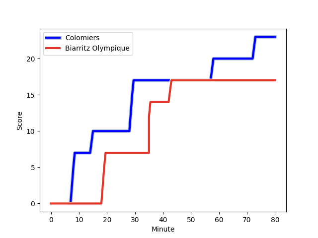
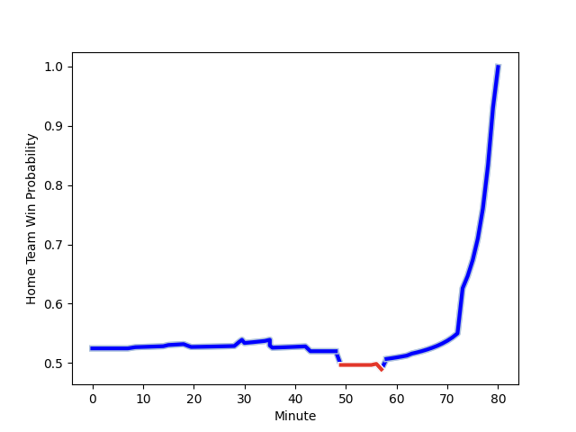

---  
layout: page  
title: Biarritz Olympique at Colomiers; 17-23  
date: 2023-01-13 21:00:00 18:00:00 -0500  
categories: match review  
---
# Biarritz Olympique (1475.7) at Colomiers (1518.82); 17-23

# Prediction: Colomiers by 8.3

Colomiers by 4.3 on a neutral field
## Scores over Time

## Win Probability over Time

# Pre-Match Prediction: Colomiers by 15.1

Colomiers by 11.1 on a neutral pitch

|   Away Minutes | Away Player                                                                    |   Away elo |   Away Percentile |   Number |   Home Percentile |   Home elo | Home Player                                                               |   Home Minutes |
|---------------:|:-------------------------------------------------------------------------------|-----------:|------------------:|---------:|------------------:|-----------:|:--------------------------------------------------------------------------|---------------:|
|             63 | [Baptiste Erdocio](..//playerfiles//BaptisteErdocio_cleaned.md)                |      98.73 |                60 |        1 |                97 |     129.71 | [Guillaume Tartas](..//playerfiles//GuillaumeTartas_cleaned.md)           |             49 |
|             80 | [Thomas Sauveterre](..//playerfiles//ThomasSauveterre_cleaned.md)              |      93.54 |                45 |        2 |                56 |      99.93 | [Andrew Ready](..//playerfiles//AndrewReady_cleaned.md)                   |             49 |
|             57 | [Quentin Samaran](..//playerfiles//QuentinSamaran_cleaned.md)                  |      80.27 |                11 |        3 |                99 |     141.14 | [Marco Fepulea'i](..//playerfiles//MarcoFepulea'i_cleaned.md)             |             49 |
|             35 | [Johan Aliouat](..//playerfiles//JohanAliouat_cleaned.md)                      |     100.86 |                64 |        4 |                37 |      98.16 | [Maxime Granouillet](..//playerfiles//MaximeGranouillet_cleaned.md)       |             80 |
|             57 | [Josh Tyrell](..//playerfiles//JoshTyrell_cleaned.md)                          |     104.87 |                73 |        5 |                72 |     104.47 | [Alexandre Ricard](..//playerfiles//AlexandreRicard_cleaned.md)           |             58 |
|             80 | [Dave O'Callaghan](..//playerfiles//DaveO'Callaghan_cleaned.md)                |      87.55 |                27 |        6 |                 2 |      65.26 | [Anthony Coletta](..//playerfiles//AnthonyColetta_cleaned.md)             |             80 |
|             80 | [Thomas Hebert](..//playerfiles//ThomasHebert_cleaned.md)                      |     107.49 |                77 |        7 |                54 |      99.45 | [Jorick Dastugue](..//playerfiles//JorickDastugue_cleaned.md)             |             58 |
|             80 | [Tornike Jalagonia](..//playerfiles//TornikeJalagonia_cleaned.md)              |      99.27 |                53 |        8 |                32 |      92.95 | [Yann Peysson](..//playerfiles//YannPeysson_cleaned.md)                   |             80 |
|             57 | [Kerman Aurrekoetxea](..//playerfiles//KermanAurrekoetxea_cleaned.md)          |      82.88 |                14 |        9 |                57 |      99.12 | [Mathis Galthié](..//playerfiles//MathisGalthié_cleaned.md)               |             56 |
|             63 | [Baptiste Germain](..//playerfiles//BaptisteGermain_cleaned.md)                |      99.13 |                54 |       10 |                 2 |      69.89 | [Maxime Javaux](..//playerfiles//MaximeJavaux_cleaned.md)                 |             80 |
|             80 | [Yohann Artru](..//playerfiles//YohannArtru_cleaned.md)                        |     122.8  |                92 |       11 |                77 |     107.33 | [Alexis Palisson](..//playerfiles//AlexisPalisson_cleaned.md)             |             30 |
|             80 | [Auguste Cadot](..//playerfiles//AugusteCadot_cleaned.md)                      |      98.54 |                55 |       12 |                96 |     132.02 | [Johan Deysel (Jnr)](..//playerfiles//JohanDeysel(Jnr)_cleaned.md)        |             80 |
|             80 | [Tyler Morgan](..//playerfiles//TylerMorgan_cleaned.md)                        |     112.8  |                83 |       13 |                74 |     106.28 | [Michele Campagnaro](..//playerfiles//MicheleCampagnaro_cleaned.md)       |             63 |
|             57 | [Darly Domvo](..//playerfiles//DarlyDomvo_cleaned.md)                          |      78.12 |                11 |       14 |                85 |     113.83 | [Valentin Saurs](..//playerfiles//ValentinSaurs_cleaned.md)               |             80 |
|             80 | [Joe Jonas](..//playerfiles//JoeJonas_cleaned.md)                              |     104.75 |                68 |       15 |                78 |     110.02 | [Max Auriac](..//playerfiles//MaxAuriac_cleaned.md)                       |             80 |
|             45 | [Adrian Motoc](..//playerfiles//AdrianMotoc_cleaned.md)                        |      96.92 |                54 |       16 |                16 |      84.66 | [Thomas Girard](..//playerfiles//ThomasGirard_cleaned.md)                 |             50 |
|             23 | [Barnabe Couilloud](..//playerfiles//BarnabeCouilloud_cleaned.md)              |      78.33 |                11 |       17 |                 9 |      80.93 | [Hugo Djehi](..//playerfiles//HugoDjehi_cleaned.md)                       |             31 |
|             23 | [Temo Matiu](..//playerfiles//TemoMatiu_cleaned.md)                            |     100.72 |                68 |       18 |                10 |      79.46 | [Hugo Pirlet](..//playerfiles//HugoPirlet_cleaned.md)                     |             31 |
|             23 | [Romain Lonca](..//playerfiles//RomainLonca_cleaned.md)                        |     118.87 |                89 |       19 |                94 |     119    | [Thomas Larrieu](..//playerfiles//ThomasLarrieu_cleaned.md)               |             31 |
|             23 | [Luka Azariashvili](..//playerfiles//LukaAzariashvili_cleaned.md)              |      80.39 |                13 |       20 |                73 |     106.62 | [Ugo Seguela](..//playerfiles//UgoSeguela_cleaned.md)                     |             24 |
|             17 | [Zhorzhi (Jorji) Saldadze](..//playerfiles//Zhorzhi(Jorji)Saldadze_cleaned.md) |      77.33 |                10 |       21 |                29 |      90.95 | [Pierre-Samuel Pacheco](..//playerfiles//Pierre-SamuelPacheco_cleaned.md) |             22 |
|             17 | [Ilian Perraux](..//playerfiles//IlianPerraux_cleaned.md)                      |     106.68 |                75 |       22 |                76 |     106.57 | [Jean Thomas](..//playerfiles//JeanThomas_cleaned.md)                     |             22 |
|            nan | nan                                                                            |     nan    |               nan |       23 |                56 |      98.61 | [Fabien Perrin](..//playerfiles//FabienPerrin_cleaned.md)                 |             17 |

