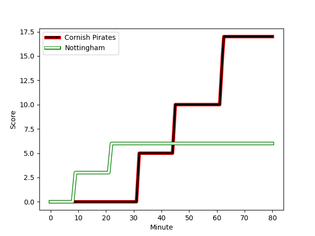
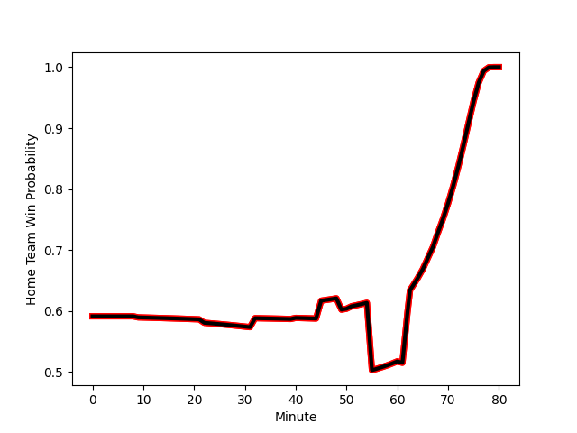

---  
layout: page  
title: Nottingham at Cornish Pirates; 6-17  
date: 2023-01-13 20:30:00 18:00:00 -0500  
categories: match review  
---
# Nottingham (1412.6) at Cornish Pirates (1573.3); 6-17

# Prediction: Cornish Pirates by 20.1

Cornish Pirates by 16.1 on a neutral field
## Scores over Time

## Win Probability over Time

# Pre-Match Prediction: Cornish Pirates by 23.6

Cornish Pirates by 19.6 on a neutral pitch

|   Away Minutes | Away Player                                                                     |   Away elo |   Away Percentile |   Number |   Home Percentile |   Home elo | Home Player                                                                 |   Home Minutes |
|---------------:|:--------------------------------------------------------------------------------|-----------:|------------------:|---------:|------------------:|-----------:|:----------------------------------------------------------------------------|---------------:|
|             61 | [Aniseko Sio](..//playerfiles//AnisekoSio_cleaned.md)                           |      93.65 |                44 |        1 |                95 |     120.21 | [Marlen Walker](..//playerfiles//MarlenWalker_cleaned.md)                   |             61 |
|             51 | [Jack Dickinson](..//playerfiles//JackDickinson_cleaned.md)                     |     102.85 |                76 |        2 |                72 |     103.32 | [William Crane](..//playerfiles//WilliamCrane_cleaned.md)                   |             40 |
|             80 | [Ben Betts](..//playerfiles//BenBetts_cleaned.md)                               |      91.98 |                40 |        3 |                51 |      98.66 | [Harvey Beaton](..//playerfiles//HarveyBeaton_cleaned.md)                   |             61 |
|             40 | [Thomas Manz](..//playerfiles//ThomasManz_cleaned.md)                           |     107.83 |                78 |        4 |                65 |     106.47 | [James Fender](..//playerfiles//JamesFender_cleaned.md)                     |             80 |
|             80 | [Iosefa Danny Wayne Fiaola](..//playerfiles//IosefaDannyWayneFiaola_cleaned.md) |     109.47 |                80 |        5 |                14 |      81.02 | [Cory Teague](..//playerfiles//CoryTeague_cleaned.md)                       |             68 |
|             49 | [Scott Hall](..//playerfiles//ScottHall_cleaned.md)                             |      68.02 |                 3 |        6 |                72 |     104.8  | [Alex Everett](..//playerfiles//AlexEverett_cleaned.md)                     |             80 |
|             80 | [Nathan Tweedy](..//playerfiles//NathanTweedy_cleaned.md)                       |     111.24 |                82 |        7 |                28 |      88.43 | [Will Gibson](..//playerfiles//WillGibson_cleaned.md)                       |             55 |
|             80 | [Josh Poullet](..//playerfiles//JoshPoullet_cleaned.md)                         |      96.75 |                48 |        8 |                85 |     114.96 | [Sebastian Nagle-Taylor](..//playerfiles//SebastianNagle-Taylor_cleaned.md) |             80 |
|             49 | [Liam Slatem](..//playerfiles//LiamSlatem_cleaned.md)                           |      78.86 |                 9 |        9 |                55 |      98.28 | [Ruaridh Dawson](..//playerfiles//RuaridhDawson_cleaned.md)                 |             66 |
|             80 | [John Joseph Neville](..//playerfiles//JohnJosephNeville_cleaned.md)            |      82.58 |                17 |       10 |                79 |     111.79 | [Harry Bazalgette](..//playerfiles//HarryBazalgette_cleaned.md)             |             55 |
|             55 | [Ryan Olowofela](..//playerfiles//RyanOlowofela_cleaned.md)                     |      90.31 |                38 |       11 |                85 |     114.63 | [Tom Wyatt](..//playerfiles//TomWyatt_cleaned.md)                           |             80 |
|             55 | [Javiah Pohe](..//playerfiles//JaviahPohe_cleaned.md)                           |      73.46 |                 8 |       12 |                82 |     112.01 | [Garyn Smith](..//playerfiles//GarynSmith_cleaned.md)                       |             80 |
|             80 | [Marcus Alexander Ramage](..//playerfiles//MarcusAlexanderRamage_cleaned.md)    |      93.26 |                43 |       13 |                87 |     115.89 | [Rory Parata](..//playerfiles//RoryParata_cleaned.md)                       |             80 |
|             80 | [David Williams](..//playerfiles//DavidWilliams_cleaned.md)                     |      92.5  |                40 |       14 |                54 |      97.07 | [Robin Wedlake](..//playerfiles//RobinWedlake_cleaned.md)                   |             80 |
|             80 | [Jordan Olowofela](..//playerfiles//JordanOlowofela_cleaned.md)                 |     111.94 |                81 |       15 |                92 |     125.93 | [Alexander AJ Cant](..//playerfiles//AlexanderAJCant_cleaned.md)            |             61 |
|             40 | [Ross Bundy](..//playerfiles//RossBundy_cleaned.md)                             |      93.42 |                46 |       16 |               nan |      93.06 | [Max Norey](..//playerfiles//MaxNorey_cleaned.md)                           |             40 |
|             31 | [Micheal Stronge](..//playerfiles//MichealStronge_cleaned.md)                   |      85.2  |                19 |       17 |                39 |      94.17 | [Arwel Robson](..//playerfiles//ArwelRobson_cleaned.md)                     |             25 |
|             31 | [George Cox](..//playerfiles//GeorgeCox_cleaned.md)                             |     104.23 |                68 |       18 |                 6 |      76.29 | [Rusiate Tuima](..//playerfiles//RusiateTuima_cleaned.md)                   |             25 |
|             29 | [Harry Clayton](..//playerfiles//HarryClayton_cleaned.md)                       |      97.73 |                57 |       19 |               nan |      95.25 | [Will Trewin](..//playerfiles//WillTrewin_cleaned.md)                       |             19 |
|             25 | [Harry Graham](..//playerfiles//HarryGraham_cleaned.md)                         |      89.39 |                31 |       20 |                71 |     102.58 | [Matt Johnson](..//playerfiles//MattJohnson_cleaned.md)                     |             19 |
|             25 | [Michael Green](..//playerfiles//MichaelGreen_cleaned.md)                       |      94.04 |               nan |       21 |                89 |     118.96 | [Jack Andrew](..//playerfiles//JackAndrew_cleaned.md)                       |             19 |
|             19 | [Toby Williams](..//playerfiles//TobyWilliams_cleaned.md)                       |      69.73 |                 3 |       22 |                29 |      89.55 | [Alex Schwarz](..//playerfiles//AlexSchwarz_cleaned.md)                     |             14 |
|            nan | nan                                                                             |     nan    |               nan |       23 |               nan |      97.24 | [Josh Williams](..//playerfiles//JoshWilliams_cleaned.md)                   |             12 |

