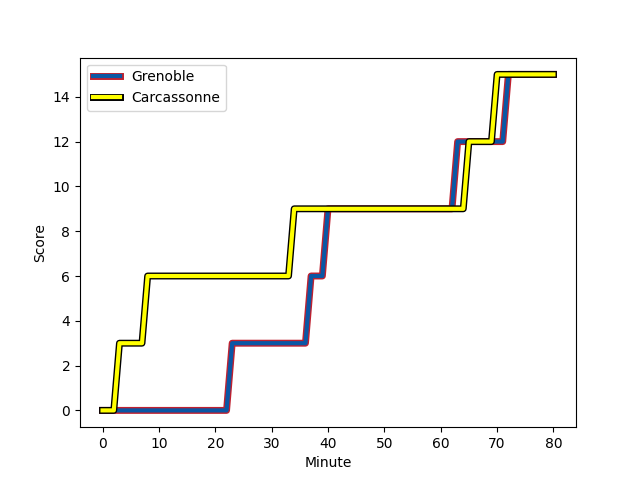
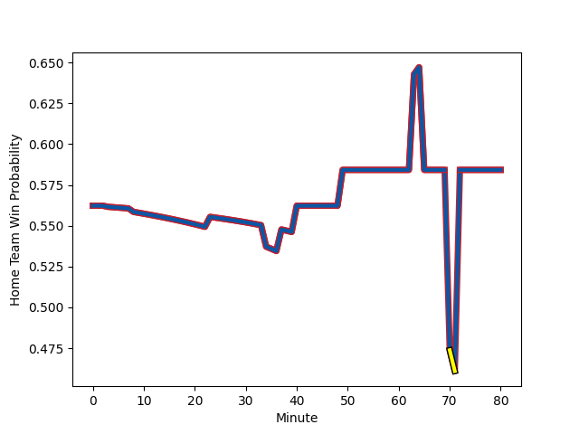

---  
layout: page  
title: Carcassonne at Grenoble; 15-15  
date: 2023-01-13 19:30:00 18:00:00 -0500  
categories: match review  
---
# Carcassonne (1376.85) at Grenoble (1485.56); 15-15

# Prediction: Grenoble by 14.9

Grenoble by 10.9 on a neutral field
## Scores over Time

## Win Probability over Time

# Pre-Match Prediction: Grenoble by 18.0

Grenoble by 14.0 on a neutral pitch

|   Away Minutes | Away Player                                                              |   Away elo |   Away Percentile |   Number |   Home Percentile |   Home elo | Home Player                                                           |   Home Minutes |
|---------------:|:-------------------------------------------------------------------------|-----------:|------------------:|---------:|------------------:|-----------:|:----------------------------------------------------------------------|---------------:|
|             52 | [Jules Martinez](..//playerfiles//JulesMartinez_cleaned.md)              |      74.38 |                10 |        1 |                13 |      83.47 | [Eli Eglaine](..//playerfiles//EliEglaine_cleaned.md)                 |             49 |
|             52 | [Luka Petriashvili](..//playerfiles//LukaPetriashvili_cleaned.md)        |      93.38 |               nan |        2 |                56 |      97.05 | [Jean Charles Orioli](..//playerfiles//JeanCharlesOrioli_cleaned.md)  |             63 |
|             52 | [Vakhtangi Akhobadze](..//playerfiles//VakhtangiAkhobadze_cleaned.md)    |      48.79 |                 0 |        3 |                54 |      96.45 | [Irakli Aptsiauri](..//playerfiles//IrakliAptsiauri_cleaned.md)       |             49 |
|             64 | [Come Clayver Joussain](..//playerfiles//ComeClayverJoussain_cleaned.md) |      89.13 |                41 |        4 |                81 |     112.45 | [Thomas Lainault](..//playerfiles//ThomasLainault_cleaned.md)         |             80 |
|             52 | [Rynard Landman](..//playerfiles//RynardLandman_cleaned.md)              |      94.9  |                48 |        5 |                77 |     107.06 | [Tanginoa Halaifonua](..//playerfiles//TanginoaHalaifonua_cleaned.md) |             80 |
|             80 | [Aaron Carroll](..//playerfiles//AaronCarroll_cleaned.md)                |     108.46 |                79 |        6 |                75 |     106.26 | [Clement Ancely](..//playerfiles//ClementAncely_cleaned.md)           |             49 |
|             80 | [Rob Harley](..//playerfiles//RobHarley_cleaned.md)                      |     105.84 |                74 |        7 |                92 |     121.53 | [Steeve Blanc-Mappaz](..//playerfiles//SteeveBlanc-Mappaz_cleaned.md) |             80 |
|             80 | [Pierre Reynaud](..//playerfiles//PierreReynaud_cleaned.md)              |      86.56 |               nan |        8 |                35 |      91.29 | [Thibaut Martel](..//playerfiles//ThibautMartel_cleaned.md)           |             58 |
|             80 | [Samuel Marques](..//playerfiles//SamuelMarques_cleaned.md)              |     133.06 |                98 |        9 |                92 |     118.84 | [Eric Escande](..//playerfiles//EricEscande_cleaned.md)               |             58 |
|             64 | [Chris Hilsenbeck](..//playerfiles//ChrisHilsenbeck_cleaned.md)          |      92.01 |                38 |       10 |                13 |      82.53 | [Thomas Fortunel](..//playerfiles//ThomasFortunel_cleaned.md)         |             80 |
|             80 | [Clément Clavières](..//playerfiles//ClémentClavières_cleaned.md)        |      92.27 |                44 |       11 |                33 |      90.3  | [Lucas Dupont](..//playerfiles//LucasDupont_cleaned.md)               |             80 |
|             80 | [Nick Grigg](..//playerfiles//NickGrigg_cleaned.md)                      |     100.74 |                62 |       12 |                23 |      85.48 | [Terrence Hepetema](..//playerfiles//TerrenceHepetema_cleaned.md)     |             58 |
|             80 | [Pierre Aguillon](..//playerfiles//PierreAguillon_cleaned.md)            |      50.5  |                 0 |       13 |                28 |      87.61 | [Romain Trouilloud](..//playerfiles//RomainTrouilloud_cleaned.md)     |             80 |
|             80 | [Benoit Jasmin](..//playerfiles//BenoitJasmin_cleaned.md)                |     116.13 |                87 |       14 |                34 |      90.7  | [Karim Qadiri](..//playerfiles//KarimQadiri_cleaned.md)               |             80 |
|             80 | [Maxime Gianet](..//playerfiles//MaximeGianet_cleaned.md)                |      77.83 |                17 |       15 |                60 |     100.36 | [Tom Sposito](..//playerfiles//TomSposito_cleaned.md)                 |             80 |
|             28 | [Sami Mavinga](..//playerfiles//SamiMavinga_cleaned.md)                  |      88.91 |                27 |       16 |                92 |     116.53 | [Zack Gauthier](..//playerfiles//ZackGauthier_cleaned.md)             |             31 |
|             28 | [Raphael Carbou](..//playerfiles//RaphaelCarbou_cleaned.md)              |      85.39 |                20 |       17 |                69 |     101.81 | [Regis Montagne](..//playerfiles//RegisMontagne_cleaned.md)           |             31 |
|             28 | [Nikoloz Narmania](..//playerfiles//NikolozNarmania_cleaned.md)          |      96.88 |               nan |       18 |                37 |      93.66 | [Talalelei Gray](..//playerfiles//TalaleleiGray_cleaned.md)           |             31 |
|             28 | [George Merrick](..//playerfiles//GeorgeMerrick_cleaned.md)              |      85.15 |                22 |       19 |                58 |      98.8  | [Pio Muarua](..//playerfiles//PioMuarua_cleaned.md)                   |             22 |
|             16 | [Baptiste Mouchous](..//playerfiles//BaptisteMouchous_cleaned.md)        |      80.74 |                18 |       20 |                35 |      90.57 | [Romain Fusier](..//playerfiles//RomainFusier_cleaned.md)             |             22 |
|             16 | [Guilhem Vettore](..//playerfiles//GuilhemVettore_cleaned.md)            |      86.25 |                23 |       21 |                96 |     126.44 | [Felipe Ezcurra](..//playerfiles//FelipeEzcurra_cleaned.md)           |             22 |
|            nan | nan                                                                      |     nan    |               nan |       22 |                36 |      90.56 | [Mathis Sarragallet](..//playerfiles//MathisSarragallet_cleaned.md)   |             17 |

