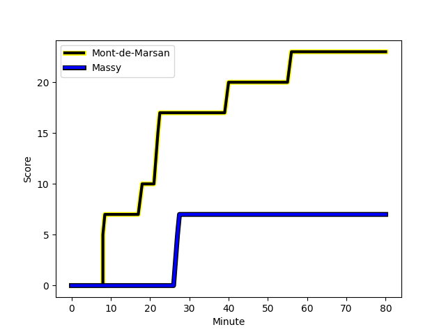
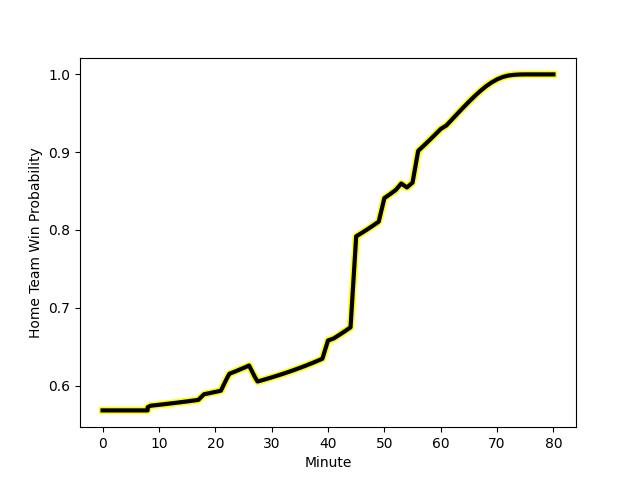

---  
layout: page  
title: Massy at Mont-de-Marsan; 7-23  
date: 2023-01-13 19:30:00 18:00:00 -0500  
categories: match review  
---
# Massy (1405.79) at Mont-de-Marsan (1524.82); 7-23

# Prediction: Mont-de-Marsan by 15.9

Mont-de-Marsan by 11.9 on a neutral field
## Scores over Time

## Win Probability over Time

# Pre-Match Prediction: Mont-de-Marsan by 12.6

Mont-de-Marsan by 8.6 on a neutral pitch

|   Away Minutes | Away Player                                                              |   Away elo |   Away Percentile |   Number |   Home Percentile |   Home elo | Home Player                                                                      |   Home Minutes |
|---------------:|:-------------------------------------------------------------------------|-----------:|------------------:|---------:|------------------:|-----------:|:---------------------------------------------------------------------------------|---------------:|
|             50 | [Robin Poipy](..//playerfiles//RobinPoipy_cleaned.md)                    |      92.54 |                40 |        1 |                66 |     100.42 | [Max Curie](..//playerfiles//MaxCurie_cleaned.md)                                |             61 |
|             50 | [Pierre Trassoudaine](..//playerfiles//PierreTrassoudaine_cleaned.md)    |     120.65 |                94 |        2 |                47 |      94.02 | [Romain Laterrade](..//playerfiles//RomainLaterrade_cleaned.md)                  |             61 |
|             50 | [Tijde Visser](..//playerfiles//TijdeVisser_cleaned.md)                  |      94.58 |                47 |        3 |                12 |      81.51 | [Lasha Macharashvili](..//playerfiles//LashaMacharashvili_cleaned.md)            |             41 |
|             45 | [Abongile Nonkontwana](..//playerfiles//AbongileNonkontwana_cleaned.md)  |      75.59 |                 7 |        4 |                85 |     112.7  | [Romain Durand](..//playerfiles//RomainDurand_cleaned.md)                        |             80 |
|             53 | [Andrew Chauveau](..//playerfiles//AndrewChauveau_cleaned.md)            |      98.48 |                57 |        5 |                27 |      87.98 | [Andrei Ostrikov](..//playerfiles//AndreiOstrikov_cleaned.md)                    |             80 |
|             80 | [Samuel Nollet](..//playerfiles//SamuelNollet_cleaned.md)                |     100.36 |                62 |        6 |                78 |     107.71 | [Yann Brethous](..//playerfiles//YannBrethous_cleaned.md)                        |             61 |
|             80 | [Jean Maurice Decubber](..//playerfiles//JeanMauriceDecubber_cleaned.md) |      94.39 |                46 |        7 |                97 |     130.71 | [Nicolas Garrault](..//playerfiles//NicolasGarrault_cleaned.md)                  |             80 |
|             80 | [Yohann Gbizie](..//playerfiles//YohannGbizie_cleaned.md)                |      86.4  |                24 |        8 |                23 |      85.89 | [Mike Faleafa](..//playerfiles//MikeFaleafa_cleaned.md)                          |             41 |
|             56 | [Gaetan Pichon](..//playerfiles//GaetanPichon_cleaned.md)                |     105.4  |                67 |        9 |               nan |      96.58 | [Baptiste Canut](..//playerfiles//BaptisteCanut_cleaned.md)                      |             54 |
|             56 | [Massimo Ortolan](..//playerfiles//MassimoOrtolan_cleaned.md)            |     104.64 |                67 |       10 |                91 |     123.89 | [Willie du Plessis](..//playerfiles//WillieduPlessis_cleaned.md)                 |             73 |
|             80 | [Nathan Farissier](..//playerfiles//NathanFarissier_cleaned.md)          |      90.93 |                35 |       11 |                73 |     105.08 | [Kaminieli Rasaku](..//playerfiles//KaminieliRasaku_cleaned.md)                  |             80 |
|             53 | [Victorien Jacomme](..//playerfiles//VictorienJacomme_cleaned.md)        |      86.74 |                26 |       12 |                 5 |      69.29 | [Jules Even](..//playerfiles//JulesEven_cleaned.md)                              |             56 |
|             80 | [JJ Taulagi](..//playerfiles//JJTaulagi_cleaned.md)                      |      96.91 |                51 |       13 |                24 |      86.84 | [Simon Desaubies](..//playerfiles//SimonDesaubies_cleaned.md)                    |             80 |
|             80 | [Martin Carré](..//playerfiles//MartinCarré_cleaned.md)                  |      91.55 |                38 |       14 |                38 |      91.58 | [Alexandre de Nardi](..//playerfiles//AlexandredeNardi_cleaned.md)               |             80 |
|             80 | [Juan Kotze](..//playerfiles//JuanKotze_cleaned.md)                      |      85.89 |                27 |       15 |                98 |     143.31 | [Yoann Laousse Azpiazu](..//playerfiles//YoannLaousseAzpiazu_cleaned.md)         |             80 |
|             35 | [Dion Evrard Oulai](..//playerfiles//DionEvrardOulai_cleaned.md)         |      77.4  |                 9 |       16 |                 9 |      78.94 | [Gheorge Gajion](..//playerfiles//GheorgeGajion_cleaned.md)                      |             39 |
|             30 | [Ushangi Tcheishvili](..//playerfiles//UshangiTcheishvili_cleaned.md)    |      67.71 |                 1 |       17 |                80 |     110.2  | [Veresa Tuqovu Ramototabua](..//playerfiles//VeresaTuqovuRamototabua_cleaned.md) |             39 |
|             30 | [Corentin Chabeaudie](..//playerfiles//CorentinChabeaudie_cleaned.md)    |      93.2  |                44 |       18 |                 4 |      70.61 | [Christophe Loustalot](..//playerfiles//ChristopheLoustalot_cleaned.md)          |             26 |
|             30 | [Guiterembi Vickos](..//playerfiles//GuiterembiVickos_cleaned.md)        |      94.01 |                43 |       19 |                70 |     104.55 | [Lucas Mensa](..//playerfiles//LucasMensa_cleaned.md)                            |             24 |
|             27 | [Ewan Coetzee](..//playerfiles//EwanCoetzee_cleaned.md)                  |      70.61 |                 6 |       20 |                15 |      82.25 | [Léo Banos](..//playerfiles//LéoBanos_cleaned.md)                                |             19 |
|             27 | [Arthur Seigneuret](..//playerfiles//ArthurSeigneuret_cleaned.md)        |     107.57 |                75 |       21 |                48 |      96.63 | [Dino Casadei](..//playerfiles//DinoCasadei_cleaned.md)                          |             19 |
|             24 | [Will Haydon-Wood](..//playerfiles//WillHaydon-Wood_cleaned.md)          |      99.39 |                54 |       22 |                84 |     111.1  | [Jose Luis Gonzalez](..//playerfiles//JoseLuisGonzalez_cleaned.md)               |             19 |
|             24 | [Benjamin Prier](..//playerfiles//BenjaminPrier_cleaned.md)              |     117.81 |                91 |       23 |                40 |      95    | [Joris Pialot](..//playerfiles//JorisPialot_cleaned.md)                          |              7 |

