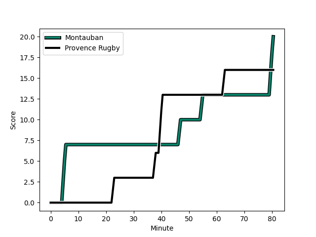
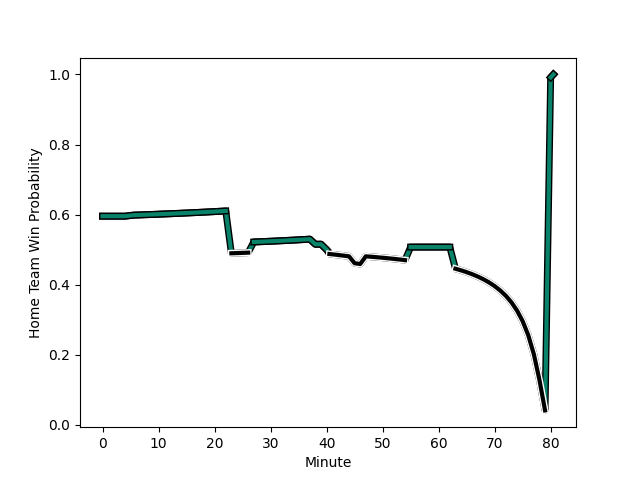

---  
layout: page  
title: Provence Rugby at Montauban; 16-20  
date: 2023-01-13 19:30:00 18:00:00 -0500  
categories: match review  
---
# Provence Rugby (1360.02) at Montauban (1528.14); 16-20

# Prediction: Montauban by 20.8

Montauban by 16.8 on a neutral field
## Scores over Time

## Win Probability over Time

# Pre-Match Prediction: Montauban by 17.1

Montauban by 13.1 on a neutral pitch

|   Away Minutes | Away Player                                                              |   Away elo |   Away Percentile |   Number |   Home Percentile |   Home elo | Home Player                                                         |   Home Minutes |
|---------------:|:-------------------------------------------------------------------------|-----------:|------------------:|---------:|------------------:|-----------:|:--------------------------------------------------------------------|---------------:|
|             80 | [Federico Wegrzyn](..//playerfiles//FedericoWegrzyn_cleaned.md)          |     107.26 |                81 |        1 |                96 |     126.76 | [Nicolas Agnesi](..//playerfiles//NicolasAgnesi_cleaned.md)         |             72 |
|             52 | [Loick Jammes](..//playerfiles//LoickJammes_cleaned.md)                  |      56.77 |                 0 |        2 |                15 |      82.22 | [Arnaud Feltrin](..//playerfiles//ArnaudFeltrin_cleaned.md)         |             40 |
|             60 | [Dave Lolohea](..//playerfiles//DaveLolohea_cleaned.md)                  |      73.44 |                 5 |        3 |                39 |      98.39 | [Victor Laval](..//playerfiles//VictorLaval_cleaned.md)             |             55 |
|             40 | [Clément Chartier](..//playerfiles//ClémentChartier_cleaned.md)          |     115.8  |                88 |        4 |                74 |     106.28 | [Tjuee Uanivi](..//playerfiles//TjueeUanivi_cleaned.md)             |             80 |
|             80 | [Hans N'kinsi](..//playerfiles//HansN'kinsi_cleaned.md)                  |      58.22 |                 2 |        5 |                 1 |      54.86 | [Kevin Gimeno](..//playerfiles//KevinGimeno_cleaned.md)             |             27 |
|             72 | [Carl Axtens](..//playerfiles//CarlAxtens_cleaned.md)                    |      99.7  |                60 |        6 |                70 |     103.88 | [Quentin Witt](..//playerfiles//QuentinWitt_cleaned.md)             |             80 |
|             55 | [Jessy Jegerlehner](..//playerfiles//JessyJegerlehner_cleaned.md)        |      56.58 |                 0 |        7 |                 0 |      57.25 | [Frédéric Quercy](..//playerfiles//FrédéricQuercy_cleaned.md)       |             80 |
|             80 | [Charles Malet](..//playerfiles//CharlesMalet_cleaned.md)                |      64.42 |                 2 |        8 |                79 |     109.78 | [Tyrone Viiga](..//playerfiles//TyroneViiga_cleaned.md)             |             45 |
|             79 | [Joris Cazenave](..//playerfiles//JorisCazenave_cleaned.md)              |      74.14 |                 6 |        9 |                96 |     125.68 | [Shaun Venter](..//playerfiles//ShaunVenter_cleaned.md)             |             80 |
|              9 | [Johnny McPhillips](..//playerfiles//JohnnyMcPhillips_cleaned.md)        |      90.33 |                34 |       10 |                75 |     108.38 | [Jérôme Bosviel](..//playerfiles//JérômeBosviel_cleaned.md)         |             80 |
|             80 | [Nadir Bouhedjeur](..//playerfiles//NadirBouhedjeur_cleaned.md)          |     101.72 |                67 |       11 |                75 |     106.04 | [Bastien Guillemin](..//playerfiles//BastienGuillemin_cleaned.md)   |             80 |
|             80 | [Louis Marrou](..//playerfiles//LouisMarrou_cleaned.md)                  |     128.14 |                95 |       12 |                80 |     110.43 | [Benjamin Puntous](..//playerfiles//BenjaminPuntous_cleaned.md)     |             23 |
|             80 | [Adrian Sanday](..//playerfiles//AdrianSanday_cleaned.md)                |     111.01 |                81 |       13 |                71 |     105.09 | [Paul Bonnefond](..//playerfiles//PaulBonnefond_cleaned.md)         |             80 |
|             80 | [Léo Drouet](..//playerfiles//LéoDrouet_cleaned.md)                      |     103.53 |                70 |       14 |                95 |     129.21 | [Semesa Rokoduguni](..//playerfiles//SemesaRokoduguni_cleaned.md)   |             80 |
|             80 | [Florent Massip](..//playerfiles//FlorentMassip_cleaned.md)              |     100.25 |                59 |       15 |                16 |      80.76 | [Segundo Tuculet](..//playerfiles//SegundoTuculet_cleaned.md)       |             80 |
|             28 | [German Kessler Lordon](..//playerfiles//GermanKesslerLordon_cleaned.md) |     106.38 |                78 |       16 |                82 |     108.34 | [Thomas Bue](..//playerfiles//ThomasBue_cleaned.md)                 |              8 |
|             20 | [Thomas Vernet](..//playerfiles//ThomasVernet_cleaned.md)                |      90.73 |                31 |       17 |                60 |      98.75 | [Kevin Firmin](..//playerfiles//KevinFirmin_cleaned.md)             |             40 |
|             40 | [Jérôme Dufour](..//playerfiles//JérômeDufour_cleaned.md)                |     110.49 |                81 |       18 |                69 |     101.68 | [Mirian Burduli](..//playerfiles//MirianBurduli_cleaned.md)         |             25 |
|             25 | [Nicolas Mousties](..//playerfiles//NicolasMousties_cleaned.md)          |      67.08 |                 2 |       19 |                68 |     105.43 | [Alexandre Manukula](..//playerfiles//AlexandreManukula_cleaned.md) |             53 |
|              1 | [Simon Tarel](..//playerfiles//SimonTarel_cleaned.md)                    |      94.17 |                48 |       20 |                10 |      79.97 | [Stéphane Munoz](..//playerfiles//StéphaneMunoz_cleaned.md)         |             35 |
|             71 | [Dorian Lavernhe](..//playerfiles//DorianLavernhe_cleaned.md)            |      86.51 |                28 |       21 |                66 |     103.72 | [Raphael Sanchez](..//playerfiles//RaphaelSanchez_cleaned.md)       |             57 |
|              8 | [Baptiste Belhadj](..//playerfiles//BaptisteBelhadj_cleaned.md)          |      95    |               nan |       22 |               nan |     nan    | nan                                                                 |            nan |

