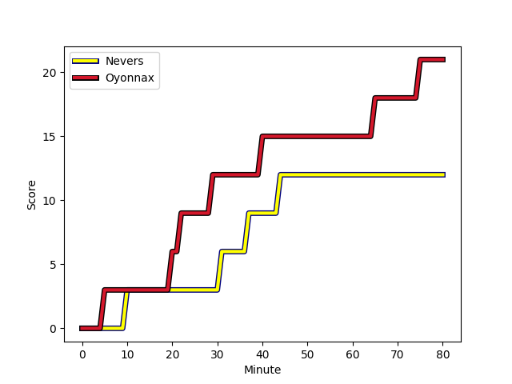
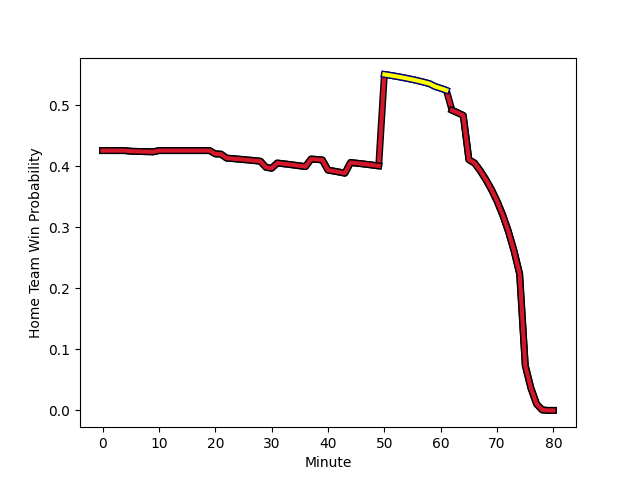

---  
layout: page  
title: Oyonnax at Nevers; 21-12  
date: 2023-01-13 19:00:00 18:00:00 -0500  
categories: match review  
---
# Oyonnax (1628.09) at Nevers (1497.81); 21-12

# Prediction: Oyonnax by 9.0

Oyonnax by 13.0 on a neutral field
## Scores over Time

## Win Probability over Time

# Pre-Match Prediction: Oyonnax by 11.4

Oyonnax by 15.4 on a neutral pitch

|   Away Minutes | Away Player                                                       |   Away elo |   Away Percentile |   Number |   Home Percentile |   Home elo | Home Player                                                                   |   Home Minutes |
|---------------:|:------------------------------------------------------------------|-----------:|------------------:|---------:|------------------:|-----------:|:------------------------------------------------------------------------------|---------------:|
|             49 | [Tommy Raynaud](..//playerfiles//TommyRaynaud_cleaned.md)         |      78.87 |                 9 |        1 |                 7 |      77.74 | [Tomike Mataradze](..//playerfiles//TomikeMataradze_cleaned.md)               |             54 |
|             49 | [Benjamin Geledan](..//playerfiles//BenjaminGeledan_cleaned.md)   |     100.39 |                64 |        2 |                64 |     100.26 | [Issam Hamel](..//playerfiles//IssamHamel_cleaned.md)                         |             54 |
|             59 | [Thibault Berthaud](..//playerfiles//ThibaultBerthaud_cleaned.md) |      94.44 |                45 |        3 |                28 |      89.33 | [Cleopas Kundiona](..//playerfiles//CleopasKundiona_cleaned.md)               |             66 |
|             41 | [Phoenix Battye](..//playerfiles//PhoenixBattye_cleaned.md)       |     162.6  |                99 |        4 |                 2 |      60.96 | [Christiaan van der Merwe](..//playerfiles//ChristiaanvanderMerwe_cleaned.md) |             80 |
|             61 | [Hugo Fabregue](..//playerfiles//HugoFabregue_cleaned.md)         |     102.42 |                66 |        5 |                92 |     120.53 | [Will Skelton](..//playerfiles//WillSkelton_cleaned.md)                       |             62 |
|             80 | [Kevin Lebreton](..//playerfiles//KevinLebreton_cleaned.md)       |     132.51 |                97 |        6 |                28 |      88.03 | [Luka Plataret](..//playerfiles//LukaPlataret_cleaned.md)                     |             80 |
|             61 | [Wandrille Picault](..//playerfiles//WandrillePicault_cleaned.md) |     126.68 |                93 |        7 |                96 |     130.59 | [Hugues Bastide](..//playerfiles//HuguesBastide_cleaned.md)                   |             59 |
|             80 | [Loïc Credoz](..//playerfiles//LoïcCredoz_cleaned.md)             |     106.27 |                75 |        8 |                49 |      97.27 | [Steven David](..//playerfiles//StevenDavid_cleaned.md)                       |             59 |
|              5 | [Charlie Cassang](..//playerfiles//CharlieCassang_cleaned.md)     |     143.35 |                99 |        9 |                72 |     104.4  | [Yoan Cottin](..//playerfiles//YoanCottin_cleaned.md)                         |             50 |
|             61 | [Jules Soulan](..//playerfiles//JulesSoulan_cleaned.md)           |     112.4  |                79 |       10 |                 3 |      71.95 | [Shaun Reynolds](..//playerfiles//ShaunReynolds_cleaned.md)                   |             62 |
|             80 | [Enzo Reybier](..//playerfiles//EnzoReybier_cleaned.md)           |     101.47 |                66 |       11 |                86 |     115.01 | [Lucas Blanc](..//playerfiles//LucasBlanc_cleaned.md)                         |             80 |
|             80 | [Gaby Lovobalavu](..//playerfiles//GabyLovobalavu_cleaned.md)     |      74.3  |                 7 |       12 |                93 |     123.32 | [Leonard Paris](..//playerfiles//LeonardParis_cleaned.md)                     |             80 |
|             80 | [Theo Millet](..//playerfiles//TheoMillet_cleaned.md)             |     106.52 |                74 |       13 |                 8 |      75.88 | [Alifereti Loaloa](..//playerfiles//AliferetiLoaloa_cleaned.md)               |             80 |
|             80 | [Gavin Stark](..//playerfiles//GavinStark_cleaned.md)             |      94.71 |                46 |       14 |                98 |     137.76 | [Andrzej Charlat](..//playerfiles//AndrzejCharlat_cleaned.md)                 |             80 |
|             80 | [Darren Sweetnam](..//playerfiles//DarrenSweetnam_cleaned.md)     |     110.08 |                78 |       15 |                88 |     120.44 | [Kylian Jaminet](..//playerfiles//KylianJaminet_cleaned.md)                   |             80 |
|             75 | [Jeremy Gondrand](..//playerfiles//JeremyGondrand_cleaned.md)     |     136.88 |                99 |       16 |                69 |     103.51 | [Guillaume Manevy](..//playerfiles//GuillaumeManevy_cleaned.md)               |             30 |
|             39 | [Tom Murday](..//playerfiles//TomMurday_cleaned.md)               |     133.21 |                97 |       17 |                21 |      86.48 | [Kamaliele Tufele](..//playerfiles//KamalieleTufele_cleaned.md)               |             26 |
|             31 | [Manu Leiataua](..//playerfiles//ManuLeiataua_cleaned.md)         |      91.64 |                45 |       18 |                47 |      94.11 | [Elia Elia](..//playerfiles//EliaElia_cleaned.md)                             |             26 |
|             31 | [Antoine Abraham](..//playerfiles//AntoineAbraham_cleaned.md)     |      91.87 |                29 |       19 |                78 |     107.8  | [Shaun Adendorff](..//playerfiles//ShaunAdendorff_cleaned.md)                 |             21 |
|             21 | [Victor Delmas](..//playerfiles//VictorDelmas_cleaned.md)         |     101.42 |               nan |       20 |                47 |      94.73 | [Julien Kazubek](..//playerfiles//JulienKazubek_cleaned.md)                   |             21 |
|             19 | [Justin Bouraux](..//playerfiles//JustinBouraux_cleaned.md)       |     102.71 |                62 |       21 |                33 |      91.55 | [Yohan Le Bourhis](..//playerfiles//YohanLeBourhis_cleaned.md)                |             18 |
|             19 | [Filimo Taofifenua](..//playerfiles//FilimoTaofifenua_cleaned.md) |     122.79 |                92 |       22 |                 0 |      50.47 | [Maka Polutele](..//playerfiles//MakaPolutele_cleaned.md)                     |             18 |
|             19 | [Steve Mafi](..//playerfiles//SteveMafi_cleaned.md)               |     107.53 |               nan |       23 |                53 |      99.78 | [Ilia Kaikatsishvili](..//playerfiles//IliaKaikatsishvili_cleaned.md)         |             14 |

